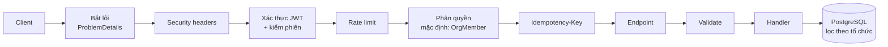
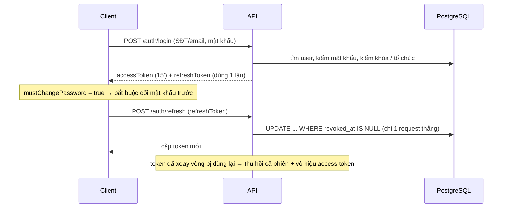
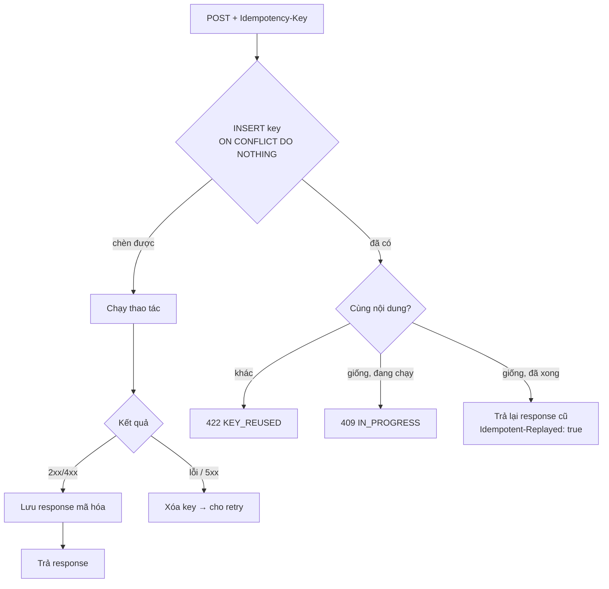
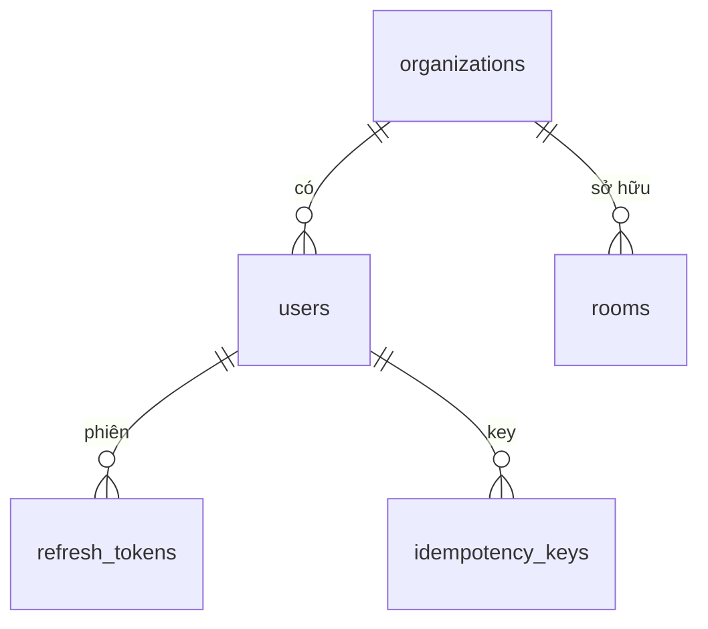

# Tổng hợp công việc đã làm

## 1. Đã làm gì

| Giai đoạn | Nội dung | Kết quả |
|-----------|----------|---------|
| Plan | Tra cứu pháp luật, chia 10 module, viết plan chi tiết, tự review | `docs/plans/` (pipeline `README.md`, M01–M10, `99-self-review.md`) |
| Hạ tầng | PostgreSQL bằng Docker, cô lập dữ liệu theo tổ chức, xử lý lỗi chuẩn | `docker-compose.yml`, `AppDbContext`, `GlobalExceptionHandler` |
| Xác thực | Đăng nhập / refresh / đăng xuất / đổi mật khẩu (JWT), admin tạo & tạm ngưng tổ chức | `/api/v1/auth/*`, `/api/v1/admin/organizations` |
| Bảo mật | Security review → sửa 8 lỗi (lộ tài khoản, dò mật khẩu, race khi đổi mật khẩu…) | |
| Chống trùng & spam | `Idempotency-Key`, rate limit nhiều lớp, giới hạn body 1 MB | |
| Kiểm thử | 58 unit + 44 integration (PostgreSQL thật) — tất cả xanh | `tests/` |
| Tài liệu | Hướng dẫn PostgreSQL, quy ước gọi API | `docs/guides/` |

## 2. Công nghệ

| Hạng mục | Công nghệ |
|----------|-----------|
| Nền tảng | .NET 8, ASP.NET Core Minimal API, Clean Architecture (Domain / Application / Infrastructure / API) |
| Database | PostgreSQL 16 (Docker), EF Core 8 + Npgsql, tên bảng snake_case |
| CQRS / validate | Mediator (source generator), FluentValidation |
| Xác thực | JWT HS256 (access 15 phút) + refresh token xoay vòng (lưu hash SHA-256), mật khẩu PBKDF2 |
| Chống spam / trùng | ASP.NET Rate Limiting (cửa sổ trượt + giới hạn song song), Idempotency-Key (mã hóa bằng Data Protection) |
| Lỗi | RFC 9457 ProblemDetails + `code` + `traceId` |
| Test | xUnit, FluentAssertions, WebApplicationFactory, Testcontainers |

## 3. Luồng một request



## 4. Đăng nhập & làm mới token



Phiên bị thu hồi ngay khi: đổi mật khẩu, đăng xuất mọi nơi, tổ chức bị tạm ngưng (đổi `security stamp`).

## 5. Idempotency-Key (chống tạo trùng)



## 6. Chống spam (rate limit)

| Lớp | Mặc định |
|-----|----------|
| Đăng nhập (theo IP, IPv6 theo /64) | 10/phút |
| Refresh / đăng xuất (theo IP) | 30/phút |
| Đổi mật khẩu, đăng xuất mọi nơi (theo user) | 5/phút |
| Mọi request: đã đăng nhập / chưa đăng nhập | 300 / 60 mỗi phút |
| Request ghi (POST/PUT/DELETE) | 60/phút |
| Request đồng thời mỗi client | 10 |

Vượt → `429 TOO_MANY_REQUESTS` + `Retry-After`. Sai mật khẩu 5 lần → khóa 15 phút.

## 7. Database hiện có



Migration: `InitialIdentity` → `AddRefreshTokenFamilyExpiry` → `AddIdempotencyKeys`.

## 8. Chạy thử

```powershell
docker compose up -d
cd renting_room; dotnet run --launch-profile http   # http://localhost:5213/swagger
dotnet test                                          # tại thư mục gốc, cần Docker
```

## 9. Việc tiếp theo

- Bảng `audit_logs` (ghi lịch sử thay đổi) — cần trước các module tiền.
- Nâng .NET 10 (cần cài SDK 10; .NET 8 hết hỗ trợ 10/11/2026).
- Module M02 Khu trọ & Phòng (viết lại `Room` theo plan).
