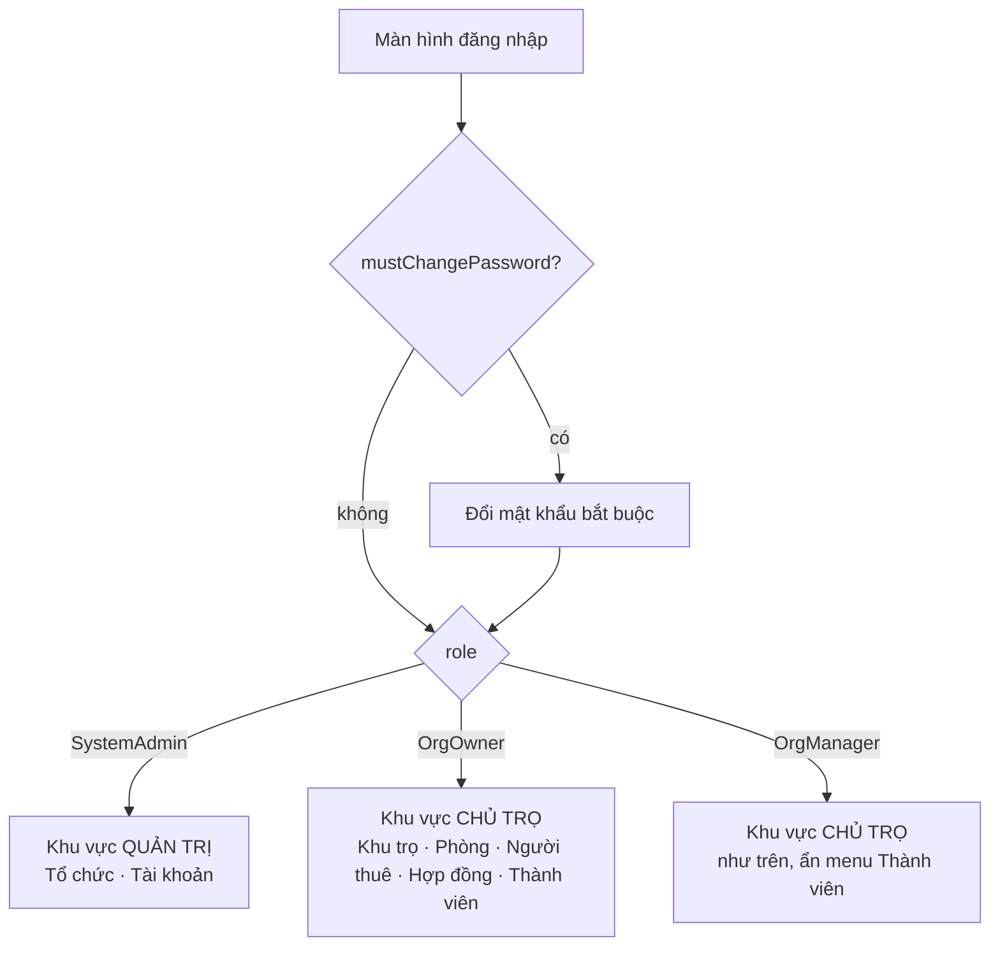
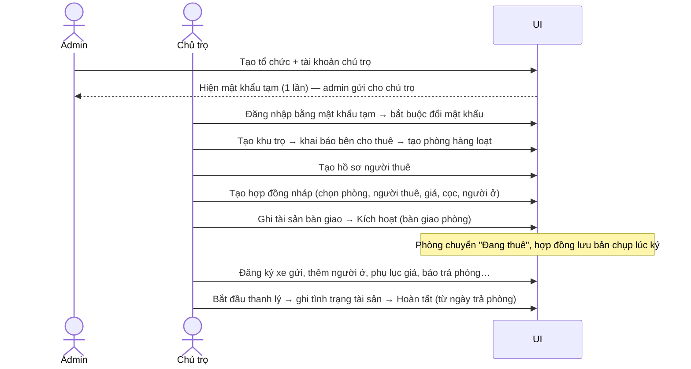

# Tài liệu API cho UI — Phần mềm quản lý nhà trọ

> Dành cho **người làm giao diện** (web / mobile): hiểu từng chức năng nghiệp vụ, cần những màn hình nào,
> gọi endpoint nào, gửi gì – nhận gì, xử lý lỗi ra sao, nút nào bật/tắt theo trạng thái.
>
> Mọi ví dụ JSON trong thư mục này lấy từ **response thật** của API (02/10/2026).
> Đặc tả máy đọc được: [`openapi.json`](openapi.json) — dùng để sinh client tự động (VD `openapi-typescript`, `orval`, NSwag).

## Mục lục

| File | Nội dung | Ai dùng |
|------|----------|---------|
| [conventions.md](conventions.md) | Quy ước chung: xác thực, token, phân trang, version, Idempotency-Key, lỗi, enum, ngày giờ, tiền | **Đọc trước** |
| [auth.md](auth.md) | Đăng nhập, đổi mật khẩu lần đầu, làm mới token, đăng xuất, hồ sơ | Mọi người |
| [admin.md](admin.md) | Quản trị nền tảng: tổ chức chủ trọ, cấp lại mật khẩu, khóa tài khoản | SystemAdmin |
| [members.md](members.md) | Chủ trọ quản lý phó quản lý | Chủ trọ |
| [properties.md](properties.md) | Khu trọ, bên cho thuê, tài khoản ngân hàng, nội quy | Chủ trọ, phó quản lý |
| [rooms.md](rooms.md) | Phòng, trạng thái phòng, bảo trì, nhóm phòng | Chủ trọ, phó quản lý |
| [renters.md](renters.md) | Hồ sơ người thuê / người ở | Chủ trọ, phó quản lý |
| [fees.md](fees.md) | Khoản thu của khu: điện nước theo công tơ; dịch vụ theo phòng / đầu người / số gói (mạng, nước theo người, giữ xe); bảng giá (một giá) | Chủ trọ, phó quản lý |
| [meters.md](meters.md) | Công tơ điện nước của phòng: lắp, thay (phiên bản), tháo, lịch sử, sửa chỉ số; lưới ghi chỉ số hằng tháng | Chủ trọ, phó quản lý |
| [invoices.md](invoices.md) | Phiếu tiền phòng: tạo nháp theo tháng, sửa tay, phụ thu, tính lại, chốt, hủy | Chủ trọ, phó quản lý |
| [payments.md](payments.md) | Thu tiền ("Đã thu"), phiếu thu, đảo phiếu thu, còn nợ | Chủ trọ, phó quản lý |
| [contract-templates.md](contract-templates.md) | Mẫu hợp đồng theo loại (thuê phòng trọ / thuê nhà): tiêu đề, điều khoản, trường tùy biến | Chủ trọ, phó quản lý |
| [contracts.md](contracts.md) | Hợp đồng: tạo, kích hoạt, người ở, phụ lục, báo trả phòng, thanh lý, tài sản, xe | Chủ trọ, phó quản lý |
| [exports.md](exports.md) | Xuất Excel danh sách người thuê theo khu / tầng / nhóm phòng / phòng / khoảng ngày | Chủ trọ, phó quản lý |
| [errors.md](errors.md) | Bảng mã lỗi → câu thông báo / hành động UI | Mọi người |
| [openapi.json](openapi.json) | Đặc tả OpenAPI 3 | Sinh code |

## Vai trò & khu vực giao diện



| Vai trò (`role`) | Thấy gì | Không được |
|------------------|---------|-----------|
| `SystemAdmin` | Danh sách tổ chức, tài khoản | **Không** xem dữ liệu trọ (khu, phòng, người thuê, hợp đồng) — API trả 403 |
| `OrgOwner` (chủ trọ) | Toàn bộ dữ liệu tổ chức mình + quản lý phó quản lý | Dữ liệu tổ chức khác (API trả 404) |
| `OrgManager` (phó quản lý) | Như chủ trọ | Thêm/sửa/khóa/gỡ thành viên (API trả 403) — **ẩn menu "Thành viên → thêm/sửa"** |

Đọc `role` từ `GET /api/v1/me` sau khi đăng nhập để dựng menu.

## Sơ đồ màn hình đề xuất (khu vực chủ trọ)

```
├── Tổng quan (P2 — dashboard)
├── Khu trọ
│   ├── Danh sách khu                         GET  /properties
│   ├── Tạo / sửa khu                         POST /properties · PUT /properties/{id}
│   └── Chi tiết khu (tab)
│       ├── Thông tin chung + cài đặt thu
│       ├── Bên cho thuê ⚠ bắt buộc trước khi ký HĐ   PUT /properties/{id}/lessor
│       ├── Tài khoản ngân hàng                PUT /properties/{id}/bank-account
│       ├── Nội quy                            PUT /properties/{id}/house-rules
│       ├── Khoản thu (điện, nước, dịch vụ)    GET /properties/{id}/fee-types
│       ├── Phòng (lưới theo tầng)             GET /rooms?propertyId=
│       └── Nhóm phòng                         GET /properties/{id}/room-groups
├── Phòng
│   ├── Danh sách / lọc theo trạng thái       GET  /rooms
│   ├── Tạo phòng / tạo hàng loạt             POST /properties/{id}/rooms[/bulk]
│   └── Chi tiết phòng (+ hợp đồng hiện hành) GET  /rooms/{id}
├── Người thuê
│   ├── Tìm kiếm                               GET  /renters
│   ├── Xuất Excel danh sách người thuê        POST /exports/renters
│   └── Tạo / sửa hồ sơ                        POST /renters · PUT /renters/{id}
├── Hợp đồng
│   ├── Mẫu hợp đồng (theo loại)               GET  /contract-templates
│   ├── Danh sách (lọc: sắp hết hạn, quá hạn) GET  /contracts
│   ├── Tạo hợp đồng (wizard 4 bước)           POST /contracts
│   └── Chi tiết hợp đồng (tab + nút theo trạng thái)
└── Thành viên (chỉ chủ trọ thao tác)          /org/members
```

## Luồng sử dụng điển hình



## Chưa có trong API (đừng làm UI)

Các module sau mới có trong plan (`docs/plans/`), **chưa có endpoint**: công tơ & ghi chỉ số (M06),
phiếu báo tiền phòng (M07), thu tiền & sổ cọc (M08), upload ảnh/file (M09), các file Excel khác ngoài danh sách người thuê (M10), theo dõi tạm trú (M03 phần cư trú).
