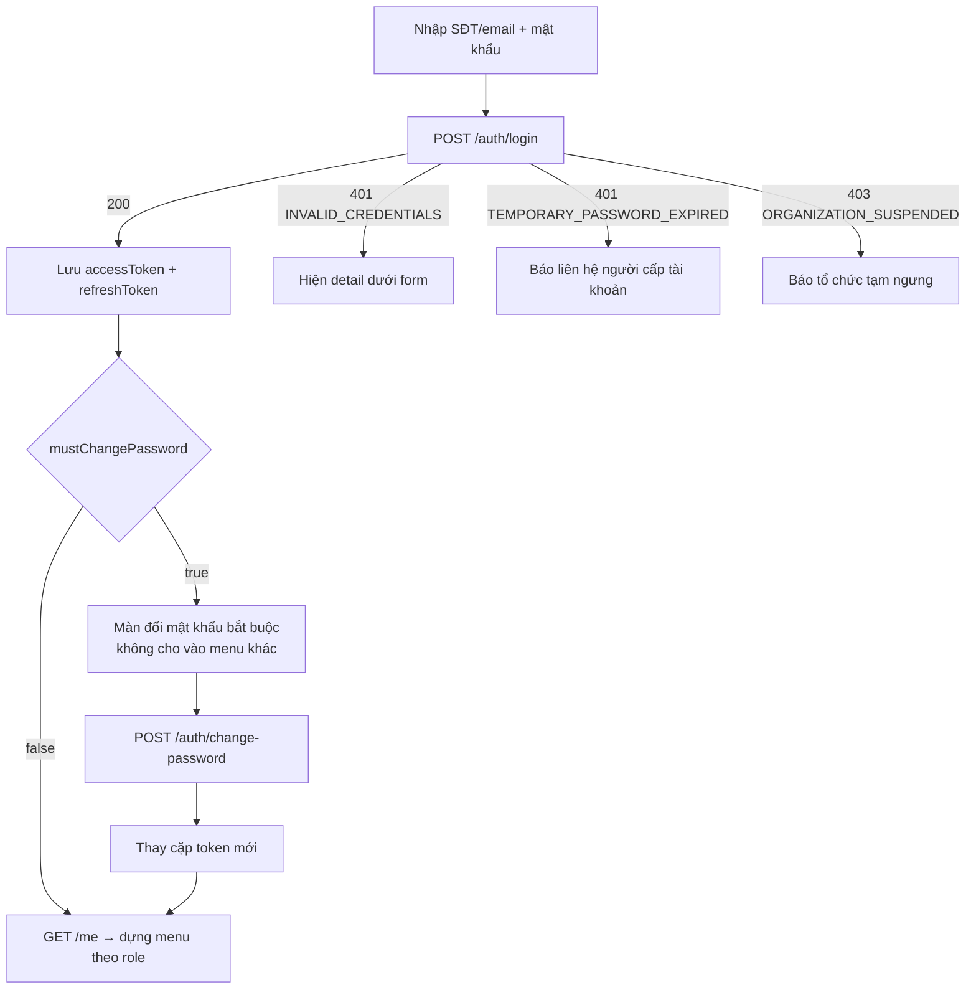

# Đăng nhập & tài khoản

Áp dụng cho **mọi vai trò**. Người thuê **không** có tài khoản.

## Màn hình

| Màn hình | Endpoint |
|----------|----------|
| Đăng nhập | `POST /auth/login` |
| Đổi mật khẩu bắt buộc (lần đầu / sau khi được cấp lại) | `POST /auth/change-password` |
| Hồ sơ của tôi + đổi mật khẩu | `GET /me`, `POST /auth/change-password` |
| Menu tài khoản: Đăng xuất / Đăng xuất mọi thiết bị | `POST /auth/logout`, `POST /auth/logout-all` |
| (ẩn) Làm mới token | `POST /auth/refresh` |

## Luồng đăng nhập



### `POST /auth/login` — không cần token

```json
{ "username": "0946781528", "password": "66V64DMMRSxg" }
```

`username` = số điện thoại **hoặc** email. SĐT nhập kiểu `0946 781 528`, `+84946781528` đều được.

**200**

```json
{
  "accessToken": "eyJhbGciOi…",
  "accessTokenExpiresAt": "2026-10-02T13:34:05.1940166+00:00",
  "refreshToken": "dMkK_wzA1KfaGnsROsNforD23ZW6nB7Q37Dbn_1BdoU",
  "refreshTokenExpiresAt": "2026-11-01T13:19:05.1940166+00:00",
  "mustChangePassword": true
}
```

| Lỗi | Khi nào | UI |
|-----|---------|----|
| 401 `INVALID_CREDENTIALS` | Sai tài khoản/mật khẩu, **hoặc tài khoản đang bị khóa tạm** (sai 5 lần → khóa 15 phút; cố ý trả cùng mã để không lộ tài khoản tồn tại) | Hiện `detail` (đã nhắc về khóa 15 phút) |
| 401 `TEMPORARY_PASSWORD_EXPIRED` | Mật khẩu tạm quá 72 giờ | "Mật khẩu tạm đã hết hạn, liên hệ người cấp tài khoản" |
| 403 `ORGANIZATION_SUSPENDED` | Tổ chức bị admin tạm ngưng | Thông báo, không cho vào |
| 429 `TOO_MANY_REQUESTS` | > 10 lần/phút từ một IP | Khóa nút trong `Retry-After` giây |

## Đổi mật khẩu

### `POST /auth/change-password`

```json
{ "currentPassword": "66V64DMMRSxg", "newPassword": "ChuTro2026x" }
```

**200** → trả **cặp token mới** (cùng dạng login). **Bắt buộc thay token đã lưu** — mọi phiên khác (thiết bị khác) bị đăng xuất.

Kiểm tra phía UI (khớp server):

| Trường | Quy tắc |
|--------|---------|
| `newPassword` | 8–128 ký tự, có **cả chữ và số**, không chứa tên đăng nhập, khác mật khẩu hiện tại |
| Ô "Nhập lại mật khẩu" | Chỉ kiểm tra ở UI (server không nhận) |

| Lỗi | UI |
|-----|----|
| 400 `VALIDATION_FAILED` (`errors.newPassword`) / 400 `WEAK_PASSWORD` | Lỗi dưới ô mật khẩu mới |
| 422 `INVALID_CURRENT_PASSWORD` | Lỗi dưới ô mật khẩu hiện tại |
| 422 `PASSWORD_REUSED` | "Mật khẩu mới phải khác mật khẩu hiện tại" |
| 423 `ACCOUNT_LOCKED` | Nhập sai mật khẩu hiện tại nhiều lần → tài khoản bị khóa tạm, đăng xuất |
| 429 | Tối đa 5 lần/phút |

### Chặn khi chưa đổi mật khẩu

Khi `mustChangePassword = true`, mọi API nghiệp vụ trả:

```json
{
  "status": 403,
  "title": "Không có quyền truy cập",
  "detail": "Bạn cần đổi mật khẩu trước khi tiếp tục.",
  "code": "PASSWORD_CHANGE_REQUIRED"
}
```

Chỉ còn gọi được: `GET /me`, `POST /auth/change-password`, `/auth/logout`, `/auth/logout-all`, `/auth/refresh`.
→ Interceptor HTTP: gặp `PASSWORD_CHANGE_REQUIRED` thì điều hướng về màn đổi mật khẩu.

## Token & làm mới

| Token | Thời hạn | Lưu ở đâu (gợi ý) |
|-------|----------|-------------------|
| `accessToken` | 15 phút | Bộ nhớ (state) |
| `refreshToken` | 30 ngày, **mỗi lần refresh đổi token mới**; phiên tối đa 90 ngày | Web: storage an toàn nhất có thể; Mobile: Keychain / Keystore |

### `POST /auth/refresh` — không cần access token

```json
{ "refreshToken": "dMkK_wzA1KfaGnsROsNforD23ZW6nB7Q37Dbn_1BdoU" }
```

**200** → cặp token mới (refresh token cũ hết hiệu lực ngay).

**Quy tắc bắt buộc cho interceptor:**

1. Gặp 401 `TOKEN_EXPIRED` → refresh rồi gửi lại request gốc **đúng 1 lần**.
2. **Chỉ một lệnh refresh chạy cùng lúc** — các request khác chờ promise đó (dùng chung 1 refresh token cũ cho 2 lệnh song song
   sẽ bị coi là dùng lại token → cả phiên bị thu hồi).
3. Refresh trả 401 (`INVALID_REFRESH_TOKEN`, `SESSION_REVOKED`) hoặc 403 `ORGANIZATION_SUSPENDED` → xóa token, về màn đăng nhập.
4. Có thể refresh chủ động khi `accessTokenExpiresAt` còn < 1 phút.

```ts
// Phác thảo
let refreshing: Promise<Tokens> | null = null;
async function ensureFreshToken() {
  refreshing ??= api.post('/auth/refresh', { refreshToken: store.refreshToken })
    .then(saveTokens)
    .finally(() => { refreshing = null; });
  return refreshing;
}
```

## Đăng xuất

| Endpoint | Body | Kết quả |
|----------|------|---------|
| `POST /auth/logout` | `{ "refreshToken": "…" }` | 204 — thu hồi phiên hiện tại. Luôn xóa token phía client kể cả khi lỗi |
| `POST /auth/logout-all` | (không body, cần access token) | 204 — đăng xuất mọi thiết bị, kể cả thiết bị này |

## Hồ sơ của tôi

### `GET /me`

```json
{
  "id": "33c8ef92-18d4-41b9-9810-b05ed908c59d",
  "fullName": "Chủ Mẫu",
  "phone": "0946781528",
  "email": null,
  "role": "OrgOwner",
  "mustChangePassword": false,
  "lastLoginAt": "2026-10-02T13:19:05.194016+00:00",
  "organization": { "id": "e22cfc70-…", "code": "MAU-9080", "name": "Nhà trọ Mẫu" }
}
```

- `organization` = `null` với `SystemAdmin`.
- Header app: hiện `organization.name` + `fullName` + nhãn vai trò.
- Hiện chưa có API tự sửa họ tên/SĐT — chủ trọ sửa cho phó quản lý ([members.md](members.md)), admin sửa chủ trọ (P2).
