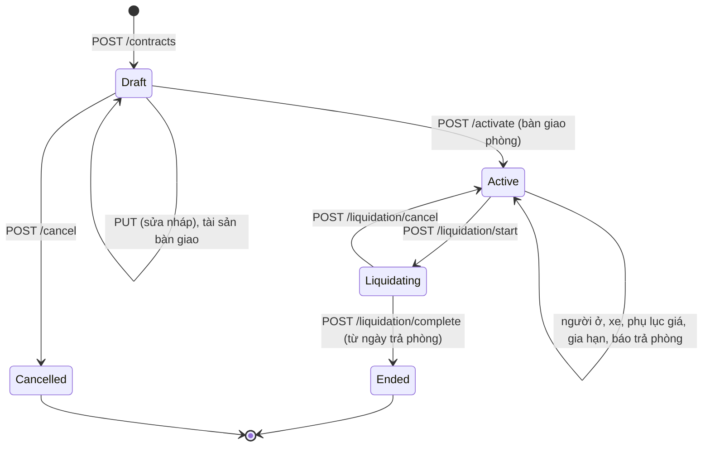

# Hợp đồng thuê

Phần mềm **lưu trữ & quản lý** hợp đồng (không phải chữ ký số). Hợp đồng gắn **1 phòng**, **1 người đại diện ký** và danh sách
**người ở**; giá thuê thay đổi qua **phụ lục**; khi trả phòng thì **thanh lý**.

## Vòng đời



| `status` | Nhãn | Màu | Ý nghĩa |
|----------|------|-----|---------|
| `Draft` | Nháp | Xám | Đang soạn, sửa tự do; phòng hiện "Giữ chỗ" |
| `Active` | Đang hiệu lực | Xanh | Đã bàn giao. Thông tin các bên đã **chụp lại**, không đổi theo hồ sơ |
| `Liquidating` | Đang thanh lý | Cam | Đã chốt ngày trả phòng, đang kiểm tài sản |
| `Ended` | Đã kết thúc | Xám đậm | Khóa, chỉ xem |
| `Cancelled` | Đã hủy | Gạch ngang | Nháp bị hủy, chỉ xem |

`isOverdue = true` (Active và đã qua `endDate`) → badge đỏ **"Quá hạn"** + gợi ý Gia hạn / Thanh lý.
Hết hạn mà chưa thanh lý thì hợp đồng **vẫn hiệu lực và vẫn tính kỳ thu**.

## Ma trận nút theo trạng thái

| Nút | Endpoint | Draft | Active | Liquidating | Ended / Cancelled |
|-----|----------|:-----:|:------:|:-----------:|:-----------------:|
| Sửa | `PUT /contracts/{id}` | ✅ | | | |
| Sửa ghi chú nội bộ | `PUT /contracts/{id}/note` `{ "note": "…" }` | ✅ | ✅ | ✅ | ✅ Ended (❌ Cancelled) |
| Hủy nháp | `POST /contracts/{id}/cancel` | ✅ | | | |
| **Kích hoạt / Bàn giao** | `POST /contracts/{id}/activate` | ✅ | | | |
| Tài sản: thêm / sửa / xóa | `/contracts/{id}/assets…` | ✅ | | | |
| Tài sản: ghi tình trạng trả | `POST …/assets/{assetId}/return` | | | ✅ | |
| Thêm người ở | `POST /contracts/{id}/occupants` | ✅ | ✅ | | |
| Người ở chuyển đi | `POST …/occupants/{occupantId}/end` | | ✅ | ✅ | |
| Đăng ký xe | `POST /contracts/{id}/vehicles` | ✅ | ✅ | | |
| Kết thúc gửi xe | `POST …/vehicles/{vehicleId}/end` | ✅ | ✅ | ✅ | |
| Phụ lục đổi giá | `POST /contracts/{id}/rent-terms` | | ✅ | | |
| Gia hạn | `POST /contracts/{id}/extend` | | ✅ (có `endDate`) | | |
| Ở tiếp chưa ký lại (đã quá hạn) | `POST /contracts/{id}/holdover` | | ✅ (cờ `ExpiredAwaitingDecision`) | | |
| Ký lại cho người còn ở | `POST /contracts/{id}/re-sign` | | ✅ (hay dùng khi cờ `RepresentativeMovedOut`) | | |
| Ghi nhận báo trả phòng | `POST /contracts/{id}/notice` | | ✅ | | |
| Bắt đầu thanh lý | `POST /contracts/{id}/liquidation/start` | | ✅ | | |
| Hủy thanh lý | `POST /contracts/{id}/liquidation/cancel` | | | ✅ | |
| Hoàn tất thanh lý | `POST /contracts/{id}/liquidation/complete` | | | ✅ (hôm nay ≥ `actualEndDate`) | |
| Xem kỳ thu | `GET /contracts/{id}/billing-periods` | ✅ | ✅ | ✅ | ✅ |
| Đổi / gỡ khoản thu từ đầu kỳ | `PUT` / `DELETE /contracts/{id}/fees/{feeTypeId}` | (sửa qua `PUT` nháp) | ✅ | | |
| **Tải văn bản (.docx)** | `GET /contracts/{id}/document` | ✅ (có dòng "BẢN NHÁP") | ✅ | ✅ | ✅ |

Gọi sai trạng thái → 422 `CONTRACT_NOT_DRAFT` / `CONTRACT_NOT_ACTIVE` / `CONTRACT_NOT_LIQUIDATING` / `CONTRACT_NOT_EDITABLE`
(thường do dữ liệu cũ — tải lại).

## Danh sách

`GET /contracts?propertyId=&roomId=&renterId=&status=&expiringWithinDays=&overdue=&search=&page=1&pageSize=20`

| Query | Ý nghĩa | Gợi ý UI |
|-------|---------|----------|
| `propertyId`, `roomId` | Lọc theo khu / phòng | Tab "Hợp đồng" trong chi tiết phòng |
| `renterId` | Người này đứng tên **hoặc** ở cùng | Tab "Lịch sử thuê" trong hồ sơ người thuê |
| `status` | 1 trạng thái | Tabs: Nháp · Hiệu lực · Thanh lý · Kết thúc · Đã hủy |
| `expiringWithinDays` | Active hết hạn trong N ngày tới (0–365) | Bộ lọc nhanh **"Sắp hết hạn (30 ngày)"** |
| `overdue=true` | Active đã quá `endDate` | Bộ lọc nhanh **"Quá hạn"** |
| `search` | Một phần số hợp đồng | Ô tìm kiếm |
| `hasDeposit` | `false` = nhóm **không cọc** (cọc = 0), `true` = có cọc | Bộ lọc nhanh **"Không cọc"** |

Sắp xếp: ngày bắt đầu mới nhất trước.

```json
{
  "items": [
    {
      "id": "274fe373-ac0f-4870-a032-d95777d23204",
      "contractNo": "HD2026-0001",
      "status": "Active",
      "propertyId": "aa9daa2c-9c31-4e96-9259-6295c9e44320",
      "propertyCode": "KMAU",
      "roomId": "4153f47f-3ad8-43f1-afea-a40e51e24566",
      "roomCode": "101",
      "representativeRenterId": "95e22443-fc6d-4211-b15f-be7e30de5780",
      "representativeName": "Trần Thị Lan",
      "startDate": "2026-10-02",
      "endDate": "2027-10-02",
      "actualEndDate": null,
      "currentRent": 3500000,
      "occupantCount": 1,
      "isOverdue": false
    }
  ],
  "page": 1, "pageSize": 20, "totalCount": 1, "totalPages": 1
}
```

Mỗi dòng có thêm `contractType` (`RoomRental` / `WholeHouseRental`) để hiện nhãn loại, `depositAmount` (0 → nhãn "Không cọc")
và `flags` — việc chủ trọ cần xử lý (xem [Cần xử lý](#cần-xử-lý-flags)).

Cột: Số HĐ · Khu/Phòng (`propertyCode`-`roomCode`) · Người đại diện · Thời hạn · Giá hiện tại · Số người · Trạng thái.

## Tạo hợp đồng — wizard gợi ý

| Bước | Nội dung | Dữ liệu cần |
|------|----------|-------------|
| 0. Mẫu | Chọn mẫu hợp đồng (hoặc "Không dùng mẫu" + chọn loại) — quyết định tiêu đề, điều khoản, form trường tùy biến | `GET /contract-templates` — xem [contract-templates.md](contract-templates.md) |
| 1. Phòng | Chọn khu → phòng (`Vacant` / `Reserved`), hoặc mở từ sơ đồ phòng | `GET /rooms?propertyId=&status=Vacant` |
| 2. Người thuê | Chọn **người đại diện ký** (≥ 18 tuổi, có SĐT) + người ở cùng. Tạo nhanh hồ sơ nếu chưa có | `GET /renters?q=`, `POST /renters` |
| 3. Điều khoản | Ngày bắt đầu/kết thúc, giá thuê (gợi ý `listedRent`), cọc (gợi ý `defaultDeposit`), cài đặt thu (gợi ý từ khu), phương thức thanh toán | `GET /rooms/{id}`, `GET /properties/{id}` |
| 4. Thông tin theo mẫu | Form sinh từ `fields` của mẫu (VD cách tính điện, tiền nước, wifi); sửa điều khoản nếu cần | — |
| 5. Xem lại & lưu nháp | Lưu → sang trang chi tiết để ghi tài sản bàn giao → Kích hoạt | `POST /contracts` |

> Người đại diện **không tự động** là người ở. UI nên mặc định tích "Người đại diện cũng ở phòng này" và thêm vào `occupants`.
> Kích hoạt yêu cầu **≥ 1 người ở**.

### `POST /contracts` — **Idempotency-Key**

```json
{
  "roomId": "4153f47f-3ad8-43f1-afea-a40e51e24566",
  "contractNo": null,
  "contract": {
    "representativeRenterId": "95e22443-fc6d-4211-b15f-be7e30de5780",
    "startDate": "2026-10-02",
    "endDate": "2027-10-01",
    "signedDate": null,
    "signedPlace": "Hà Nội",
    "effectiveDate": null,
    "monthlyRent": 3500000,
    "depositAmount": 3500000,
    "depositTerms": "Hoàn cọc khi trả phòng đúng hạn, trừ chi phí hư hỏng.",
    "billing": { "anchorDay": 1, "chargeMode": "Prepaid", "prorationMode": "Daily", "paymentDueDays": 5 },
    "noticeDays": 30,
    "paymentMethods": ["Cash", "BankTransfer"],
    "copiesCount": 2,
    "termsText": null,
    "note": null,
    "occupants": [
      { "renterId": "95e22443-fc6d-4211-b15f-be7e30de5780", "moveInDate": null, "expectedEndDate": null, "relationship": null, "note": null },
      { "renterId": "0b5e…", "relationshipType": "Wife" },
      { "renterId": "7c21…", "relationshipType": "Child" },
      { "renterId": "a9f3…", "relationshipType": "NephewNiece", "relationship": "Cháu gọi bằng cậu", "guardianConsent": true }
    ],
    "templateId": "5d1c…",
    "contractType": null,
    "title": null,
    "clauses": null,
    "customFields": {
      "overnight_guest_policy": "Phải báo và được chủ nhà đồng ý",
      "gate_closing_time": "23:00",
      "pets_allowed": false
    }
  }
}
```

→ **201**

```json
{ "id": "…", "warnings": [ { "code": "DEPOSIT_ABOVE_THREE_MONTHS", "message": "Tiền cọc lớn hơn 3 tháng tiền thuê — kiểm tra lại số tiền." } ] }
```

`warnings` là **cảnh báo mềm** (đã lưu thành công) — UI hiện toast vàng. Danh sách cảnh báo hiện tại của HĐ có ở `warnings` trong chi tiết.

| Trường | Bắt buộc | Mặc định khi `null` | Quy tắc |
|--------|:-------:|---------------------|---------|
| `roomId` | ✅ | | Phòng chưa ngừng dùng |
| `contractNo` | | Tự sinh `HD{năm}-{0001}` | ≤ 30; duy nhất (`CONTRACT_NO_TAKEN`) |
| `contract.representativeRenterId` | ✅ | | |
| `contract.startDate` | ✅ | | Không trước hôm nay quá 1 năm (cho phép nhập lại HĐ cũ) |
| `contract.endDate` | | `null` = **không thời hạn** | > `startDate`, tối đa 10 năm |
| `contract.signedDate` | | Lúc kích hoạt: = `startDate` nếu ở quá khứ, ngược lại = hôm nay | Không ở tương lai |
| `contract.effectiveDate` | | = ngày ký | ≥ ngày ký, ≤ `endDate` |
| `contract.monthlyRent` | ✅* | `listedRent` của phòng | > 0, số nguyên ≤ 1 tỷ. *Phòng chưa có giá niêm yết thì bắt buộc (`MONTHLY_RENT_REQUIRED`) |
| `contract.depositAmount` | | `defaultDeposit` của phòng, hoặc 0 | 0 = không cọc; tối đa 12 tháng tiền thuê (400 `DEPOSIT_TOO_HIGH`). Mẫu `noDeposit` ⇒ luôn 0, gửi > 0 → 400 `DEPOSIT_NOT_ALLOWED` |
| `contract.depositTerms` | | | ≤ 5000 |
| `contract.billing` | | Cài đặt thu của khu | Gửi **cả object** hoặc `null` |
| `contract.noticeDays` | | Của khu | 0–180 |
| `contract.paymentMethods` | | `["Cash","BankTransfer"]` | ≥ 1 giá trị |
| `contract.copiesCount` | | 2 | 1–10 (số bản hợp đồng giấy) |
| `contract.termsText` | | | Điều khoản bổ sung ≤ 50.000 |
| `contract.occupants[]` | | `[]` | ≤ 20, không trùng người; `moveInDate` null = `startDate`, không trước `startDate`. Mỗi người không đứng tên cần `relationshipType` (+ `guardianConsent` nếu < 18 tuổi) — xem [Người ở](#người-ở) |
| `contract.householdHeadRenterId` | | Người đứng tên | **Chủ hộ** khi đăng ký tạm trú chung — phải là một người trong `occupants` (400 `HOUSEHOLD_HEAD_NOT_OCCUPANT`). Quan hệ của người ở khai so với chủ hộ. Dùng khi người đứng tên không ở cùng (VD bố mẹ ký cho con) |
| `contract.fees[]` | | **null** ⇒ tự gắn các khoản "tự gắn" của khu; `[]` ⇒ không khoản nào | `{ feeTypeId, quantity?, unitPriceOverride? }` — xem [Khoản thu của hợp đồng](#khoản-thu-của-hợp-đồng) |
| `contract.templateId` | | Không dùng mẫu | Mẫu chưa ngừng dùng (`CONTRACT_TEMPLATE_ARCHIVED`); có mẫu thì `contractType` lấy theo mẫu |
| `contract.contractType` | | Theo mẫu, hoặc `RoomRental` | `RoomRental` / `WholeHouseRental` — chỉ dùng khi không chọn mẫu |
| `contract.title` | | Tiêu đề của mẫu / theo loại | ≤ 200 — ghi đè tiêu đề |
| `contract.clauses[]` | | Điều khoản của mẫu | Gửi = **thay** điều khoản của mẫu cho riêng hợp đồng này (≤ 30) |
| `contract.customFields` | | | Object `{ key: value }` theo `fields` của mẫu: thiếu trường bắt buộc, sai kiểu, key lạ → 400 với key `contract.customFields.<key>`. Không dùng mẫu thì không được gửi |

Lỗi validation có tiền tố `contract.`: `contract.endDate`, `contract.occupants[1].renterId`…

Nhiều bản **nháp** cho cùng một phòng được phép (đàm phán song song) — chặn trùng thời gian chỉ xảy ra khi **kích hoạt**.

## Chi tiết hợp đồng

`GET /contracts/{id}`

```json
{
  "id": "274fe373-ac0f-4870-a032-d95777d23204",
  "contractNo": "HD2026-0001",
  "status": "Active",
  "propertyId": "aa9daa2c-…", "propertyCode": "KMAU",
  "roomId": "4153f47f-…", "roomCode": "101",
  "representativeRenterId": "95e22443-…", "representativeName": "Trần Thị Lan",
  "signedDate": "2026-10-02",
  "signedPlace": null,
  "effectiveDate": "2026-10-02",
  "startDate": "2026-10-02",
  "endDate": "2027-10-02",
  "actualEndDate": null,
  "noticeGivenDate": "2026-10-02",
  "plannedMoveOutDate": "2026-10-12",
  "noticeDays": 30,
  "depositAmount": 0,
  "depositTerms": null,
  "billing": { "anchorDay": 1, "chargeMode": "Prepaid", "prorationMode": "Daily", "paymentDueDays": 5 },
  "paymentMethods": ["Cash", "BankTransfer"],
  "copiesCount": 2,
  "termsText": null,
  "note": null,
  "currentRent": 3500000,
  "isOverdue": false,
  "lessor": {
    "type": "Individual",
    "name": "Nguyễn Văn Chủ",
    "address": "Số 1 Láng Hạ, Hà Nội",
    "phone": "0911222333",
    "email": null,
    "idType": "CitizenId",
    "idNumberMasked": "********2345",
    "idIssueDate": null, "idIssuePlace": null,
    "dateOfBirth": "1980-01-01",
    "taxCode": null, "representativeName": null, "representativeTitle": null,
    "authorizationDocNo": null, "authorizationDocDate": null,
    "bankAccount": { "bankName": "Vietcombank", "accountNo": "0123456789", "accountName": "NGUYEN VAN CHU" },
    "propertyName": "Khu Mẫu",
    "propertyAddress": "Số 5 ngõ 10, Phường Cầu Giấy, Hà Nội",
    "capturedAt": "2026-10-02T13:19:07.5281002+00:00"
  },
  "roomAtSigning": { "code": "101", "floor": "1", "areaM2": 18.5, "maxOccupants": 2 },
  "representativeAtSigning": {
    "fullName": "Trần Thị Lan",
    "dateOfBirth": "2002-04-15",
    "idType": "CitizenId",
    "idNumberMasked": "********2345",
    "idIssueDate": null, "idIssuePlace": null,
    "permanentAddress": "Nam Định",
    "phone": "0987654321"
  },
  "houseRulesSnapshot": null,
  "terminationReason": null,
  "terminationGround": null,
  "terminationNote": null,
  "activatedAt": "2026-10-02T13:19:07.5281+00:00",
  "endedAt": null,
  "cancelledAt": null,
  "cancelReason": null,
  "rentTerms": [
    { "id": "bcb4946c-…", "effectiveFrom": "2026-10-02", "monthlyRent": 3500000, "addendumNo": null, "note": null }
  ],
  "occupants": [
    { "id": "1550cecd-…", "renterId": "95e22443-…", "fullName": "Trần Thị Lan", "moveInDate": "2026-10-02", "moveOutDate": null, "expectedEndDate": null,
      "relationship": null, "note": null, "isRepresentative": true, "relationshipType": null, "guardianConsent": false }
  ],
  "assets": [
    { "id": "f9f10c36-…", "name": "Điều hòa", "quantity": 1, "conditionAtHandover": "Tốt", "conditionAtReturn": null, "valueEstimate": 6000000, "compensationValue": null, "note": null }
  ],
  "vehicles": [
    { "id": "c77c1cf7-…", "renterId": null, "vehicleType": "Motorbike", "plateNumber": "29B112345", "brandColor": "Honda Vision đỏ", "registeredFrom": "2026-10-02", "registeredTo": null, "note": null }
  ],
  "document": {
    "templateId": "5d1c…",
    "contractType": "RoomRental",
    "title": "HỢP ĐỒNG THUÊ PHÒNG TRỌ",
    "clauses": [ { "heading": "Trách nhiệm của bên A", "body": "- Bàn giao phòng…" } ],
    "customFieldDefinitions": [ { "key": "overnight_guest_policy", "label": "Khách ở qua đêm", "type": "Select", "required": true,
      "options": ["Phải báo và được chủ nhà đồng ý", "Không cho phép", "Không hạn chế"], "unit": null, "hint": null } ],
    "customFields": { "overnight_guest_policy": "Phải báo và được chủ nhà đồng ý", "gate_closing_time": "23:00", "pets_allowed": false }
  },
  "householdHeadRenterId": null,
  "utilityPrices": [
    { "feeTypeId": "…", "name": "Điện", "group": "Metered", "chargeBasis": null, "unit": "kWh", "quantity": 1,
      "unitPrice": 3500, "isOverride": false },
    { "feeTypeId": "…", "name": "Nước theo người", "group": "Service", "chargeBasis": "PerOccupant", "unit": "người", "quantity": 1,
      "unitPrice": 20000, "isOverride": false }
  ],
  "fees": [
    { "id": "…", "feeTypeId": "…", "name": "Giữ xe máy", "group": "Service", "chargeBasis": "PerUnit", "unit": "xe", "quantity": 2,
      "unitPriceOverride": 80000, "currentUnitPrice": 80000, "effectiveFrom": "2026-10-02", "effectiveTo": null },
    { "id": "…", "feeTypeId": "…", "name": "Nước theo người", "group": "Service", "chargeBasis": "PerOccupant", "unit": "người", "quantity": 1,
      "unitPriceOverride": null, "currentUnitPrice": 20000, "effectiveFrom": "2026-10-02", "effectiveTo": null }
  ],
  "warnings": [],
  "version": "965"
}
```

### Bố cục gợi ý

- **Header**: số HĐ · badge trạng thái · badge "Quá hạn" · khu/phòng · thanh nút theo ma trận ở trên.
- **Banner**: `plannedMoveOutDate` có giá trị → "Đã báo trả phòng ngày dd/MM"; `Liquidating` → "Trả phòng ngày `actualEndDate`".
- **Tab Tổng quan**: thời hạn, giá hiện tại (`currentRent`), cọc, cài đặt thu, phương thức thanh toán.
- **Tab Các bên**: `lessor` + `representativeAtSigning` + `roomAtSigning` (**bản chụp lúc ký**; ở Draft các trường này `null` →
  hiển thị dữ liệu hiện tại của khu/phòng/người thuê kèm ghi chú "sẽ chốt khi kích hoạt").
- **Tab Người ở**: `occupants` (đang ở = `moveOutDate` null hoặc ≥ hôm nay), nút Thêm / Chuyển đi.
- **Tab Giá thuê**: `rentTerms` theo thời gian (dòng cuối có `effectiveFrom` ≤ hôm nay là giá hiện hành) + nút Phụ lục đổi giá.
- **Tab Tài sản bàn giao**: `assets`, cột tình trạng khi trả / bồi thường hiện ở giai đoạn thanh lý.
- **Tab Xe**: `vehicles` (đang gửi = `registeredTo` null).
- **Tab Kỳ thu**: `GET /contracts/{id}/billing-periods`.
- **Tab Nội quy**: `houseRulesSnapshot`.
- **Tab Văn bản**: `document.title`, `document.clauses`, và bảng "Thông tin bổ sung" — duyệt `document.customFieldDefinitions`
  theo thứ tự, lấy giá trị ở `document.customFields[key]` (định nghĩa đã chụp vào hợp đồng, không phụ thuộc mẫu hiện tại).

## Khoản thu của hợp đồng

Danh mục khoản thu của khu: [fees.md](fees.md). Mỗi hợp đồng chọn khoản áp cho phòng, VD phòng A "Nước" theo số, phòng B "Nước theo người".

**Bản nháp** — gửi trong `contract.fees` (thay toàn bộ):

```json
"fees": [
  { "feeTypeId": "…nước theo người" },
  { "feeTypeId": "…giữ xe", "quantity": 2, "unitPriceOverride": 80000 }
]
```

| Trường | Quy tắc |
|--------|---------|
| `feeTypeId` | Thuộc **cùng khu** với phòng (422 `FEE_NOT_IN_PROPERTY`), chưa ngừng dùng (422 `FEE_ARCHIVED`), không trùng; **không** phải khoản theo công tơ (400 `FEE_METERED_FOLLOWS_ROOM`) |
| `quantity` | Chỉ khoản theo số lượng (0–100, mặc định = số lượng mặc định của khoản); khoản khác để trống |
| `unitPriceOverride` | Giá riêng cho phòng này (thay bảng giá của khu); null = theo bảng giá |

UI wizard: danh sách checkbox khoản thu **cố định / theo số lượng** của khu (lọc bỏ `group = Metered`), tích sẵn các khoản `autoAttach`;
dịch vụ `PerUnit` có ô số gói; nút "Giá riêng". Hiện thêm dòng chỉ đọc "Điện, nước: theo công tơ của phòng — giá hiện tại …".

`utilityPrices` = **đơn giá điện nước dịch vụ theo thỏa thuận lúc ký** (chụp khi kích hoạt — CT-BR-19; nháp tính theo hiện tại):
điện / nước theo công tơ của khu + các khoản gắn với hợp đồng.
Đổi giá của khu sau đó không làm đổi hợp đồng đã ký; `unitPrice = null` nghĩa là lúc ký khoản đó chưa có giá.

**Đang hiệu lực** — đổi từ **đầu một kỳ thu** (chọn từ `GET /billing-periods`), giữ lịch sử để tính lại kỳ cũ:

- `PUT /contracts/{id}/fees/{feeTypeId}` `{ "quantity": 2, "unitPriceOverride": null, "effectiveFrom": "2026-11-01" }` → 204.
  Gắn thêm khoản mới hoặc đổi số lượng / giá riêng: bản cũ kết thúc ngày trước `effectiveFrom`.
- `DELETE /contracts/{id}/fees/{feeTypeId}?effectiveFrom=2026-11-01` → 204: thôi tính từ kỳ đó.

Lỗi: 422 `NOT_PERIOD_START`, `PERIOD_ALREADY_BILLED`, `DATE_OUTSIDE_CONTRACT`, `CONTRACT_NOT_ACTIVE`; 409 `CONTRACT_FEE_LATER_CHANGE_EXISTS`
(đã có thay đổi từ kỳ sau); 404 `CONTRACT_FEE_NOT_FOUND`. Trong chi tiết, `fees` gồm cả bản đã kết thúc (`effectiveTo`) — bản đang áp dụng có
`effectiveTo = null`; `currentUnitPrice` = giá riêng hoặc giá hiện hành của khu.

## Văn bản hợp đồng (.docx)

`GET /contracts/{id}/document` → file `hop-dong_HD2026-0001.docx` (A4, Times New Roman 13) để in, ký, lưu:

- Quốc hiệu, tiêu đề (theo mẫu), số HĐ, ngày & nơi ký.
- Bên A, bên B (**số giấy tờ đầy đủ** — thao tác được ghi log), bảng người cùng ở + quan hệ với chủ hộ (chỉ người còn ở tại thời điểm in;
  HĐ đã kết thúc: người ở tại ngày trả phòng).
- Các điều: phòng/nhà cho thuê, thời hạn, giá thuê (kèm **bằng chữ**), kỳ & hình thức thanh toán, **điện nước dịch vụ theo thỏa thuận lúc ký**
  (`utilityPrices`) + các thay đổi sau đó in thành dòng "Từ ngày …",
  đặt cọc (hoặc "không đặt cọc"), thỏa thuận bổ sung (trường tùy biến), điều khoản của mẫu, tài sản bàn giao, xe gửi, thỏa thuận khác, hiệu lực.
- Khối chữ ký 2 bên; phụ lục nội quy (nếu có).
- Hợp đồng đã ký in theo **bản chụp lúc ký**; bản nháp in theo dữ liệu hiện tại và có dòng đỏ "BẢN NHÁP".

Tải ở web như file Excel (xem [exports.md](exports.md)) với `responseType: 'blob'`.

## Dữ liệu cần xem lại

`GET /contracts/data-review?propertyId=` → mảng vấn đề của các HĐ đang hiệu lực / đang thanh lý (chỉ đọc):

```json
[
  { "contractId": "…", "contractNo": "HD2026-0003", "propertyCode": "KMAU", "roomCode": "101",
    "code": "RELATIONSHIP_AGE_MISMATCH", "message": "Quan hệ không khớp tuổi: …", "renterId": "…", "renterName": "Con" },
  { "contractId": "…", "contractNo": "HD2026-0003", "propertyCode": "KMAU", "roomCode": "101",
    "code": "FEE_PRICE_MISSING", "message": "Khoản thu \"Điện\" chưa có giá — thêm bảng giá trước khi lập phiếu.", "renterId": null, "renterName": null }
]
```

| `code` | Ý nghĩa |
|--------|---------|
| `RELATIONSHIP_*`, `GUARDIAN_CONSENT_REQUIRED`, `SPOUSE_UNDER_MARRIAGE_AGE`, `MULTIPLE_SPOUSES` | Quan hệ người ở không còn hợp lý theo hồ sơ hiện tại (thường do sửa ngày sinh / giới tính sau khi ký) |
| `REPRESENTATIVE_UNDERAGE` | Người đứng tên chưa đủ 18 tuổi tại ngày ký theo hồ sơ hiện tại |
| `OCCUPANT_LIVES_ELSEWHERE` | Một người đang ở 2 phòng (dữ liệu cũ / nhập lùi ngày) |
| `FEE_PRICE_MISSING` | Khoản thu đang gắn chưa có giá — sẽ không lập được phiếu |

UI: trang "Cần xem lại" hoặc badge số lượng trên dashboard; mỗi dòng link tới hợp đồng / hồ sơ người thuê.

## Sửa nháp / hủy nháp

- `PUT /contracts/{id}` — `{ "contract": { …như khi tạo… }, "version": "965" }` → 204. Đổi người đứng tên / người ở mà còn xe đăng ký cho người không thuộc HĐ nữa → 422 `VEHICLE_OWNER_NOT_IN_CONTRACT` (kết thúc đăng ký xe đó trước). **Thay toàn bộ** nội dung, kể cả danh sách
  `occupants`, `templateId`, `customFields` (gửi đủ). Văn bản (tiêu đề, điều khoản, trường) chỉ sửa được khi còn nháp. Không đổi được phòng — muốn đổi phòng thì hủy nháp và tạo mới.
- `POST /contracts/{id}/cancel` — `{ "reason": "Khách đổi ý" }` (bắt buộc, ≤ 500) → 204. Xe đã đăng ký ở nháp được giải phóng biển số.

## Kích hoạt (bàn giao phòng)

`POST /contracts/{id}/activate` (nên gửi `Idempotency-Key`) → 204.

```json
{
  "overrideCapacity": false,
  "handoverReadings": [
    { "meterId": "…điện", "value": 108 },
    { "meterId": "…nước", "value": null }
  ]
}
```

**Chỉ số nhận phòng** (bắt buộc khi phòng có công tơ): mỗi công tơ đang hoạt động của phòng tại `startDate` một dòng — lấy danh sách từ
`GET /rooms/{roomId}/meters`. Mỗi dòng 2 lựa chọn: **"Dùng số mới nhất"** (`value: null` = `latestReading`, thường là số cuối của người
thuê trước) hoặc **nhập số khác** ≥ số đó (VD sửa chữa phòng đã dùng thêm điện). Phòng không có công tơ thì bỏ trống mảng.

| Lỗi công tơ | Khi nào |
|-------------|---------|
| 422 `HANDOVER_READING_REQUIRED` | Thiếu công tơ nào (`meterIds` trong body lỗi) |
| 422 `READING_NOT_MONOTONIC` | Số nhập nhỏ hơn số mới nhất (`previousValue`, `meterId`) |
| 422 `METER_NOT_IN_ROOM` | `meterId` không phải công tơ đang hoạt động của phòng |

Chi tiết hợp đồng đang hiệu lực mà phòng chưa có công tơ điện → cảnh báo `ROOM_WITHOUT_METER`.

`overrideCapacity` chỉ gửi khi người dùng **xác nhận** vượt sức chứa (VD gia đình có con nhỏ ở phòng 2 người) sau khi nhận
422 `ROOM_CAPACITY_EXCEEDED` — thao tác được ghi log kiểm toán.

Điều kiện — nên hiện **checklist** trước khi bấm, lỗi trả theo thứ tự:

| Kiểm tra | Code lỗi |
|----------|----------|
| Phòng không bảo trì / ngừng dùng, khu không ngừng dùng | 422 `ROOM_UNAVAILABLE` |
| `startDate` ≤ ngày mai (chỉ kích hoạt khi bàn giao thật) | 422 `START_DATE_IN_FUTURE` |
| Khu đã khai báo đủ **bên cho thuê** | 422 `LESSOR_INFO_INCOMPLETE` → link tab Bên cho thuê |
| Có ≥ 1 người ở | 422 `NO_OCCUPANT` |
| Số người ở đồng thời ≤ sức chứa phòng (hoặc gửi `overrideCapacity: true`) | 422 `ROOM_CAPACITY_EXCEEDED` |
| Không ai đang ở phòng khác cùng thời gian | 409 `OCCUPANT_LIVES_ELSEWHERE` |
| Quan hệ người ở vẫn hợp lệ với hồ sơ hiện tại | 422 `RELATIONSHIP_*`, `GUARDIAN_CONSENT_REQUIRED`… (`detail` có tên người) |
| Người đại diện có SĐT | 422 `REPRESENTATIVE_PHONE_REQUIRED` → link sửa hồ sơ |
| Người đại diện đủ 18 tuổi tại ngày ký | 422 `REPRESENTATIVE_UNDERAGE` |
| Phòng chưa có hợp đồng hiệu lực khác trùng thời gian | 409 `ROOM_PERIOD_OVERLAP` |

Khi kích hoạt, server **chụp lại** bên cho thuê, ngân hàng, phòng, người đại diện, nội quy vào hợp đồng.

## Người ở

Một phòng có **nhiều người ở**, **một người đứng tên** ký hợp đồng (`representativeRenterId`). Người đứng tên có thể ở cùng hoặc không
(VD bố mẹ ký thuê cho con đi học). Khi đăng ký tạm trú chung hộ, người đứng tên thường là **chủ hộ**, mỗi người còn lại khai
**quan hệ với chủ hộ** — vì vậy mỗi người ở (trừ người đứng tên) phải chọn `relationshipType`.

### Quan hệ với người đứng tên (`relationshipType`)

Danh mục theo Thông tư 55/2021/TT-BCA Điều 6 (sửa bởi TT 66/2023/TT-BCA). UI: dropdown nhóm theo cột 1.

| Nhóm | Giá trị → nhãn |
|------|----------------|
| Vợ chồng | `Wife` Vợ · `Husband` Chồng |
| Cha mẹ | `Father` Cha đẻ · `Mother` Mẹ đẻ · `FatherInLaw` Cha vợ/chồng · `MotherInLaw` Mẹ vợ/chồng · `AdoptiveFather` Cha nuôi · `AdoptiveMother` Mẹ nuôi · `Stepfather` Cha dượng · `Stepmother` Mẹ kế |
| Con | `Child` Con đẻ · `AdoptedChild` Con nuôi · `StepChild` Con riêng của vợ/chồng · `SonInLaw` Con rể · `DaughterInLaw` Con dâu |
| Ông bà, cháu | `Grandparent` Ông/bà · `GreatGrandparent` Cụ · `Grandchild` Cháu nội/ngoại · `GreatGrandchild` Chắt |
| Anh chị em, họ hàng | `Sibling` Anh/chị/em ruột · `HalfSibling` Cùng cha khác mẹ / cùng mẹ khác cha · `SiblingInLaw` Anh rể/em rể/chị dâu/em dâu · `NephewNiece` Cháu ruột · `UncleAunt` Bác/chú/cậu/cô/dì |
| Giám hộ | `Guardian` Người giám hộ · `Ward` Người được giám hộ |
| Không phải người thân | `CoTenant` Cùng ở thuê (bạn bè, đồng nghiệp) · `Other` Khác — **bắt buộc ghi rõ** ở `relationship` |

`relationship` (≤ 50) là ghi chú thêm (VD "em gái", "bạn học"). Người đứng tên luôn có `relationshipType = null` (server bỏ qua nếu gửi).

### Kiểm tra của server (400, key theo từng người ở)

| Code | Khi nào | Gợi ý UI |
|------|---------|----------|
| `RELATIONSHIP_REQUIRED` | Người ở không đứng tên mà không chọn quan hệ | Dropdown bắt buộc |
| `RELATIONSHIP_NOTE_REQUIRED` | Chọn "Khác" mà không ghi rõ | Hiện ô ghi chú khi chọn Khác |
| `RELATIONSHIP_GENDER_MISMATCH` | Vợ/mẹ/con dâu… là nam; chồng/cha/con rể… là nữ (giới tính "Khác" không bị chặn) | Lọc dropdown theo giới tính người được chọn |
| `RELATIONSHIP_AGE_MISMATCH` | Cha/mẹ đẻ, ông bà, cụ không lớn tuổi hơn; con đẻ, cháu nội ngoại, chắt không nhỏ tuổi hơn người đứng tên | |
| `SPOUSE_UNDER_MARRIAGE_AGE` | Vợ chồng chưa đủ tuổi kết hôn (nam 20, nữ 18 — Luật HN&GĐ 2014 Điều 8), xét cả hai bên tại ngày vào ở | |
| `MULTIPLE_SPOUSES` | Hơn 1 người là vợ/chồng ở cùng thời gian | |
| `GUARDIAN_CONSENT_REQUIRED` | Người **chưa đủ 18 tuổi** (tại ngày vào ở) mà người đứng tên không phải cha/mẹ/người giám hộ (quan hệ khác `Child`, `AdoptedChild`, `Ward`) và chưa tích `guardianConsent` | Hiện checkbox "Đã có ý kiến đồng ý của cha, mẹ hoặc người giám hộ" khi người được chọn < 18 tuổi (Luật Cư trú 2020 Điều 28) |

Key lỗi: tạo/sửa nháp `contract.occupants[2].relationshipType`; thêm người ở `relationshipType` / `guardianConsent`.
Khi **kích hoạt**, server kiểm tra lại với hồ sơ hiện tại (người thuê có thể đã sửa ngày sinh/giới tính) → 422 cùng mã, `detail` có tên người.

### Một người không ở 2 phòng cùng lúc

Thêm người ở vào HĐ đang hiệu lực, hoặc kích hoạt HĐ, mà người đó **đang ở phòng khác** trong cùng thời gian → 409 `OCCUPANT_LIVES_ELSEWHERE`
(`detail` nêu phòng và số HĐ). Ghi "chuyển đi" ở hợp đồng cũ trước — chuyển đi ngày X và vào phòng mới ngày X là hợp lệ.

### Chủ hộ

Mặc định **người đứng tên là chủ hộ**, mọi người ở khai quan hệ so với người đứng tên. Nếu người đứng tên **không ở cùng**
(VD bố mẹ ký thuê cho 2 anh em sinh viên), chọn `householdHeadRenterId` = một người ở (người anh) — người đó không khai quan hệ,
những người còn lại khai quan hệ **so với chủ hộ** (người em: `Sibling`). Chi tiết HĐ: `householdHeadRenterId`, `occupants[].isHouseholdHead`.
UI: radio "Chủ hộ" trên danh sách người ở ở bước 2 wizard; đổi chủ hộ chỉ khi còn nháp.

### Thao tác

| Thao tác | Request | Ghi chú |
|----------|---------|---------|
| Thêm | `POST /contracts/{id}/occupants` `{ "renterId": "…", "moveInDate": "2026-11-01", "expectedEndDate": null, "relationshipType": "Sibling", "relationship": "Em gái", "guardianConsent": false, "note": null, "overrideCapacity": false }` | `moveInDate` trong thời hạn HĐ. Vượt sức chứa → 422 `ROOM_CAPACITY_EXCEEDED`; người dùng xác nhận "vẫn thêm" → gửi lại với `overrideCapacity: true`. Người đang ở rồi → 409 `OCCUPANCY_OVERLAP`. Ngày vào sau `endDate` (HĐ quá hạn) → 422 `CONTRACT_EXPIRED_EXTEND_FIRST` → gợi ý nút **Gia hạn** |
| Chuyển đi | `POST /contracts/{id}/occupants/{occupantId}/end` `{ "moveOutDate": "2026-12-15" }` | ≥ ngày vào ở; ≤ ngày trả phòng nếu đang thanh lý. Đã chuyển đi rồi → 409 `OCCUPANT_ALREADY_MOVED_OUT` (ẩn nút với người có `moveOutDate`) |

`occupantId` là `occupants[].id` (không phải `renterId`). Ở Draft, nên sửa người ở qua `PUT`.

## Phụ lục đổi giá

`POST /contracts/{id}/rent-terms`

```json
{ "effectiveFrom": "2027-01-01", "monthlyRent": 3800000, "addendumNo": "PL01", "note": "Tăng giá theo thỏa thuận" }
```

- Chỉ khi `Active`. Giá **không** sửa giá niêm yết của phòng.
- `effectiveFrom` phải là **ngày bắt đầu một kỳ thu** sau ngày bắt đầu HĐ (`NOT_PERIOD_START`) → UI nên cho **chọn từ dropdown**
  lấy `start` của `GET /billing-periods`, không cho gõ ngày tự do.
- Trùng ngày với phụ lục có sẵn → 409 `RENT_TERM_EXISTS`. Kỳ đã lập phiếu → 422 `PERIOD_ALREADY_BILLED` (khi có module thu tiền).

## Cần xử lý (`flags`)

Danh sách HĐ, chi tiết HĐ và `currentContract` của phòng có `flags` (tính theo hôm nay, chỉ HĐ đang hiệu lực). Chi tiết HĐ có thêm câu
cảnh báo tương ứng trong `warnings`. **Phòng vẫn "Đang thuê"** trong mọi trường hợp dưới — chỉ về "Trống" khi thanh lý xong.

| Cờ | Khi nào | Cảnh báo | Nút gợi ý |
|----|---------|----------|-----------|
| `RepresentativeMovedOut` | Người ký (là người ở) đã chuyển đi, còn người khác ở | `REPRESENTATIVE_MOVED_OUT` | **Ký lại cho người còn ở** |
| `NoOccupantLeft` | Không còn ai ở mà HĐ vẫn hiệu lực | `NO_OCCUPANT_LEFT` | **Thanh lý** |
| `ExpiredAwaitingDecision` | Đã quá `endDate`, chủ trọ chưa quyết định | `CONTRACT_EXPIRED_DECISION_NEEDED` | **Gia hạn** · **Cho ở tiếp, chưa ký** · **Thu lại phòng** (thanh lý) |
| `Holdover` | Đã chọn "ở tiếp, chưa ký lại" (`holdoverSince`) | `HOLDOVER_SIGN_ADDENDUM` | **Gia hạn** (ký phụ lục) · **Thu lại phòng** |

Người ký không phải người ở (VD bố ký cho con) thì không có cờ `RepresentativeMovedOut`.
"Trả phòng 1 người" = `POST …/occupants/{id}/end`; "trả cả phòng" = thanh lý.

## Gia hạn

`POST /contracts/{id}/extend` — `{ "newEndDate": "2028-10-01" }` → 204.
Phải sau `endDate` hiện tại, tối đa 10 năm từ hôm nay. HĐ không thời hạn → 422 `CANNOT_EXTEND_INDEFINITE` (ẩn nút khi `endDate` null).
Gia hạn xóa trạng thái "ở tiếp, chưa ký lại".

## Ở tiếp, chưa ký lại

`POST /contracts/{id}/holdover` — `{ "note": "Hẹn ký lại cuối tháng" }` (note tùy chọn, ≤ 500) → 204.
Chi tiết HĐ trả `holdoverSince`, `holdoverNote`. Vẫn tính tiền theo điều khoản cũ, kỳ thu chạy tiếp. Luật không tự gia hạn HĐ hết hạn —
nên ký phụ lục sớm (nút Gia hạn).

| Lỗi | Khi nào |
|-----|---------|
| 422 `CONTRACT_NOT_EXPIRED` | HĐ chưa quá `endDate` (hoặc không thời hạn) |
| 409 `HOLDOVER_ALREADY` | Đã ghi nhận trước đó |

## Ký lại cho người còn ở

`POST /contracts/{id}/re-sign` — **Idempotency-Key**

```json
{ "handoverDate": "2026-11-15", "representativeRenterId": "…người còn ở", "endDate": null }
```

→ **201** `{ "id": "<HĐ nháp mới>", "warnings": [] }`. Trong 1 thao tác:
1. HĐ cũ **bắt đầu thanh lý** tại `handoverDate` (lý do `MutualAgreement`, ghi chú tự sinh).
2. Tạo **HĐ nháp mới** từ `handoverDate + 1`, `previousContractId` = HĐ cũ, chép: giá thuê hiện hành, kỳ thu, cọc + điều khoản cọc,
   mẫu / điều khoản / trường tùy biến, dịch vụ đang áp, người ở còn lại, xe của họ. `endDate` null = không thời hạn.
3. Quan hệ người ở giữ nguyên nếu chủ hộ còn ở; ngược lại bỏ trống → **mở nháp mới để khai lại quan hệ** rồi kích hoạt như bình thường.

| Lỗi | Khi nào |
|-----|---------|
| 422 `RESIGN_REPRESENTATIVE_NOT_OCCUPANT` | Người đứng tên mới không phải người còn ở sau `handoverDate` |
| 422 `RESIGN_NO_OCCUPANT_LEFT` | Không còn ai ở — dùng thanh lý |
| 422 `INVALID_END_DATE` | `handoverDate` sai (như bắt đầu thanh lý) hoặc `endDate` ≤ ngày bắt đầu mới |

## Báo trả phòng

`POST /contracts/{id}/notice` — `{ "noticeDate": "2026-10-02", "plannedMoveOutDate": "2026-10-12" }`

**200**

```json
{ "shorterThanNoticePeriod": true, "noticeDays": 30, "actualDays": 10 }
```

Chỉ **ghi nhận** (trạng thái vẫn `Active`); gửi lại để sửa ngày. `shorterThanNoticePeriod = true` → cảnh báo
"Báo trước 10 ngày, ít hơn 30 ngày theo hợp đồng — có thể mất cọc tùy thỏa thuận".
Đến ngày trả phòng → bấm **Bắt đầu thanh lý** với `actualEndDate` = `plannedMoveOutDate`.

## Thanh lý

```mermaid
sequenceDiagram
  participant U as Người dùng
  participant API
  U->>API: POST /liquidation/start {actualEndDate, reason, ground?, note}
  API-->>U: 204 — trạng thái Liquidating
  U->>API: POST /assets/{assetId}/return (từng tài sản)
  U->>API: POST /occupants/{id}/end, /vehicles/{id}/end (nếu cần ngày khác)
  U->>API: POST /liquidation/complete (từ ngày trả phòng)
  API-->>U: 204 — Ended; người ở & xe còn lại tự kết thúc tại actualEndDate
```

### Bắt đầu — `POST /contracts/{id}/liquidation/start`

```json
{ "actualEndDate": "2026-10-12", "reason": "LesseeUnilateral", "ground": null, "note": "Chuyển công tác" }
```

| Trường | Quy tắc |
|--------|---------|
| `actualEndDate` | ≥ `startDate`, ≥ ngày vào ở của mọi người ở, ≤ hôm nay + 60 ngày (căn cứ `IndefiniteTermNotice`: + 90 ngày). Được chọn ngày **quá khứ** (người thuê đã đi) |
| `reason` | `Expired` · `MutualAgreement` · `LesseeUnilateral` · `LessorUnilateral` · `RoomTransfer` · `Abandoned` (bỏ đi không báo) |
| `ground` | **Bắt buộc khi `LessorUnilateral`** (`TERMINATION_GROUND_REQUIRED`): `RentArrears3Months` · `WrongPurpose` · `UnauthorizedRenovation` · `IndefiniteTermNotice` (chỉ HĐ không thời hạn) · `Other` |
| `note` | ≤ 1000; bắt buộc khi `ground = Other` hoặc `reason = Abandoned` |

Còn phiếu tiền phòng (chưa hủy) của kỳ bắt đầu **sau** `actualEndDate` → 422 `INVOICE_AFTER_END_DATE` (hủy / xóa phiếu đó trước).

| Lỗi | Khi nào |
|-----|---------|
| 422 `EXPIRED_REASON_INVALID` | Chọn "Hết hạn" cho HĐ không thời hạn, hoặc ngày trả phòng trước ngày hết hạn |
| 422 `INDEFINITE_GROUND_ONLY` | `IndefiniteTermNotice` cho HĐ có thời hạn |
| 422 `ABANDONED_NOTE_REQUIRED` | `Abandoned` mà không ghi chú |

UI:
- Chỉ hiện "Hết hạn" khi HĐ có `endDate` và ngày trả phòng ≥ `endDate`.
- Chọn `reason = LessorUnilateral` → hiện dropdown căn cứ (Luật Nhà ở 2023 Điều 172; HĐ không thời hạn: "Thông báo chấm dứt HĐ không thời hạn — 90 ngày", Điều 171).
- Chọn `Abandoned` → ô ghi chú bắt buộc với gợi ý "ngày phát hiện, đồ để lại, người chứng kiến", cho chọn ngày trong quá khứ.

Cảnh báo (trong `warnings` của chi tiết HĐ khi đang thanh lý): `LESSOR_TERMINATION_SHORT_NOTICE` (< 30 ngày, HĐ không thời hạn < 90 ngày),
`LESSEE_TERMINATION_SHORT_NOTICE` (bên thuê chưa báo trước đủ số ngày của HĐ), `LESSEE_ABANDONED` (hướng dẫn xử lý khi người thuê bỏ đi).

### Ghi tình trạng tài sản — `POST /contracts/{id}/assets/{assetId}/return`

```json
{ "conditionAtReturn": "Hỏng remote", "compensationValue": 200000 }
```

### Hủy thanh lý — `POST /contracts/{id}/liquidation/cancel` → quay lại `Active`.

Bị chặn nếu phòng đã có HĐ mới (409 `ROOM_PERIOD_OVERLAP`) hoặc người ở đã sang phòng khác (409 `OCCUPANT_LIVES_ELSEWHERE`).

### Hoàn tất — `POST /contracts/{id}/liquidation/complete`

```json
{ "finalReadings": [ { "meterId": "…điện", "value": 1338 } ] }
```

Chỉ từ ngày `actualEndDate` trở đi (`LIQUIDATION_BEFORE_END_DATE`) → UI vô hiệu nút và hiện "Hoàn tất được từ dd/MM".
**Chỉ số cuối** bắt buộc nhập số (không có "dùng số mới nhất") cho mỗi công tơ hoạt động của phòng tại `actualEndDate`
— thiếu → 422 `FINAL_READING_REQUIRED` (`meterIds`); nhỏ hơn chỉ số trước → 422 `READING_NOT_MONOTONIC`.
Phòng vẫn tính "Đang thuê" **trong ngày trả phòng**, sang hôm sau mới Trống.

## Tài sản bàn giao (khi còn nháp)

| Method | URL | Body |
|--------|-----|------|
| POST | `/contracts/{id}/assets` | `{ "name": "Điều hòa", "quantity": 1, "conditionAtHandover": "Tốt", "valueEstimate": 6000000, "note": null }` → 201 `{ id }` |
| PUT | `/contracts/{id}/assets/{assetId}` | như trên → 204 |
| DELETE | `/contracts/{id}/assets/{assetId}` | → 204 |

`name` bắt buộc ≤ 200, `quantity` 1–100. Body phẳng — key lỗi `name`, `quantity`.

## Xe gửi

`POST /contracts/{id}/vehicles`

```json
{ "renterId": null, "vehicleType": "Motorbike", "plateNumber": "29-B1 123.45", "brandColor": "Honda Vision đỏ", "registeredFrom": null, "note": null }
```

→ 201 `{ id, warnings }`. Biển số được chuẩn hóa (`29B112345`); không giống biển số VN → cảnh báo `PLATE_FORMAT_UNUSUAL` (vẫn lưu).

- `plateNumber` bắt buộc với `Motorbike` / `Car`; xe đạp, xe điện có thể bỏ trống.
- Một biển số chỉ gửi ở **một** hợp đồng đang hiệu lực trong tổ chức → 409 `PLATE_ALREADY_REGISTERED`.
- `renterId` (chủ xe) phải là người đại diện hoặc người ở của hợp đồng.
- `registeredFrom` null = max(ngày bắt đầu HĐ, hôm nay).

Kết thúc: `POST /contracts/{id}/vehicles/{vehicleId}/end` `{ "endDate": "2026-12-31" }` → 204 (409 `VEHICLE_ALREADY_ENDED`).

## Kỳ thu

`GET /contracts/{id}/billing-periods?until=2027-12-31`

```json
[
  { "start": "2026-10-02", "end": "2026-10-31", "billingMonth": "2026-10" },
  { "start": "2026-11-01", "end": "2026-11-30", "billingMonth": "2026-11" }
]
```

- Kỳ chạy từ ngày chốt (`billing.anchorDay`) tới trước ngày chốt kế tiếp. Kỳ đầu lẻ nếu ngày bắt đầu không trùng ngày chốt.
- `billingMonth` = "tháng thu" (`yyyy-MM`) hiển thị "Tháng 10/2026".
- `until` mặc định: ngày trả phòng → ngày kết thúc → hôm nay + 12 tháng (tối đa 10 năm từ ngày bắt đầu).
- Kỳ cuối chỉ bị cắt ở **ngày trả phòng thực tế**, không cắt ở `endDate`.

## Lỗi thường gặp

| Code | HTTP | UI |
|------|------|----|
| `CONTRACT_NOT_FOUND`, `ROOM_NOT_FOUND`, `RENTER_NOT_FOUND` | 404 | Chọn lại |
| `ROOM_ARCHIVED` | 422 | Phòng ngừng dùng — chọn phòng khác |
| `MONTHLY_RENT_REQUIRED` | 400 | Lỗi dưới ô giá thuê |
| `CONTRACT_NO_TAKEN` | 409 | Lỗi dưới ô số HĐ |
| `ROOM_PERIOD_OVERLAP` | 409 | "Phòng đã có hợp đồng trong thời gian này" |
| `DATE_OUTSIDE_CONTRACT`, `INVALID_END_DATE` | 422 | Lỗi dưới ô ngày |
| `CONCURRENCY_CONFLICT` | 409 | Tải lại |
