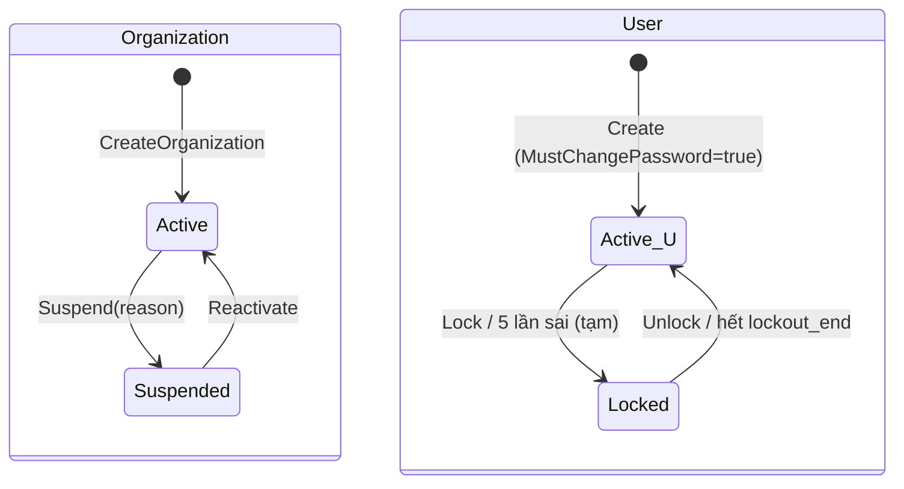

# M01 — Identity & Access (Tổ chức, Tài khoản, Phân quyền)

> **Plan mẫu chuẩn** — các module khác theo cùng cấu trúc ([_TEMPLATE.md](_TEMPLATE.md)).
> Quy ước chung: [README.md §6](README.md#6-quy-ước-dùng-chung-cross-cutting--bắt-buộc).

## 1. Mục tiêu & phạm vi

**Mục tiêu**: Quản lý **tổ chức chủ trọ** (tenant của SaaS) và **tài khoản người dùng**; xác thực (đăng nhập,
token) và phân quyền; cung cấp `ICurrentUser` (UserId, OrganizationId, Role) cho mọi module khác để cô lập dữ liệu (C-01).

**Trong phạm vi**
- SystemAdmin tạo tổ chức + tài khoản chủ trọ (OrgOwner) trong **một giao dịch**; cấp mật khẩu tạm.
- Đăng nhập bằng **số điện thoại hoặc email** + mật khẩu; JWT access token + refresh token xoay vòng.
- Bắt buộc đổi mật khẩu lần đầu; đổi mật khẩu; Admin reset mật khẩu; khóa/mở tài khoản; tạm ngưng/kích hoạt tổ chức.
- Hồ sơ cá nhân (`/me`).
- Seed SystemAdmin đầu tiên từ cấu hình khi khởi động.

**Ngoài phạm vi (P1)**
- Tự đăng ký (self sign-up) — chỉ Admin cấp tài khoản (định hướng B2B).
- Quên mật khẩu qua email/SMS (P2 — cần nhà cung cấp SMS/OTP).
- Giới hạn `OrgManager` theo từng khu, gói dịch vụ/giới hạn (P3 — đã chừa chỗ trong schema).
- SSO, 2FA (P3).

**Phase**: P0 (xác thực, ICurrentUser) + P1 (quản trị tổ chức).

## 2. Thuật ngữ

| Thuật ngữ | Code | Định nghĩa |
|-----------|------|-----------|
| Tổ chức | `Organization` | Một khách hàng B2B (một chủ trọ hoặc công ty quản lý). Đơn vị cô lập dữ liệu |
| Người dùng | `User` | Tài khoản đăng nhập. `SystemAdmin` không thuộc tổ chức; các role khác thuộc đúng 1 tổ chức |
| Vai trò | `UserRole` | `SystemAdmin`, `OrgOwner` (chủ trọ), `OrgManager` (phó quản lý — xem §3.3) |
| Mật khẩu tạm | `MustChangePassword` | Cờ bắt buộc đổi mật khẩu trước khi gọi API nghiệp vụ |
| Refresh token family | `FamilyId` | Chuỗi refresh token sinh ra từ một lần đăng nhập; phát hiện tái sử dụng → thu hồi cả family |
| Security stamp | `SecurityStamp` | Giá trị ngẫu nhiên đổi khi đổi mật khẩu/khóa → vô hiệu token cũ |

## 3. Nghiệp vụ

### 3.1 Use case

| ID | Actor | Mô tả | Kết quả |
|----|-------|-------|---------|
| ID-UC-01 | SystemAdmin | Tạo tổ chức + tài khoản chủ trọ | Org `Active`, User `OrgOwner` `MustChangePassword=true`; trả mật khẩu tạm **một lần** |
| ID-UC-02 | SystemAdmin | Xem danh sách / chi tiết tổ chức (tên, trạng thái, số khu, số phòng, ngày tạo) | Không kèm dữ liệu nghiệp vụ chi tiết |
| ID-UC-03 | SystemAdmin | Cập nhật thông tin tổ chức (tên, liên hệ, ghi chú, giới hạn) | |
| ID-UC-04 | SystemAdmin | Tạm ngưng tổ chức (lý do) | Mọi user của tổ chức không đăng nhập/refresh được; token hiện tại bị từ chối ≤ 1 phút |
| ID-UC-05 | SystemAdmin | Kích hoạt lại tổ chức | |
| ID-UC-06 | SystemAdmin | Reset mật khẩu user | Mật khẩu tạm mới, `MustChangePassword=true`, thu hồi mọi refresh token, đổi SecurityStamp |
| ID-UC-07 | SystemAdmin | Khóa / mở khóa user | |
| ID-UC-08 | Mọi user | Đăng nhập | Access token + refresh token (+ cờ `mustChangePassword`) |
| ID-UC-09 | Mọi user | Làm mới token | Cặp token mới; refresh cũ bị thu hồi |
| ID-UC-10 | Mọi user | Đăng xuất | Thu hồi refresh token hiện tại |
| ID-UC-11 | Mọi user | Đổi mật khẩu | Thu hồi refresh token khác; đổi SecurityStamp |
| ID-UC-12 | Mọi user | Xem/cập nhật hồ sơ (họ tên, email, SĐT) | Đổi email/SĐT phải còn unique |

### 3.2 Quy tắc nghiệp vụ

| Mã | Quy tắc | Nơi kiểm tra |
|----|---------|-------------|
| ID-BR-01 | Tên đăng nhập = SĐT (chuẩn hóa `0xxxxxxxxx`) **hoặc** email (lowercase). User phải có ít nhất 1 trong 2 | Validator + Domain |
| ID-BR-02 | SĐT và email **unique toàn hệ thống** (không chỉ trong tổ chức) vì dùng để đăng nhập | DB unique index trên cột đã chuẩn hóa |
| ID-BR-03 | `SystemAdmin` ⇔ `organization_id IS NULL`; role khác ⇔ `organization_id IS NOT NULL` | DB CHECK + Domain |
| ID-BR-04 | Mỗi tổ chức có **đúng 1** OrgOwner ở trạng thái không bị xóa (P1). Không được khóa OrgOwner duy nhất mà không tạm ngưng tổ chức | Domain + partial unique index |
| ID-BR-05 | Mật khẩu: ≥ 8 ký tự, có chữ và số, không trùng tên đăng nhập; tối đa 128 | Validator |
| ID-BR-06 | Sai mật khẩu 5 lần liên tiếp (đăng nhập **và** đổi mật khẩu dùng chung bộ đếm) → khóa tạm 15 phút (`lockout_end`). Đăng nhập đúng → reset bộ đếm. Khi đang khóa, đăng nhập trả **cùng lỗi `INVALID_CREDENTIALS`** dù mật khẩu đúng hay sai (không lộ tài khoản tồn tại/bị khóa, không thành công cụ dò mật khẩu). Đổi mật khẩu khi đang khóa → 423 `ACCOUNT_LOCKED` | Domain + Application |
| ID-BR-07 | User `MustChangePassword=true` chỉ được gọi: `change-password`, `logout`, `me` (GET). Còn lại → 403 `PASSWORD_CHANGE_REQUIRED` | Authorization policy |
| ID-BR-08 | Tổ chức `Suspended` hoặc user `Locked` → không đăng nhập, không refresh; access token đang có bị từ chối (kiểm tra trạng thái có cache ≤ 60s) | Middleware |
| ID-BR-09 | Refresh token dùng 1 lần. Dùng lại token **đã bị xoay vòng** (sau grace 10s) → thu hồi **toàn bộ family** và đổi security stamp (vô hiệu access token của kẻ gian). Token bị thu hồi vì đăng xuất/đổi mật khẩu/admin chỉ bị từ chối. Mỗi phiên có hạn tuyệt đối (`SessionAbsoluteDays`, mặc định 90 ngày) — xoay vòng không kéo dài quá mốc này | Domain |
| ID-BR-10 | Mật khẩu tạm sinh ngẫu nhiên 12 ký tự (CSPRNG), chỉ trả về **một lần** trong response; không lưu dạng rõ, không log | Application |
| ID-BR-11 | SystemAdmin **không** truy cập API nghiệp vụ của tổ chức (rooms, renters…) → 403. Hỗ trợ khách hàng qua impersonation có audit (P3) | Authorization policy |
| ID-BR-12 | Không xóa vật lý user/tổ chức (dữ liệu tài chính tham chiếu `created_by`). Chỉ khóa/tạm ngưng | Không có endpoint DELETE |
| ID-BR-13 | Thông báo lỗi đăng nhập **không** phân biệt "sai tài khoản" hay "sai mật khẩu" | Application |

### 3.3 Phó quản lý (OrgManager)

Chủ trọ thêm một hoặc nhiều **phó quản lý**: thao tác nghiệp vụ (khu, phòng, người thuê, hợp đồng, chỉ số, phiếu, thu tiền, xuất Excel)
**giống chủ trọ**, nhưng không quản lý thành viên và **không xem dữ liệu nhạy cảm** (số giấy tờ đầy đủ của người thuê / bên cho thuê;
xuất Excel, in hợp đồng có số đầy đủ) trừ khi chủ trọ cấp quyền (ID-BR-22). SystemAdmin chỉ quản lý tài khoản, **không** xem dữ liệu trọ (ID-BR-11).

| ID | Actor | Mô tả |
|----|-------|-------|
| ID-UC-13 | OrgOwner | Thêm phó quản lý (họ tên, SĐT/email, ghi chú) → trả mật khẩu tạm một lần, bắt buộc đổi khi đăng nhập |
| ID-UC-14 | OrgOwner, OrgManager | Xem danh sách thành viên tổ chức (chủ + phó) |
| ID-UC-15 | OrgOwner | Sửa thông tin phó quản lý |
| ID-UC-16 | OrgOwner | Khóa / mở khóa phó quản lý (tạm thời) |
| ID-UC-17 | OrgOwner | Cấp lại mật khẩu tạm cho phó quản lý |
| ID-UC-18 | OrgOwner | Gỡ phó quản lý khỏi tổ chức (vĩnh viễn) |
| ID-UC-19 ✅ | OrgOwner | Cấp / thu hồi quyền xem dữ liệu nhạy cảm cho phó quản lý (`PUT /org/members/{id}/sensitive-data-access`) |

| Mã | Quy tắc | Nơi kiểm tra |
|----|---------|-------------|
| ID-BR-14 | Chỉ OrgOwner thêm/sửa/khóa/gỡ phó quản lý. Phó quản lý không tạo được phó quản lý khác, không tác động được chủ trọ | Policy `OrgOwnerOnly` |
| ID-BR-15 | Tối đa `organizations.max_managers` phó quản lý đang hoạt động (mặc định 10) — đếm dưới khóa hàng `organizations` để 2 request song song không vượt | Application |
| ID-BR-16 | Khóa / gỡ / cấp lại mật khẩu ⇒ đổi security stamp + thu hồi mọi refresh token ⇒ phiên đang mở bị từ chối ngay | Application (transaction) |
| ID-BR-17 | Gỡ = trạng thái `Removed` (không xóa vật lý — `created_by` của phiếu, hợp đồng vẫn trỏ tới user này). Tài khoản `Removed` không đăng nhập, không khôi phục; SĐT/email được giải phóng bằng cách ẩn danh hóa trường đăng nhập | Domain |
| ID-BR-18 | SĐT/email unique toàn hệ thống ⇒ một người chỉ thuộc 1 tổ chức (P1). Cần làm cho nhiều tổ chức → P3 `memberships` | DB unique |
| ID-BR-19 | Mọi thao tác nghiệp vụ lưu `created_by`/`updated_by` ⇒ chủ trọ biết phó quản lý nào đã làm gì (bảng `audit_logs` — C-10) | AppDbContext |
| ID-BR-20 | Mật khẩu tạm (tạo tài khoản, cấp lại) hết hạn sau `Auth:TemporaryPasswordHours` (mặc định 72h). Đăng nhập **đúng** mật khẩu tạm nhưng đã hết hạn → 401 `TEMPORARY_PASSWORD_EXPIRED` (người cấp phải cấp lại) | Domain + LoginHandler |
| ID-BR-21 | Phó quản lý xem được thông tin bên cho thuê của khu (M02) và hồ sơ người thuê như chủ trọ, nhưng số giấy tờ luôn ở dạng che (`********1234`). **Đã đổi 04/10/2026** — thay mặc định cũ "phó quản lý xem số đầy đủ" bằng ID-BR-22 | Policy |
| ID-BR-22 ✅ | **Quyền dữ liệu nhạy cảm**: chủ trọ luôn có; phó quản lý chỉ khi chủ trọ cấp (`users.can_view_sensitive_data`). Áp cho: xem số giấy tờ đầy đủ (người thuê, bên cho thuê) → 403 `SENSITIVE_DATA_FORBIDDEN`; xuất Excel `includeSensitive` → 403; in hợp đồng → **vẫn in được** nhưng số giấy tờ ở dạng che. Quyền đọc từ DB ở mỗi request (không nằm trong token) ⇒ thu hồi có hiệu lực ngay. Cấp / thu hồi ghi audit; gỡ phó quản lý ⇒ mất quyền. `/me` và danh sách thành viên trả `canViewSensitiveData` để UI ẩn nút | Domain `User` + `SensitiveDataAccess` |

API (owner/manager — trong phạm vi tổ chức của mình):

| Method | Route | Quyền | Ghi chú |
|--------|-------|-------|--------|
| GET | `/org/members` | OrgMember | Danh sách chủ + phó |
| POST | `/org/members` | OrgOwner | Idempotency-Key bắt buộc; 201 + mật khẩu tạm; 409 `PHONE_TAKEN`/`EMAIL_TAKEN`; 422 `MANAGER_LIMIT_REACHED` |
| GET | `/org/members/{id}` | OrgMember | |
| PUT | `/org/members/{id}` | OrgOwner | Chỉ sửa phó quản lý; 422 `CANNOT_MODIFY_OWNER` |
| POST | `/org/members/{id}/lock` · `/unlock` | OrgOwner | |
| POST | `/org/members/{id}/reset-password` | OrgOwner | Trả mật khẩu tạm mới (no-store) |
| POST | `/org/members/{id}/remove` | OrgOwner | Không đảo ngược |

### 3.4 Vòng đời trạng thái



| Từ | Đến | Lệnh | Điều kiện | Tác động phụ |
|----|-----|------|-----------|--------------|
| Org Active | Suspended | `SuspendOrganization` | lý do 1–500 ký tự | Thu hồi mọi refresh token của tổ chức; đổi SecurityStamp mọi user; audit |
| Org Suspended | Active | `ReactivateOrganization` | — | audit |
| User Active | Locked | `LockUser` | Không phải OrgOwner duy nhất của org Active (ID-BR-04) | Thu hồi refresh token; đổi SecurityStamp |
| User Locked | Active | `UnlockUser` | — | reset `failed_login_count` |

## 4. Dữ liệu

### 4.1 Bảng

**`organizations`**

| Cột | Kiểu | Null | Mặc định | Ràng buộc / ghi chú |
|-----|------|------|----------|---------------------|
| id | uuid | N | | PK (UUIDv7) |
| code | varchar(32) | N | | UNIQUE; `^[A-Z0-9-]{3,32}$`; mã ngắn hiển thị (VD `NT-HANOI-01`) |
| name | varchar(200) | N | | |
| contact_name | varchar(200) | Y | | |
| contact_phone | varchar(15) | Y | | chuẩn hóa |
| contact_email | varchar(254) | Y | | lowercase |
| tax_code | varchar(14) | Y | | MST 10 hoặc 13 số (dạng `xxxxxxxxxx-xxx`) |
| status | varchar(16) | N | 'Active' | CHECK in (`Active`,`Suspended`) |
| suspended_reason | varchar(500) | Y | | NOT NULL khi Suspended (CHECK) |
| max_properties | int | Y | | null = không giới hạn (P3 dùng) |
| max_rooms | int | Y | | |
| max_managers | int | N | 10 | số phó quản lý tối đa (ID-BR-15), CHECK 0–100 |
| address | varchar(500) | Y | | địa chỉ liên hệ của tổ chức |
| note | text | Y | | |
| created_at / created_by / updated_at / updated_by | timestamptz / uuid | | | |
| xmin | xid | | | concurrency token (C-07) |

**`users`**

| Cột | Kiểu | Null | Ràng buộc / ghi chú |
|-----|------|------|---------------------|
| id | uuid | N | PK |
| organization_id | uuid | Y | FK → organizations(id); NULL ⇔ SystemAdmin (CHECK) |
| role | varchar(16) | N | CHECK in (`SystemAdmin`,`OrgOwner`,`OrgManager`) |
| full_name | varchar(200) | N | |
| phone_normalized | varchar(15) | Y | UNIQUE (partial: NOT NULL) |
| email_normalized | varchar(254) | Y | UNIQUE (partial: NOT NULL) |
| password_hash | varchar(256) | N | ASP.NET Core `PasswordHasher<T>` (PBKDF2, V3) |
| security_stamp | uuid | N | đổi khi đổi MK / khóa / reset |
| must_change_password | bool | N | |
| status | varchar(16) | N | `Active`,`Locked`,`Removed` (Removed: phó quản lý đã gỡ — ID-BR-17) |
| failed_login_count | int | N | default 0, CHECK ≥ 0 |
| lockout_end | timestamptz | Y | |
| last_login_at | timestamptz | Y | |
| temp_password_expires_at | timestamptz | Y | hạn mật khẩu tạm (ID-BR-20); NULL khi mật khẩu đã đổi |
| can_view_sensitive_data | bool | N | false — phó quản lý được chủ trọ cấp quyền dữ liệu nhạy cảm (ID-BR-22); chủ trọ bỏ qua cờ này |
| password_changed_at | timestamptz | Y | lần đổi mật khẩu gần nhất |
| removed_at / removed_by | timestamptz / uuid | Y | CHECK: NOT NULL ⇔ status = `Removed` |
| created_at/by, updated_at/by, xmin | | | |

CHECK: `phone_normalized IS NOT NULL OR email_normalized IS NOT NULL`;
CHECK: `(role = 'SystemAdmin') = (organization_id IS NULL)`.

**`refresh_tokens`**

| Cột | Kiểu | Null | Ghi chú |
|-----|------|------|--------|
| id | uuid | N | PK |
| user_id | uuid | N | FK users |
| family_id | uuid | N | |
| token_hash | char(64) | N | SHA-256 hex của token ngẫu nhiên 32 byte; UNIQUE |
| security_stamp | uuid | N | stamp tại thời điểm phát hành; lệch → từ chối |
| expires_at | timestamptz | N | 30 ngày |
| created_at | timestamptz | N | |
| created_ip | inet | Y | |
| revoked_at | timestamptz | Y | |
| revoked_reason | varchar(32) | Y | `Rotated`,`Logout`,`Reuse`,`PasswordChanged`,`AdminAction` |
| replaced_by_id | uuid | Y | |

Dọn rác: job xóa token hết hạn > 7 ngày (P2; P1 chấp nhận tăng dần).

**(P3, chừa chỗ)** `user_property_access(organization_id, user_id, property_id)` cho `OrgManager`.

### 4.2 Ràng buộc & index

- `UNIQUE (phone_normalized) WHERE phone_normalized IS NOT NULL`
- `UNIQUE (email_normalized) WHERE email_normalized IS NOT NULL`
- `UNIQUE (organization_id) WHERE role = 'OrgOwner'` → đúng 1 owner / tổ chức (ID-BR-04)
- `INDEX refresh_tokens (user_id) WHERE revoked_at IS NULL`
- `organizations`: `UNIQUE (code)`.
- `users` là bảng **ngoài** global filter C-01 (admin cần đọc chéo), nhưng mọi query của OrgOwner lên `users` phải lọc `organization_id` tường minh.

### 4.3 Dữ liệu dẫn xuất
- `User.IsLockedOut(now) = status = Locked || lockout_end > now`.
- Số khu / số phòng của tổ chức (ID-UC-02): đếm on-demand từ M02, không lưu.

## 5. Domain model

```
Organization (aggregate root)
  + Create(code, name, contact..., now) : Organization
  + Suspend(reason, now) : Result          // Active → Suspended
  + Reactivate(now) : Result
  + UpdateProfile(...)

User (aggregate root)
  + CreateOrgOwner(orgId, fullName, phone?, email?, passwordHash, now)
  + CreateSystemAdmin(...)
  + RecordFailedLogin(now) : void         // ++count; ≥5 → lockout_end = now+15m
  + RecordSuccessfulLogin(now)
  + ChangePassword(newHash) : void        // must_change=false, new stamp
  + ResetPassword(tempHash) : void        // must_change=true, new stamp
  + Lock() / Unlock()

RefreshToken (entity, aggregate riêng)
  + Issue(userId, familyId, stamp, now, ttl) : (entity, rawToken)
  + Rotate(now) : (newEntity, rawToken)   // revoked_reason=Rotated
  + Revoke(reason, now)
```
Domain không phụ thuộc ASP.NET Identity; băm mật khẩu qua interface `IPasswordHasher` (Application) hiện thực bằng `PasswordHasher<User>` (Infrastructure).

## 6. Application — Commands / Queries

| Use case | Loại | Input | Output | Lỗi nghiệp vụ |
|----------|------|-------|--------|---------------|
| `CreateOrganizationCommand` | Cmd | code, name, contact*, taxCode?, owner{fullName, phone?, email?} | orgId, ownerUserId, **temporaryPassword** | `ORG_CODE_TAKEN`, `PHONE_TAKEN`, `EMAIL_TAKEN` |
| `ListOrganizationsQuery` | Qry | search?, status?, page | page of OrgSummary (kèm propertyCount, roomCount) | |
| `GetOrganizationQuery` | Qry | id | OrgDetail + danh sách user (không password) | `NOT_FOUND` |
| `UpdateOrganizationCommand` | Cmd | id, version, fields | OrgDetail | `CONCURRENCY_CONFLICT` |
| `SuspendOrganizationCommand` | Cmd | id, reason | — | `ORG_ALREADY_SUSPENDED` |
| `ReactivateOrganizationCommand` | Cmd | id | — | `ORG_NOT_SUSPENDED` |
| `ResetUserPasswordCommand` | Cmd | userId | temporaryPassword | `NOT_FOUND` |
| `LockUserCommand` / `UnlockUserCommand` | Cmd | userId | — | `CANNOT_LOCK_SOLE_OWNER` |
| `LoginCommand` | Cmd | username, password, ip | TokenPair, mustChangePassword | `INVALID_CREDENTIALS` (kể cả khi bị khóa — ID-BR-06), `ORGANIZATION_SUSPENDED` |
| `RefreshTokenCommand` | Cmd | refreshToken | TokenPair | `INVALID_REFRESH_TOKEN` (mọi trường hợp: hết hạn, thu hồi, reuse, stamp lệch) |
| `LogoutCommand` | Cmd | refreshToken | — | (luôn 204) |
| `ChangePasswordCommand` | Cmd | currentPassword, newPassword | TokenPair mới | `INVALID_CURRENT_PASSWORD`, `PASSWORD_REUSED` |
| `GetMeQuery` | Qry | — | MeDto (id, fullName, role, org{id,name}, mustChangePassword) | |
| `UpdateMeCommand` | Cmd | fullName, phone?, email?, version | MeDto | `PHONE_TAKEN`, `EMAIL_TAKEN` |

`ICurrentUser` (Application/Common/Interfaces): `Guid UserId`, `Guid? OrganizationId`, `UserRole Role`, `bool IsSystemAdmin`.
Hiện thực đọc claim `sub`, `org`, `role` từ `HttpContext.User`.

## 7. API

Tiền tố `/api/v1`. Lỗi theo C-09.

| Method | Route | Quyền | Response | Mã lỗi chính |
|--------|-------|-------|----------|--------------|
| POST | `/auth/login` | Anonymous, rate limit | 200 TokenResponse | 401 `INVALID_CREDENTIALS`, 403 `ORGANIZATION_SUSPENDED`, 429 |
| POST | `/auth/refresh` | Anonymous, rate limit | 200 TokenResponse | 401 `INVALID_REFRESH_TOKEN` |
| POST | `/auth/logout` | Authenticated | 204 | |
| POST | `/auth/change-password` | Authenticated (kể cả MustChange) | 200 TokenResponse | 400, 422 `INVALID_CURRENT_PASSWORD` |
| GET | `/me` | Authenticated | 200 MeDto | |
| PUT | `/me` | Authenticated | 200 MeDto | 409 `PHONE_TAKEN`/`EMAIL_TAKEN`/`CONCURRENCY_CONFLICT` |
| GET | `/admin/organizations` | SystemAdmin | 200 Page | |
| POST | `/admin/organizations` | SystemAdmin | 201 + Location | 409 `ORG_CODE_TAKEN`/`PHONE_TAKEN`/`EMAIL_TAKEN` |
| GET | `/admin/organizations/{id}` | SystemAdmin | 200 | 404 |
| PUT | `/admin/organizations/{id}` | SystemAdmin | 200 | 409 |
| POST | `/admin/organizations/{id}/suspend` | SystemAdmin | 204 | 409 `ORG_ALREADY_SUSPENDED` |
| POST | `/admin/organizations/{id}/reactivate` | SystemAdmin | 204 | 409 `ORG_NOT_SUSPENDED` |
| POST | `/admin/users/{id}/reset-password` | SystemAdmin | 200 `{ temporaryPassword }` | 404 |
| POST | `/admin/users/{id}/lock` | SystemAdmin | 204 | 422 `CANNOT_LOCK_SOLE_OWNER` |
| POST | `/admin/users/{id}/unlock` | SystemAdmin | 204 | |

**Ví dụ — tạo tổ chức**

```http
POST /api/v1/admin/organizations
{
  "code": "NT-CAUGIAY",
  "name": "Nhà trọ Cầu Giấy - Anh Minh",
  "contactName": "Nguyễn Văn Minh",
  "contactPhone": "0912345678",
  "taxCode": null,
  "owner": { "fullName": "Nguyễn Văn Minh", "phone": "0912345678", "email": "minh@example.com" }
}
```
```json
201 Created
Location: /api/v1/admin/organizations/0192f3a0-...
Cache-Control: no-store
{
  "organizationId": "0192f3a0-...",
  "ownerUserId": "0192f3a1-...",
  "username": "0912345678",
  "temporaryPassword": "q7Rk2mXw9pLa"
}
```

**Ví dụ — đăng nhập**

```json
POST /api/v1/auth/login
{ "username": "0912345678", "password": "q7Rk2mXw9pLa" }

200 OK
{
  "accessToken": "eyJ...", "accessTokenExpiresAt": "2026-10-01T08:15:00Z",
  "refreshToken": "base64url-32-bytes", "refreshTokenExpiresAt": "2026-10-31T08:00:00Z",
  "mustChangePassword": true
}
```
Access token claims: `sub`, `org` (nếu có), `role`, `stamp`, `jti`, `exp`. Ký HS256 với key ≥ 256 bit từ secret (hoặc RS256 nếu cần nhiều service — P3).

## 8. Validation

| Field | Quy tắc | Mã lỗi |
|-------|---------|--------|
| `organization.code` | bắt buộc, `^[A-Z0-9-]{3,32}$` (tự upper-case) | `INVALID_FORMAT` |
| `organization.name` | bắt buộc, trim, 1–200 | `REQUIRED`, `MAX_LENGTH` |
| `taxCode` | null hoặc `^\d{10}(-\d{3})?$` | `INVALID_TAX_CODE` |
| `phone` | chuẩn hóa: bỏ khoảng trắng/dấu chấm; `+84`/`84` → `0`; sau chuẩn hóa `^0(3\|5\|7\|8\|9)\d{8}$` | `INVALID_PHONE` |
| `email` | trim + lowercase, ≤ 254, định dạng email | `INVALID_EMAIL` |
| owner | có ít nhất phone hoặc email (ID-BR-01) | `USERNAME_REQUIRED` |
| `fullName` | 1–200, không toàn khoảng trắng | |
| `password` (mới) | ID-BR-05; khác mật khẩu hiện tại | `WEAK_PASSWORD`, `PASSWORD_REUSED` |
| `suspend.reason` | 1–500 | |
| `username` (login) | trim; nếu chứa `@` → email chuẩn hóa, ngược lại → phone chuẩn hóa | (lỗi chung `INVALID_CREDENTIALS`) |

## 9. Phân quyền

| Hành động | SystemAdmin | OrgOwner | OrgManager |
|-----------|:-:|:-:|:-:|
| Quản lý tổ chức, reset/khóa user | ✅ | ❌ | ❌ |
| API nghiệp vụ (M02–M10) | ❌ (ID-BR-11) | ✅ tổ chức mình | ✅ như chủ trọ (P1); P3 theo khu được gán |
| `/me`, đổi mật khẩu | ✅ | ✅ | ✅ |
| Quản lý phó quản lý (§3.3) | ❌ | ✅ | ❌ |
| Xem / xuất / in số giấy tờ đầy đủ (ID-BR-22) | ❌ | ✅ | Chỉ khi chủ trọ cấp quyền |
| Cấp / thu hồi quyền dữ liệu nhạy cảm | ❌ | ✅ | ❌ |
| Xem danh sách thành viên tổ chức | ✅ (chỉ thông tin tài khoản) | ✅ | ✅ (chỉ xem) |

Policies: `RequireSystemAdmin`, `RequireOrgMember` (role ∈ OrgOwner/OrgManager ∧ org Active ∧ !MustChangePassword).
Mặc định **mọi endpoint** yêu cầu `RequireOrgMember` (fallback policy); chỉ endpoint auth/admin khai báo khác.

## 10. Toàn vẹn dữ liệu & concurrency

| Kịch bản | Rủi ro | Giải pháp |
|----------|--------|----------|
| 2 admin tạo tổ chức cùng SĐT chủ trọ | Trùng tài khoản | Unique index; bắt `23505` → 409 `PHONE_TAKEN` |
| Tạo org thành công nhưng tạo user lỗi | Org mồ côi không có owner | Một `SaveChangesAsync` cho cả 2 aggregate (cùng transaction) |
| 2 request refresh song song cùng token (tab trình duyệt) | Một bị coi là reuse → logout cả family | Xoay vòng bằng `UPDATE … WHERE revoked_at IS NULL` + kiểm số dòng ⇒ đúng 1 request thắng. Grace window 10 giây: token vừa bị `Rotated` < 10s mà bị dùng lại → chỉ trả 401, **không** thu hồi family (client dùng token mới từ response thắng). *(Đã sửa so với bản đầu: không thể "trả lại cùng token kế nhiệm" vì DB chỉ lưu hash, không lưu token gốc.)* |
| Đổi mật khẩu khi token cũ còn hạn | Phiên cũ vẫn dùng được | SecurityStamp mới; middleware so `stamp` claim với cache (≤60s) |
| Tạm ngưng org | Access token còn hạn 15' | Middleware kiểm org status cache ≤ 60s (ID-BR-08) |
| Đếm sai đăng nhập song song | Bộ đếm lệch | `UPDATE users SET failed_login_count = failed_login_count + 1` nguyên tử |

## 11. Audit & bảo mật

- Audit: tạo/sửa/tạm ngưng tổ chức, reset mật khẩu, khóa/mở, đăng nhập thành công/thất bại (bảng `login_events` riêng: user_id?, username_hash, ip, success, reason, at).
- Không log mật khẩu, token, mật khẩu tạm. Response chứa mật khẩu tạm có `Cache-Control: no-store`.
- Rate limit (ASP.NET Core RateLimiter): `/auth/login` 5 req/phút theo IP+username, 20 req/phút theo IP; `/auth/refresh` 30/phút/IP.
- Chống timing attack: khi username không tồn tại vẫn chạy hash giả.
- Seed SystemAdmin: đọc `Bootstrap:AdminPhone`/`AdminPassword` từ secret; chỉ chạy khi chưa có SystemAdmin nào.

## 12. Kế hoạch test

**Unit (Domain)**
- `RecordFailedLogin` 5 lần → lockout 15'; lần đăng nhập đúng reset bộ đếm.
- `Suspend` khi đã Suspended → Failure.
- `Rotate` refresh token đã revoked → Failure.
- Chuẩn hóa SĐT: `+84 912 345 678`, `84912345678`, `0912.345.678` → `0912345678`; `0123456789` → invalid.

**Integration (API + Testcontainers)**
- Admin tạo org → owner đăng nhập → mustChange=true → gọi `/api/v1/rooms` bị 403 `PASSWORD_CHANGE_REQUIRED` → đổi MK → gọi được.
- Tạo org trùng SĐT owner → 409 `PHONE_TAKEN`, không có org rác trong DB.
- Refresh reuse sau grace window → 401 và toàn bộ family bị thu hồi.
- Tạm ngưng org → login 403; access token cũ bị từ chối sau ≤ 60s (dùng FakeTimeProvider/cache TTL 0 trong test).
- OrgOwner gọi `/admin/*` → 403; SystemAdmin gọi `/api/v1/rooms` → 403.
- Rate limit login trả 429.

**E2E**: F1 onboarding.

## 13. Phụ thuộc
- Không phụ thuộc module nghiệp vụ. Mọi module phụ thuộc M01 qua `ICurrentUser` và policy `RequireOrgMember`.
- M02 cung cấp `IOrganizationStatsQuery` (đếm khu/phòng) cho ID-UC-02 — gọi qua interface để tránh phụ thuộc vòng.

## 14. Task breakdown

| ID | Task | Lớp | Ước lượng | Phụ thuộc |
|----|------|-----|-----------|-----------|
| ID-01 | Entity `Organization`, `User`, `RefreshToken` + unit test | Domain | 1d | P0-03 |
| ID-02 | EF config + migration + index/CHECK | Infra | 0.5d | ID-01 |
| ID-03 | `IPasswordHasher`, `ITokenService` (JWT), cấu hình JwtBearer, fallback policy | Infra/API | 1d | ID-01 |
| ID-04 | Login / Refresh / Logout / ChangePassword + rate limit | App/API | 1.5d | ID-03 |
| ID-05 | `ICurrentUser`, middleware kiểm stamp + org status (cache) | API | 0.5d | ID-03 |
| ID-06 | Admin: CRUD tổ chức, suspend/reactivate, reset/lock/unlock | App/API | 1.5d | ID-02 |
| ID-07 | Seed SystemAdmin | Infra | 0.25d | ID-02 |
| ID-08 | Integration tests §12 | Test | 1.5d | ID-04, ID-06 |

## 15. Câu hỏi mở

| # | Câu hỏi | Đề xuất mặc định |
|---|---------|------------------|
| Q1 | Giao mật khẩu tạm cho chủ trọ thế nào? | Admin copy và gửi thủ công (P1); P2 gửi SMS/Zalo OA |
| Q2 | Một người có thể là chủ của nhiều tổ chức? | Không (P1): mỗi SĐT/email 1 tài khoản. Nếu cần, P3 tách `memberships` |
| Q3 | Lưu refresh token ở đâu phía client (web)? | Cookie `HttpOnly; Secure; SameSite=Strict` cho web; body JSON cho mobile |
| Q4 | Admin có cần xem dữ liệu chủ trọ để hỗ trợ? | P3 impersonation có thời hạn + audit + thông báo cho chủ trọ |

## 16. Checklist review
- [x] Bảng nghiệp vụ M01 không cần `organization_id` filter toàn cục — đã ghi chú lọc tường minh
- [x] Không xóa vật lý user/tổ chức
- [x] Mọi BR có nơi kiểm tra + test
- [x] Race condition refresh/đếm sai mật khẩu đã xử lý
- [x] Thời gian dùng `TimeProvider`
- [x] Mã lỗi liệt kê đầy đủ
