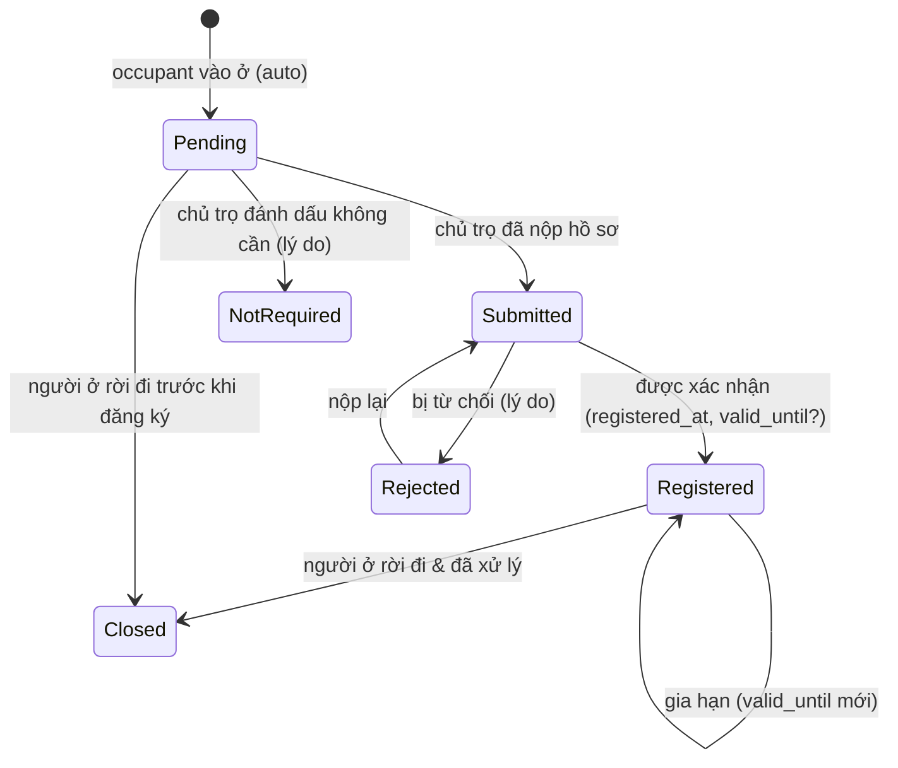

# M03 — Renter & Residence (Người thuê, Cư trú, Tạm vắng)

> Theo khuôn [_TEMPLATE.md](_TEMPLATE.md). Pháp lý: L5–L8, L11, L14 trong [00-legal-basis.md](00-legal-basis.md).

## 1. Mục tiêu & phạm vi

**Mục tiêu**: Lưu **hồ sơ người thuê / người ở** (renter) rõ ràng, chính xác, bảo vệ dữ liệu cá nhân; theo dõi
**tình trạng cư trú** (đăng ký tạm trú, thông báo lưu trú, khai báo tạm trú người nước ngoài) và **tạm vắng** của từng người.

**Trong phạm vi**: CRUD hồ sơ, tìm kiếm, chống trùng theo số giấy tờ; ghi nhận đồng ý xử lý dữ liệu;
bản ghi cư trú + trạng thái + file xác nhận; bản ghi tạm vắng; ẩn danh hóa theo yêu cầu.

**Ngoài phạm vi**: nộp hồ sơ lên VNeID/Cổng DVC; xác thực CCCD với CSDL quốc gia; OCR CCCD (P3).

**Phase**: P1 (hồ sơ + bản ghi cư trú), P2 (nhắc việc tự động, dashboard tuân thủ).

## 2. Thuật ngữ

| Thuật ngữ | Code | Định nghĩa |
|-----------|------|-----------|
| Người thuê | `Renter` | Một con người (hồ sơ). Có thể là người đại diện ký HĐ và/hoặc người ở (occupant) — vai trò nằm ở M05 |
| Giấy tờ | `IdDocument` | `CitizenId` (CCCD/thẻ căn cước 12 số), `LegacyId` (CMND 9 số – chỉ để lưu lịch sử), `Passport` |
| Bản ghi cư trú | `ResidenceRecord` | Theo dõi thủ tục cư trú của 1 người ở tại 1 hợp đồng |
| Loại cư trú | `ResidenceType` | `TemporaryResidence` (tạm trú ≥30 ngày), `StayNotice` (lưu trú <30 ngày), `ForeignerResidence` |
| Tạm vắng | `AbsenceRecord` | Khoảng thời gian người ở vắng mặt (ghi nhận thông tin) |
| Đồng ý | `Consent` | Ghi nhận người thuê đồng ý cho chủ trọ thu thập/xử lý dữ liệu (L11) |

## 3. Nghiệp vụ

### 3.1 Use case

| ID | Mô tả |
|----|-------|
| RT-UC-01 | Tạo hồ sơ người thuê (có thể kèm ảnh CCCD mặt trước/sau, ảnh chân dung — M09) |
| RT-UC-02 | Tìm người thuê theo tên, SĐT, **số giấy tờ (khớp chính xác)**; gợi ý hồ sơ cũ khi nhập trùng số giấy tờ |
| RT-UC-03 | Sửa hồ sơ |
| RT-UC-04 | Xem lịch sử thuê của người (các hợp đồng, phòng, thời gian) |
| RT-UC-05 | Ghi nhận đồng ý xử lý dữ liệu (phương thức: ký giấy / điều khoản trong HĐ / xác nhận miệng có chứng cứ) |
| RT-UC-06 | Xem / cập nhật bản ghi cư trú: trạng thái, ngày nộp, ngày được xác nhận, hạn tạm trú, số tham chiếu, ảnh xác nhận |
| RT-UC-07 | Ghi nhận tạm vắng (từ ngày – đến ngày, lý do, đã khai báo hay chưa) |
| RT-UC-08 | Danh sách "cần xử lý cư trú": người ở chưa đăng ký / sắp hết hạn tạm trú / đã rời đi chưa xử lý |
| RT-UC-09 | Ẩn danh hóa hồ sơ theo yêu cầu (khi không còn hợp đồng hiệu lực & hết thời hạn lưu giữ) |
| RT-UC-10 | Xem số giấy tờ đầy đủ (có audit) |

### 3.2 Quy tắc nghiệp vụ

| Mã | Quy tắc | Nơi kiểm tra |
|----|---------|-------------|
| RT-BR-01 | Bắt buộc: họ tên, ngày sinh, giới tính, loại + số giấy tờ, quốc tịch. SĐT không bắt buộc (trẻ em, người già) nhưng **người đại diện ký HĐ phải có SĐT** (kiểm ở M05) | Validator / M05 |
| RT-BR-02 | Số giấy tờ unique **trong tổ chức** theo `(id_type, id_number_hash)`. Trùng → 409 kèm id hồ sơ cũ để dùng lại (không tạo bản sao) | DB unique |
| RT-BR-03 | Số giấy tờ có thể **sửa** (nhập sai) nhưng mọi thay đổi được audit; không cho sửa khi hồ sơ đã ẩn danh | Domain |
| RT-BR-04 | Quốc tịch ≠ `VN` ⇒ loại giấy tờ bắt buộc `Passport` (hoặc giấy tờ khác ghi chú) ; quốc tịch `VN` và ≥ 14 tuổi ⇒ `CitizenId` (khuyến nghị, cảnh báo nếu khác) | Validator (cảnh báo) |
| RT-BR-05 | Không xóa vật lý hồ sơ đã gắn hợp đồng. Archive = ẩn khỏi tìm kiếm mặc định | Application |
| RT-BR-06 | Ẩn danh hóa: chỉ khi không có HĐ `Draft/Active/Liquidating`; thay họ tên = "Đã ẩn danh #xxxx", xóa SĐT/email/địa chỉ/ngày sinh/số giấy tờ/liên hệ khẩn cấp; hard delete file nhạy cảm (M09, FS-BR-09); **thay cả bản snapshot tên** trên phiếu báo (`invoices.snapshot_representative_name`) và phiếu thu (`payer_name`) — ngoại lệ duy nhất cho quy tắc bất biến C-06, chỉ chạy qua lệnh ẩn danh, có audit; **xóa giá trị cá nhân trong `audit_logs.changes`** của renter đó. Giữ liên kết & số liệu tài chính. Không đảo ngược | Domain + Application |
| RT-BR-07 | **Bản ghi cư trú tự sinh** khi occupant được thêm vào HĐ và HĐ ở trạng thái Active (hoặc khi kích hoạt HĐ): loại theo LEG-03 (dự kiến ở ≥ 30 ngày → `TemporaryResidence`; < 30 → `StayNotice`; nước ngoài → `ForeignerResidence`), trạng thái `Pending` | Domain event từ M05, xử lý trong cùng transaction |
| RT-BR-08 | Mỗi (occupant stay của HĐ, loại) có tối đa 1 bản ghi cư trú chưa đóng (`Pending/Submitted/Registered`) | DB partial unique |
| RT-BR-09 | `Registered` yêu cầu `registered_at`; `valid_until` (nếu có) > `registered_at` | Domain + CHECK |
| RT-BR-10 | Occupant rời đi (M05) ⇒ bản ghi cư trú đang mở chuyển cờ `needs_deregistration = true` (nhắc chủ trọ); chủ trọ xác nhận → `Closed` | Domain event |
| RT-BR-11 | Tạm vắng: `from_date ≤ to_date`; không chồng lấn với tạm vắng khác của cùng người trong cùng HĐ; phải nằm trong thời gian ở của occupant | Domain + EXCLUDE |
| RT-BR-12 | Tạm vắng **không** tự động giảm tiền (chủ trọ dùng điều chỉnh thủ công M07 nếu muốn) | Thiết kế |
| RT-BR-13 | Tuổi: ngày sinh ≤ hôm nay và ≥ 1900-01-01 | Validator |

### 3.3 Vòng đời bản ghi cư trú



## 4. Dữ liệu

### 4.1 Bảng

**`renters`**

| Cột | Kiểu | Null | Ghi chú |
|-----|------|------|--------|
| id, organization_id | uuid | N | UNIQUE (organization_id, id) |
| full_name | varchar(200) | N | |
| full_name_search | varchar(200) | N | bỏ dấu + lowercase (tìm kiếm không dấu); index trigram (`pg_trgm`) |
| date_of_birth | date | Y | NULL chỉ khi đã ẩn danh |
| gender | varchar(8) | Y | `Male`,`Female`,`Other` |
| phone_normalized | varchar(15) | Y | |
| email | varchar(254) | Y | |
| nationality | char(2) | N | ISO 3166-1 alpha-2, mặc định `VN` |
| id_type | varchar(16) | Y | `CitizenId`,`LegacyId`,`Passport` |
| id_number_encrypted | bytea | Y | AES-GCM (C-11) |
| id_number_hash | char(64) | Y | HMAC-SHA256(org_id + normalized number) — unique, tìm chính xác |
| id_number_last4 | varchar(4) | Y | hiển thị dạng `********1234` |
| id_issue_date | date | Y | |
| id_issue_place | varchar(200) | Y | |
| permanent_province_code / permanent_commune_code | varchar(10) | Y | C-12 |
| permanent_street_address | varchar(300) | Y | |
| permanent_address_text | varchar(500) | Y | địa chỉ nguyên văn trên giấy tờ (có thể 3 cấp cũ) |
| occupation / workplace | varchar(200) | Y | |
| emergency_contact_name / emergency_contact_phone | varchar | Y | |
| note | text | Y | |
| archived_at | timestamptz | Y | |
| anonymized_at | timestamptz | Y | |
| audit cols, xmin | | | |

CHECK: `anonymized_at IS NOT NULL OR (id_type IS NOT NULL AND id_number_hash IS NOT NULL AND date_of_birth IS NOT NULL)`.

**`renter_consents`**: id, organization_id, renter_id, purpose varchar(100) (VD `contract_management`, `residence_registration`),
method varchar(20) (`PaperSigned`,`ContractClause`,`Verbal`), given_at date, withdrawn_at date null, attachment_id null (M09), note, audit.

**`residence_records`**

| Cột | Kiểu | Null | Ghi chú |
|-----|------|------|--------|
| id, organization_id | uuid | N | |
| renter_id | uuid | N | FK composite |
| contract_id | uuid | N | FK composite (M05) |
| occupancy_id | uuid | N | FK composite → contract_occupants (M05) |
| property_id | uuid | N | denormalized để lọc nhanh; phải = khu của HĐ (kiểm ở domain khi tạo) |
| type | varchar(24) | N | `TemporaryResidence`,`StayNotice`,`ForeignerResidence` |
| status | varchar(16) | N | `Pending`,`Submitted`,`Registered`,`Rejected`,`NotRequired`,`Closed` |
| submitted_at | date | Y | |
| registered_at | date | Y | |
| valid_until | date | Y | hạn tạm trú (nếu có) |
| reference_no | varchar(50) | Y | số tiếp nhận/xác nhận |
| status_reason | varchar(500) | Y | bắt buộc khi Rejected/NotRequired |
| needs_deregistration | bool | N | false |
| closed_at | date | Y | |
| audit cols, xmin | | | |

- CHECK `status <> 'Registered' OR registered_at IS NOT NULL`; CHECK `valid_until IS NULL OR registered_at IS NULL OR valid_until > registered_at`.
- UNIQUE `(occupancy_id, type) WHERE status IN ('Pending','Submitted','Registered','Rejected')` (RT-BR-08).
- Ảnh/file xác nhận → M09 owner_type `ResidenceRecord`.

**`absence_records`**: id, organization_id, renter_id, occupancy_id, from_date date, to_date date, reason varchar(500),
declared bool, declared_at date null, audit, xmin.
- CHECK `from_date <= to_date`.
- `EXCLUDE USING gist (occupancy_id WITH =, daterange(from_date, to_date, '[]') WITH &&)` (cần `btree_gist`).

### 4.2 Index
- `UNIQUE (organization_id, id_type, id_number_hash) WHERE id_number_hash IS NOT NULL`.
- `INDEX renters (organization_id, phone_normalized)`; GIN trigram trên `full_name_search`.
- `INDEX residence_records (organization_id, property_id, status)`.

### 4.3 Dẫn xuất
- `IsCurrentlyStaying` (từ M05 occupancies).
- Danh sách RT-UC-08: query `residence_records` status `Pending/Rejected` hoặc `Registered` có `valid_until` ≤ hôm nay + 30 ngày, hoặc `needs_deregistration`.

## 5. Domain model

```
Renter (aggregate root)
  + Create(orgId, PersonalInfo, IdDocument, Address?, now)
  + UpdateInfo(...), ChangeIdDocument(IdDocument)   // audit lý do
  + Archive(), Anonymize(now)                         // RT-BR-06
IdDocument (VO): Type, Number(normalized) — validate theo type
ResidenceRecord (aggregate root)
  + CreateForOccupancy(occupancy, renter, expectedStayDays, nationality)  // chọn type
  + Submit(date, ref?), Register(date, validUntil?, ref?), Reject(reason), MarkNotRequired(reason)
  + Extend(newValidUntil), FlagDeregistration(), Close(date)
AbsenceRecord (entity, aggregate riêng): Create(...), Update(...)
```
Mã hóa/giải mã số giấy tờ qua `IPersonalDataProtector` (Application interface, Infrastructure hiện thực, khóa xoay vòng có `key_id`).

## 6. Application — Commands / Queries

| Use case | Loại | Lỗi nghiệp vụ |
|----------|------|---------------|
| `CreateRenterCommand` | Cmd | `RENTER_ID_NUMBER_EXISTS` (kèm `existingRenterId`) |
| `UpdateRenterCommand` | Cmd | `RENTER_ID_NUMBER_EXISTS`, `RENTER_ANONYMIZED`, `CONCURRENCY_CONFLICT` |
| `SearchRentersQuery` | Qry | `q` (tên không dấu/SĐT), `idNumber` (khớp chính xác qua hash), `propertyId`, `staying` |
| `GetRenterQuery` | Qry | số giấy tờ đã che |
| `RevealRenterIdNumberQuery` | Qry | ghi audit "read sensitive" |
| `GetRenterRentalHistoryQuery` | Qry | |
| `ArchiveRenterCommand` / `AnonymizeRenterCommand` | Cmd | `RENTER_HAS_ACTIVE_CONTRACT` |
| `AddConsentCommand` / `WithdrawConsentCommand` | Cmd | |
| `ListResidenceRecordsQuery` | Qry | filter propertyIds, status, type, needsAction |
| `SubmitResidenceCommand` / `RegisterResidenceCommand` / `RejectResidenceCommand` / `MarkResidenceNotRequiredCommand` / `ExtendResidenceCommand` / `CloseResidenceCommand` | Cmd | `INVALID_RESIDENCE_TRANSITION` |
| `CreateAbsenceCommand` / `UpdateAbsenceCommand` / `DeleteAbsenceCommand` | Cmd | `ABSENCE_OVERLAP`, `ABSENCE_OUTSIDE_STAY` |

## 7. API

| Method | Route | Mã lỗi |
|--------|-------|--------|
| GET | `/renters?q=&idNumber=&propertyId=&staying=true` | |
| POST | `/renters` | 409 `RENTER_ID_NUMBER_EXISTS` |
| GET / PUT | `/renters/{id}` | 404, 409, 422 `RENTER_ANONYMIZED` |
| POST | `/renters/{id}/reveal-id-number` | (POST để không bị cache/prefetch; audit) |
| GET | `/renters/{id}/rental-history` | |
| POST | `/renters/{id}/archive` · `/anonymize` | 422 `RENTER_HAS_ACTIVE_CONTRACT` |
| GET/POST | `/renters/{id}/consents`; POST `/consents/{id}/withdraw` | |
| GET | `/residence-records?propertyIds=&status=&needsAction=true` | |
| POST | `/residence-records/{id}/submit` · `/register` · `/reject` · `/not-required` · `/extend` · `/close` | 422 `INVALID_RESIDENCE_TRANSITION` |
| GET/POST | `/occupancies/{occupancyId}/absences`; PUT/DELETE `/absences/{id}` | 409 `ABSENCE_OVERLAP` |

**Ví dụ — tạo người thuê**
```json
POST /api/v1/renters
{
  "fullName": "Trần Thị Lan", "dateOfBirth": "2002-04-15", "gender": "Female",
  "phone": "0987654321", "nationality": "VN",
  "idDocument": { "type": "CitizenId", "number": "001302012345", "issueDate": "2021-06-01", "issuePlace": "Cục CS QLHC về TTXH" },
  "permanentAddress": { "provinceCode": "01", "communeCode": "00004", "streetAddress": "Số 5 ngõ 10", "addressText": "Số 5 ngõ 10, P. Trúc Bạch, Q. Ba Đình, Hà Nội" },
  "occupation": "Sinh viên"
}
→ 201 { "id": "...", "idNumberMasked": "********2345", ... }
→ 409 { "code": "RENTER_ID_NUMBER_EXISTS", "existingRenterId": "..." }
```

## 8. Validation

| Field | Quy tắc | Mã lỗi |
|-------|---------|--------|
| fullName | 1–200, chữ cái (kể cả tiếng Việt), khoảng trắng, `'.-` | `INVALID_NAME` |
| dateOfBirth | 1900-01-01 ≤ d ≤ hôm nay (C-04) | `INVALID_DATE_OF_BIRTH` |
| idDocument.number — CitizenId | đúng 12 chữ số; 3 số đầu là mã tỉnh hợp lệ (001–096); chữ số thứ 4 (giới tính/thế kỷ) khớp ngày sinh & giới tính → **cảnh báo**, không chặn | `INVALID_ID_NUMBER` |
| — LegacyId | đúng 9 chữ số | |
| — Passport | `^[A-Z0-9]{6,20}$` (uppercase) | |
| idDocument.issueDate | ≤ hôm nay, ≥ dateOfBirth | |
| nationality | ISO alpha-2 có trong danh mục | |
| phone | như M01 (VN); người nước ngoài cho phép `+` quốc tế E.164 | `INVALID_PHONE` |
| email | định dạng | |
| absence | from ≤ to; khoảng ≤ 366 ngày | |
| residence.validUntil | > registeredAt | |

## 9. Phân quyền
OrgOwner toàn quyền. OrgManager (P3): chỉ renter đang/đã ở trong khu được gán; **không** reveal số giấy tờ trừ khi được cấp quyền `ViewSensitive`. SystemAdmin: không.

## 10. Toàn vẹn dữ liệu & concurrency

| Kịch bản | Giải pháp |
|----------|-----------|
| 2 người dùng tạo cùng renter (cùng số CCCD) song song | Unique `(org, id_type, id_number_hash)` → 1 bản ghi; request còn lại 409 + id cũ |
| Hash phụ thuộc chuẩn hóa: "001 302 012 345" vs "001302012345" | Chuẩn hóa (bỏ ký tự không phải chữ/số, upper-case) **trước** khi hash — một hàm duy nhất `IdNumberNormalizer` |
| Đổi khóa HMAC làm mất khả năng tìm | Khóa HMAC cố định theo môi trường, không xoay (khóa mã hóa AES thì xoay được nhờ `key_id`) |
| Bản ghi cư trú tạo 2 lần khi kích hoạt HĐ bị retry | Partial unique (RT-BR-08) + idempotency key ở lệnh kích hoạt (M05) |
| `property_id` denormalized lệch HĐ | Chỉ set khi tạo từ occupancy; HĐ không đổi phòng/khu (chuyển phòng = HĐ mới — M05) ⇒ không thể lệch |
| Ẩn danh hóa khi đang tạo HĐ mới cho người đó | Khóa hàng renter `FOR UPDATE` trong cả 2 lệnh |

## 11. Audit & bảo mật
- Audit mọi tạo/sửa (giá trị số giấy tờ ghi "changed"), reveal, ẩn danh, thay đổi trạng thái cư trú.
- Ảnh CCCD: category `IdCardFront/IdCardBack` ở M09 → chỉ tải qua API có audit, không public URL.
- Export (M10) che số giấy tờ mặc định (LEG-06).

## 12. Kế hoạch test
- Unit: `IdDocument` các định dạng; `IdNumberNormalizer`; chọn `ResidenceType` theo ngày dự kiến & quốc tịch; chuyển trạng thái cư trú hợp lệ/không hợp lệ; `Anonymize` xóa đúng trường.
- Integration: trùng CCCD (có/không khoảng trắng) → 409 + existingRenterId; tìm "tran thi lan" ra "Trần Thị Lan";
  kích hoạt HĐ 2 occupant → 2 residence records `Pending`; occupant rời đi → `needs_deregistration`; tạm vắng chồng lấn → 409;
  ẩn danh khi còn HĐ Active → 422; **C-01** hash cùng CCCD ở 2 tổ chức khác nhau không xung đột và không tìm thấy chéo.

## 13. Phụ thuộc
- Dùng: M01, M09 (ảnh giấy tờ), bảng ĐVHC.
- Bị dùng: M05 (occupant, người đại diện), M10 (export, dashboard tuân thủ).
- Nhận domain event từ M05: `OccupancyStarted`, `OccupancyEnded`.

## 14. Task breakdown

| ID | Task | Ước lượng |
|----|------|-----------|
| RT-01 | Renter + IdDocument + normalizer + `IPersonalDataProtector` (AES-GCM + HMAC) | 1.5d |
| RT-02 | EF config, pg_trgm, unaccent search column, migration | 0.5d |
| RT-03 | CRUD + search + reveal + history | 1.5d |
| RT-04 | Consent | 0.5d |
| RT-05 | ResidenceRecord + transitions + handler domain event | 1.5d |
| RT-06 | Absence + exclusion constraint | 0.5d |
| RT-07 | Anonymize | 0.5d |
| RT-08 | Tests | 1.5d |

## 15. Câu hỏi mở

| # | Câu hỏi | Đề xuất |
|---|---------|---------|
| Q1 | Thời hạn lưu giữ dữ liệu sau khi người thuê rời đi? | Mặc định 24 tháng sau khi HĐ kết thúc → gợi ý ẩn danh (không tự động); cần tư vấn luật |
| Q2 | Có lưu ảnh chân dung? | Cho phép (category `Portrait`) nhưng không bắt buộc — giảm dữ liệu nhạy cảm |
| Q3 | Ngày dự kiến ở dùng để chọn tạm trú/lưu trú lấy từ đâu? | `occupancy.expected_end_date` hoặc HĐ `end_date`; HĐ không thời hạn → coi như ≥ 30 ngày |
