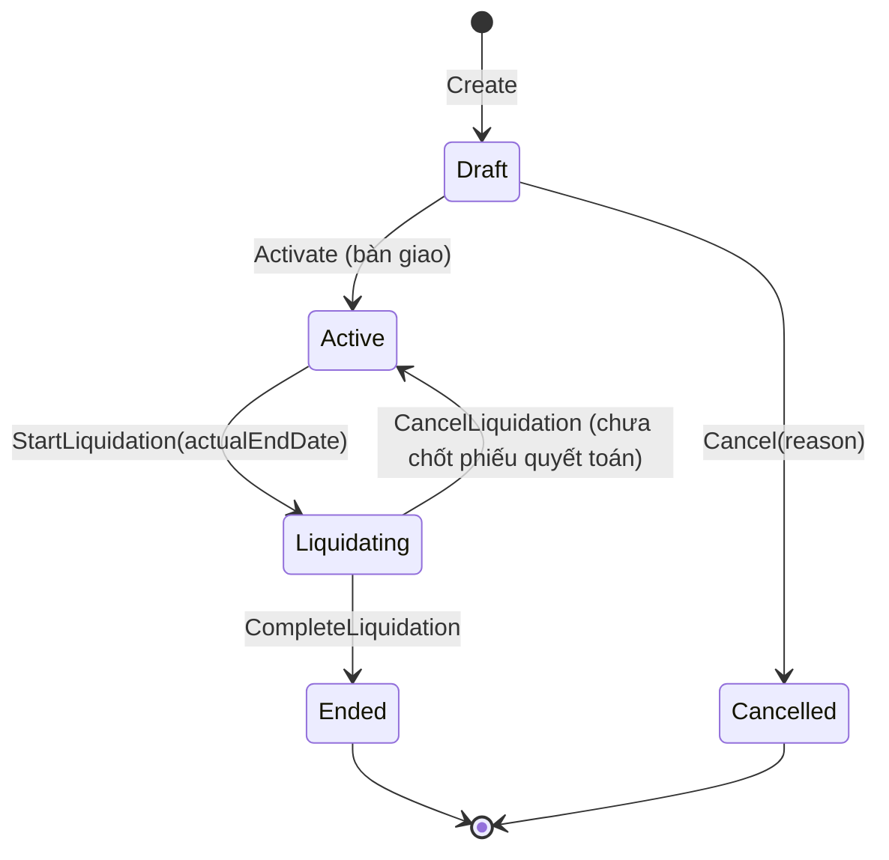

# M05 — Contract (Hợp đồng, Người ở, Phụ lục, Thanh lý)

> Theo khuôn [_TEMPLATE.md](_TEMPLATE.md). Pháp lý: L1, L2, L4, LEG-01. Kỳ thu: C-05.

## 1. Mục tiêu & phạm vi

**Mục tiêu**: Lưu trữ **thông tin hợp đồng thuê** giữa chủ trọ và người thuê cho **một phòng**, là nguồn sự thật cho:
phòng đang có người (M02), ai đang ở (M03), giá thuê theo thời gian, khoản thu đăng ký, cài đặt kỳ thu (M07), tiền cọc thỏa thuận (M08).

**Trong phạm vi**: tạo nháp, kích hoạt (bàn giao), người ở cùng vào/ra, phụ lục giá & gia hạn, đăng ký khoản thu,
báo trả phòng, thanh lý (orchestration), hủy nháp, file scan (M09).

**Bổ sung (02–03/10/2026)**: **mẫu hợp đồng** theo loại (thuê phòng trọ / thuê nhà nguyên căn) gồm tiêu đề, điều khoản, trường tùy biến;
**hợp đồng không cọc**; **quan hệ người ở với người đứng tên** (phục vụ đăng ký tạm trú chung hộ), đồng ý của cha mẹ / người giám hộ
cho người chưa thành niên; chặn một người ở 2 phòng cùng lúc.

**Ngoài phạm vi**: in hợp đồng ra PDF/DOCX từ mẫu (P2 — CT-UC-15), ký điện tử.

**Phase**: P1.

## 2. Thuật ngữ

| Thuật ngữ | Code | Định nghĩa |
|-----------|------|-----------|
| Hợp đồng | `Contract` | Thỏa thuận thuê 1 phòng trong một khoảng thời gian |
| Bên thuê (đại diện) | `RepresentativeRenter` | Người đứng tên ký HĐ — có thể **không** ở (VD phụ huynh ký cho con) |
| Người ở | `Occupant` / `contract_occupants` | Người thực tế ở phòng, có ngày vào/ra riêng |
| Điều khoản giá | `RentTerm` | Giá thuê tháng hiệu lực từ đầu một kỳ |
| Đăng ký khoản thu | `ContractFee` | Khoản thu (M04) áp cho HĐ, có số lượng/giá riêng, hiệu lực theo kỳ |
| Ngày kết thúc thỏa thuận | `end_date` | Hạn HĐ ghi trên giấy (NULL = không thời hạn) |
| Ngày kết thúc thực tế | `actual_end_date` | **Ngày cuối cùng tính tiền** (bao gồm), đặt khi thanh lý |
| Thanh lý | `Liquidation` | Quy trình kết thúc: chỉ số cuối, phiếu quyết toán, cấn trừ/hoàn cọc |
| Loại hợp đồng | `ContractType` | `RoomRental` (thuê phòng trọ) · `WholeHouseRental` (thuê nhà nguyên căn — khai báo là 1 khu có 1 phòng) |
| Mẫu hợp đồng | `ContractTemplate` / `contract_templates` | Của tổ chức: tên, loại, tiêu đề, điều khoản, định nghĩa trường tùy biến, chính sách cọc |
| Điều khoản | `ContractClause` | Một mục văn bản `{heading, body}` (VD "Trách nhiệm của bên A") |
| Trường tùy biến | `CustomFieldDefinition` | Ô nhập thêm theo mẫu: `key`, `label`, `type` (Text/LongText/Number/Money/Date/Boolean/Select), `required`, `options`, `unit`, `hint` |
| Hợp đồng không cọc | `no_deposit` | Mẫu có cờ này ⇒ `deposit_amount = 0`. "Nhóm không cọc" = mọi HĐ có `deposit_amount = 0` |
| Quan hệ với người đứng tên | `OccupantRelationship` | Quan hệ của người ở với người ký HĐ — dùng làm "quan hệ với chủ hộ" khi đăng ký tạm trú chung hộ |
| Đồng ý của người giám hộ | `guardian_consent` | Người ở < 18 tuổi đã có ý kiến đồng ý của cha, mẹ hoặc người giám hộ (Luật Cư trú Điều 28) |

## 3. Nghiệp vụ

### 3.1 Use case

| ID | Mô tả |
|----|-------|
| CT-UC-01 | Tạo HĐ nháp: chọn phòng, người đại diện, người ở, ngày bắt đầu, thời hạn, giá thuê, tiền cọc, cài đặt kỳ thu (mặc định từ khu), khoản thu (auto-attach từ M04, chỉnh được), điều khoản (text) |
| CT-UC-02 | Sửa HĐ nháp (mọi trường) / hủy nháp |
| CT-UC-03 | **Kích hoạt** (bàn giao phòng): nhập chỉ số bàn giao cho các công tơ (M06), (tùy chọn) ghi nhận tiền cọc đã nhận (M08) |
| CT-UC-04 | Thêm người ở (ngày vào, **quan hệ với người đứng tên**, đồng ý của người giám hộ nếu < 18 tuổi) / ghi nhận người ở rời đi (ngày ra) |
| CT-UC-05 | Phụ lục: đổi giá thuê từ kỳ X; gia hạn `end_date`; đổi tiền cọc thỏa thuận |
| CT-UC-06 | Đổi đăng ký khoản thu từ kỳ X (thêm/bỏ khoản, đổi số lượng xe, giá riêng) |
| CT-UC-07 | Báo trả phòng: ghi nhận ngày báo, ngày dự kiến trả; cảnh báo nếu < `notice_days` |
| CT-UC-08 | Bắt đầu thanh lý (đặt `actual_end_date`) → ghi chỉ số cuối → tạo phiếu quyết toán (M07) → cấn trừ/hoàn cọc (M08) → hoàn tất |
| CT-UC-09 | Hủy thanh lý (quay về Active) khi chưa chốt phiếu quyết toán |
| CT-UC-10 | Danh sách HĐ: lọc khu, phòng, trạng thái, sắp hết hạn (≤ 30 ngày), quá hạn, người thuê |
| CT-UC-11 | Đính kèm file scan HĐ, phụ lục, biên bản bàn giao (M09) |
| CT-UC-12 | Chuyển phòng: kết thúc HĐ cũ + tạo HĐ mới với `previous_contract_id`, chuyển cọc (M08) |
| CT-UC-13 | Ghi **tài sản bàn giao** (điều hòa, giường, chìa khóa…) và tình trạng; khi trả phòng ghi tình trạng lúc trả + giá trị bồi thường |
| CT-UC-14 | Đăng ký **xe gửi** (biển số, loại, màu) — đối chiếu số lượng khoản phí giữ xe |
| CT-UC-15 | (P2) In hợp đồng / phụ lục / biên bản bàn giao từ mẫu, điền sẵn dữ liệu snapshot |
| CT-UC-16 ✅ | Quản lý **mẫu hợp đồng**: tạo từ mẫu gợi ý (thuê trọ / thuê trọ không cọc / thuê nhà nguyên căn), sửa tiêu đề, điều khoản, trường tùy biến, ngừng dùng / khôi phục |
| CT-UC-17 ✅ | Tạo / sửa HĐ nháp **theo mẫu**: chép tiêu đề, điều khoản, định nghĩa trường vào HĐ; nhập giá trị trường tùy biến (VD cách tính điện, tiền nước/người, wifi); ghi đè tiêu đề / điều khoản cho riêng HĐ |
| CT-UC-18 ✅ | Lọc **nhóm hợp đồng không cọc / có cọc** trong danh sách HĐ |
| CT-UC-19 ✅ | Khai **quan hệ người ở với người đứng tên** (vợ, chồng, con, cha mẹ, cùng ở thuê…) — dữ liệu để lập tờ khai tạm trú chung hộ và xuất danh sách (M10 E1) |

### 3.2 Quy tắc nghiệp vụ

| Mã | Quy tắc | Nơi kiểm tra |
|----|---------|-------------|
| CT-BR-01 | Một phòng **không thể có 2 HĐ chồng lấn thời gian** trong các trạng thái `Active/Liquidating/Ended`. Khoảng chiếm phòng = `[start_date, COALESCE(actual_end_date, 'infinity')]` | **DB EXCLUDE constraint** (btree_gist) |
| CT-BR-02 | Kích hoạt yêu cầu: phòng không archive/bảo trì; người đại diện có SĐT; ≥ 1 người ở; giá thuê > 0; **mỗi khoản Metered HĐ đăng ký phải có công tơ đang hoạt động** trên phòng (MT-BR-11) và có **chỉ số bàn giao** cho công tơ đó; `start_date` ≤ hôm nay + 1 (kích hoạt = bàn giao thực tế; cho phép lùi ngày khi nhập HĐ cũ) | Domain + Application |
| CT-BR-03 | `end_date` (nếu có) > `start_date`. Hết `end_date` mà chưa thanh lý → HĐ **vẫn Active** (cờ dẫn xuất `IsOverdue`), vẫn lập phiếu bình thường — không tự kết thúc | Thiết kế |
| CT-BR-04 | Cài đặt kỳ thu (`billing_anchor_day`, `charge_mode`, `proration_mode`, `payment_due_days`) **snapshot** từ khu khi tạo; **khóa** sau khi có phiếu đầu tiên chưa Void (đổi anchor làm vỡ chuỗi kỳ) | Domain (cờ `has_invoices` kiểm qua M07) |
| CT-BR-05 | Giá thuê theo `contract_rent_terms`; bản đầu tiên `effective_from = start_date`. Phụ lục giá chỉ cho hợp đồng **Active** (nháp sửa trực tiếp). Bản mới phải có `effective_from` là **ngày bắt đầu một kỳ** (C-05) và ≥ kỳ đầu tiên chưa có phiếu **Finalized** (draft của các kỳ đó → stale) | Domain |
| CT-BR-06 | `contract_fees`: mỗi `(contract, fee_type)` các khoảng hiệu lực không chồng lấn; `effective_from` là đầu kỳ, cùng quy tắc khóa như CT-BR-05. Khoản thu phải thuộc **cùng khu** với HĐ | DB EXCLUDE + FK composite `(organization_id, property_id, fee_type_id)` |
| CT-BR-07 | `quantity`: Quantity > 0; Metered/Fixed = 1. `unit_price_override` ≥ 0 hoặc NULL (dùng giá danh mục) | CHECK |
| CT-BR-08 | Người ở: `move_in_date` ≥ `start_date` của HĐ; `move_out_date` (nếu có) ≥ `move_in_date` và ≤ `actual_end_date` (nếu có). Cùng 1 renter không có 2 khoảng ở chồng lấn trong cùng HĐ. Đã ghi chuyển đi thì **không ghi lại** (409 `OCCUPANT_ALREADY_MOVED_OUT`) — muốn ở tiếp thì thêm lại như người ở mới | Domain + DB EXCLUDE |
| CT-BR-09 | Số người ở đồng thời ≤ `rooms.max_occupants` — vượt → 422 `ROOM_CAPACITY_EXCEEDED` trừ khi `overrideCapacity=true` (ghi audit) — áp dụng cả khi **thêm người ở** và khi **kích hoạt** (VD gia đình có con nhỏ ở phòng 2 người) | Application |
| CT-BR-10 | Một renter đang ở (occupancy mở) tại HĐ khác → **cảnh báo**, không chặn (có thể thuê 2 phòng) | Application |
| CT-BR-11 | Bắt đầu thanh lý: `actual_end_date` ≥ `start_date` và ≥ `move_in_date` muộn nhất; ≤ hôm nay + 60 ngày; **không tồn tại phiếu Regular chưa Void có `period_start` > `actual_end_date`** (phải hủy trước — tránh thu tiền kỳ sau khi đã trả phòng); không tồn tại chỉ số `Periodic` chưa hủy có `closing_period_start` > `actual_end_date`. Trong trạng thái `Liquidating` M07 **không** tạo phiếu định kỳ cho kỳ bắt đầu sau `actual_end_date` | Domain + Application |
| CT-BR-12 | Hoàn tất thanh lý yêu cầu: có chỉ số cuối cho mọi công tơ đang tính; phiếu quyết toán `Finalized`; mọi phiếu của HĐ `Paid` hoặc `Void`; số dư cọc = 0; số dư có (credit) = 0. Tự đặt `move_out_date = actual_end_date` cho người ở còn mở → phát `OccupancyEnded` | Application (transaction) |
| CT-BR-13 | Không xóa HĐ khác `Draft`. Nháp chỉ **hủy** (`Cancelled`, lý do) — giữ lại lịch sử | Domain |
| CT-BR-14 | HĐ không đổi phòng. Chuyển phòng = HĐ mới (CT-UC-12) | Thiết kế |
| CT-BR-15 | `contract_no`: người dùng nhập hoặc tự sinh `HD{yyyy}-{seq:0000}`; unique trong tổ chức | DB unique |
| CT-BR-16 | Thông báo trả phòng < `notice_days` trước ngày dự kiến → cảnh báo (L4) và gợi ý xử lý cọc theo điều khoản | Application |
| CT-BR-17 | `deposit_amount` (thỏa thuận) ≥ 0; **tiền cọc thực nhận** chỉ ghi qua sổ cọc M08 — không suy ra từ trường này | Thiết kế |
| CT-BR-18 | **Người đại diện ký phải đủ 18 tuổi** tại ngày ký (`signed_date`, nếu trống dùng ngày kích hoạt) — BLDS 2015 Điều 117. Người ở có thể dưới 18 tuổi | Domain |
| CT-BR-19 | Kích hoạt yêu cầu khu có **thông tin bên cho thuê đầy đủ** (PR-BR-12). Khi kích hoạt chụp **snapshot bất biến**: `signing_snapshot` (bên cho thuê, bên thuê, phòng, ngân hàng), `utility_price_snapshot` (đơn giá điện, nước, dịch vụ tại ngày bắt đầu), `house_rules_snapshot` — sửa khu sau đó không đổi hợp đồng đã ký | Application |
| CT-BR-20 | `effective_date` mặc định = `signed_date` (Luật Nhà ở 2023 Điều 164: không thỏa thuận thì hiệu lực từ lúc ký); ràng buộc `signed_date ≤ effective_date` (có thể sau ngày bàn giao: dọn vào trước, ký sau). Không ghi ngày ký: HĐ nhập lại (bắt đầu trong quá khứ) lấy ngày bắt đầu, HĐ mới lấy hôm nay | Validator + CHECK |
| CT-BR-21 | Kết thúc phải có `termination_reason`: `Expired`, `MutualAgreement`, `LesseeUnilateral`, `LessorUnilateral`, `RoomTransfer`. `LessorUnilateral` bắt buộc `termination_ground` thuộc Điều 172 khoản 2 (`RentArrears3Months`, `WrongPurpose`, `UnauthorizedRenovation`) hoặc `Other` + mô tả; báo trước < 30 ngày → cảnh báo (trừ bất khả kháng) | Domain + Application |
| CT-BR-22 | Tổng số xe đăng ký đang hiệu lực theo loại ≠ số lượng khoản phí giữ xe tương ứng → **cảnh báo** (không chặn) | Application |
| CT-BR-23 | Tài sản bàn giao: ghi tình trạng lúc trả khi thanh lý; tổng `compensation_value` được **gợi ý** làm khoản trừ cọc — chủ trọ xác nhận mới tạo bút toán (M08) | Application |
| CT-BR-24 | Hợp đồng là giấy tờ chứng minh chỗ ở hợp pháp để đăng ký tạm trú, không cần công chứng (NĐ 154/2024) ⇒ phải in được đầy đủ thông tin 2 bên + địa chỉ phòng | Thiết kế (CT-UC-15) |
| CT-BR-25 | **Mẫu hợp đồng** theo tổ chức (`contract_templates`: tên duy nhất, loại `RoomRental`/`WholeHouseRental`, tiêu đề, điều khoản jsonb, định nghĩa trường jsonb). Tạo/sửa nháp **chép** tiêu đề, điều khoản, định nghĩa trường vào hợp đồng (`title`, `clauses`, `custom_field_definitions`) ⇒ sửa/ngừng mẫu không đổi HĐ đã kích hoạt. Mẫu ngừng dùng không chọn được cho HĐ mới; nháp đang gắn mẫu vẫn sửa được | Application + FK composite `(organization_id, template_id)` |
| CT-BR-26 | `custom_field_values` khớp định nghĩa: đủ trường bắt buộc, đúng kiểu (Text/LongText/Number/Money/Date/Boolean/Select), không có key lạ. Không dùng mẫu ⇒ không có trường tùy biến. Trường chỉ **ghi nhận thỏa thuận** — tính tiền điện/nước vẫn thuộc M04 | Application (lỗi 400 theo `contract.customFields.<key>`) |
| CT-BR-27 | **Hợp đồng không cọc**: mẫu có `no_deposit = true` ⇒ `deposit_amount = 0` (bỏ qua cọc mặc định của phòng; gửi > 0 → 400 `DEPOSIT_NOT_ALLOWED`). Nhóm không cọc = mọi HĐ có `deposit_amount = 0` (lọc `hasDeposit=false`). Mẫu gợi ý không cọc bù rủi ro bằng trả trước đầu kỳ + quyền chấm dứt khi chậm trả quá N ngày | Application |
| CT-BR-28 | Một phòng nhiều người ở, **một người đứng tên**. Mỗi người ở không đứng tên khai **quan hệ với người đứng tên** (`contract_occupants.relationship_type`) theo danh mục "quan hệ với chủ hộ" TT 55/2021/TT-BCA Điều 6 (sửa bởi TT 66/2023/TT-BCA); "Khác" phải ghi rõ (`relationship`) | Application + Domain `OccupantRelationshipRules` |
| CT-BR-29 | Quan hệ phải hợp lý: giới tính khớp nhãn (vợ/mẹ/con dâu… nữ; chồng/cha/con rể… nam; giới tính "Khác" bỏ qua); cha mẹ đẻ, ông bà, cụ lớn tuổi hơn; con đẻ, cháu nội ngoại, chắt nhỏ tuổi hơn; vợ chồng tối đa 1 người cùng thời gian, cả hai đủ tuổi kết hôn (nam 20, nữ 18 — Luật HN&GĐ 2014 Điều 8) | Domain; kiểm lại khi kích hoạt |
| CT-BR-30 | Người ở **chưa thành niên** (< 18 tuổi tại ngày vào ở) phải có ý kiến đồng ý của cha, mẹ hoặc người giám hộ (`guardian_consent`, Luật Cư trú 2020 Điều 28), trừ khi người đứng tên là cha/mẹ/người giám hộ (con đẻ, con nuôi, người được giám hộ) | Domain |
| CT-BR-31 | Một người **không ở 2 phòng cùng lúc**: thêm người ở vào HĐ đang hiệu lực / kích hoạt HĐ bị chặn nếu người đó đang ở HĐ khác (Active/Liquidating/Ended) có khoảng ở giao nhau; HĐ đang thanh lý tính tới ngày trả phòng; chuyển đi ngày X – vào ở ngày X hợp lệ | Application → 409 `OCCUPANT_LIVES_ELSEWHERE` |
| CT-BR-32 | Tiền cọc ≤ 12 tháng tiền thuê (chặn nhập thừa số 0) → 400 `DEPOSIT_TOO_HIGH` | Application |
| CT-BR-33 | Phòng / khu còn **người thuê trong ngày trả phòng** (HĐ `Ended` có `actual_end_date ≥ hôm nay`) ⇒ không ngừng dùng phòng / khu, không bắt đầu bảo trì — khớp trạng thái "Đang thuê" | Application |
| CT-BR-34 | Hủy thanh lý: người ở chưa ghi chuyển đi trở lại "đang ở" ⇒ kiểm CT-BR-31 (không đang ở phòng khác) | Application → 409 `OCCUPANT_LIVES_ELSEWHERE` |
| CT-BR-35 | Dời ngày bắt đầu HĐ nháp về sau ⇒ xe đã đăng ký giữ dời `registered_from` theo (không giữ xe trước ngày bắt đầu HĐ) | Domain |
| CT-BR-36 ✅ | **Chủ hộ** (`household_head_renter_id`): chọn trong số người ở, mặc định = người đứng tên. Quan hệ của người ở (CT-BR-28..30) khai so với **chủ hộ**; chủ hộ không khai quan hệ. Chủ hộ không phải người ở → 400 `HOUSEHOLD_HEAD_NOT_OCCUPANT`. Chỉ đặt ở bản nháp | Application + Domain |
| CT-BR-37 ✅ | Thêm người ở với ngày vào **sau `end_date`** khi HĐ đang hiệu lực (quá hạn / sắp hết hạn) → 422 `CONTRACT_EXPIRED_EXTEND_FIRST` — gia hạn (phụ lục) trước | Domain |
| CT-BR-38 ✅ | Sửa nháp làm chủ xe (`contract_vehicles.renter_id`) không còn là người đứng tên / người ở → 422 `VEHICLE_OWNER_NOT_IN_CONTRACT`; kết thúc đăng ký xe đó trước | Domain |
| CT-BR-39 ✅ | **Cảnh báo mềm** (không chặn) trả trong `warnings` của tạo HĐ / đăng ký xe / chi tiết HĐ: `DEPOSIT_ABOVE_THREE_MONTHS` (cọc > 3 tháng tiền thuê ban đầu), `PLATE_FORMAT_UNUSUAL` (biển số sau chuẩn hóa không khớp `^[0-9]{2}[A-Z]{1,2}[0-9]?[0-9]{4,5}$`) | Domain `ContractWarnings` |
| CT-BR-40 ✅ | Ghi chú nội bộ (`note`) sửa được ở mọi trạng thái trừ `Cancelled` qua `PUT /contracts/{id}/note`; nội dung đã ký (điều khoản, giá, trường tùy biến) chỉ đổi qua phụ lục | Domain |

### 3.3 Vòng đời



| Từ → Đến | Lệnh | Điều kiện | Tác động phụ (cùng transaction) |
|----------|------|-----------|--------------------------------|
| Draft → Active | `ActivateContract` | CT-BR-01, 02 | Ghi chỉ số bàn giao (M06); occupancy bắt đầu → `OccupancyStarted` → bản ghi cư trú (M03); (tùy chọn) giao dịch nhận cọc (M08) |
| Draft → Cancelled | `CancelContract` | — | |
| Active → Liquidating | `StartLiquidation` | CT-BR-11 | Đặt `actual_end_date` (EXCLUDE kiểm lại) |
| Liquidating → Active | `CancelLiquidation` | Phiếu `Final` chưa Finalized (draft bị xóa) | `actual_end_date = NULL` (EXCLUDE kiểm lại: nếu phòng đã có HĐ mới kích hoạt sau ngày trả → 409 `ROOM_PERIOD_OVERLAP`); hủy (void) các chỉ số `Final` chưa khóa của HĐ |
| Liquidating → Ended | `CompleteLiquidation` | CT-BR-12 | Đóng occupancy, `OccupancyEnded` → M03 cờ `needs_deregistration`; tạo `contract_liquidations` |

## 4. Dữ liệu

**`contracts`**

| Cột | Kiểu | Null | Ghi chú |
|-----|------|------|--------|
| id, organization_id | uuid | N | UNIQUE (organization_id, id); UNIQUE (organization_id, property_id, id) (cho FK của `contract_fees`, `invoices`) |
| property_id | uuid | N | = khu của phòng (FK composite `(organization_id, property_id, room_id)` → rooms) |
| room_id | uuid | N | |
| contract_no | varchar(30) | N | CT-BR-15 |
| status | varchar(16) | N | `Draft`,`Active`,`Liquidating`,`Ended`,`Cancelled` |
| representative_renter_id | uuid | N | FK composite renters |
| signed_date | date | Y | |
| start_date | date | N | ngày bàn giao / bắt đầu tính tiền |
| end_date | date | Y | thỏa thuận |
| actual_end_date | date | Y | ngày cuối tính tiền (bao gồm) |
| notice_given_date / planned_move_out_date | date | Y | CT-UC-07 |
| notice_days | smallint | N | snapshot |
| deposit_amount | numeric(18,0) | N | thỏa thuận, ≥ 0 |
| billing_anchor_day | smallint | N | 1–31 |
| charge_mode | varchar(16) | N | `Prepaid`/`Postpaid` |
| proration_mode | varchar(16) | N | `Daily`/`FullPeriod` |
| payment_due_days | smallint | N | |
| terms_text | text | Y | điều khoản quyền/nghĩa vụ (LEG-01) |
| note | text | Y | |
| previous_contract_id | uuid | Y | chuyển phòng / tái ký |
| activated_at / ended_at / cancelled_at | timestamptz | Y | |
| cancel_reason | varchar(500) | Y | |
| **Bổ sung theo Luật Nhà ở 2023 Điều 163–164, 172** | | | |
| effective_date | date | Y | CT-BR-20; NOT NULL khi Active |
| signed_place | varchar(200) | Y | nơi ký |
| copies_count | smallint | N | số bản, mặc định 2 (mỗi bên 1) |
| payment_methods | varchar(20)[] | N | mặc định `{Cash,BankTransfer}` |
| deposit_terms | text | Y | điều kiện hoàn / mất cọc |
| signing_snapshot | jsonb | Y | CT-BR-19 — bản chụp lúc ký: bên cho thuê, bên thuê (người đứng tên), phòng (mã, tầng, diện tích, sức chứa), ngân hàng, tên & địa chỉ khu (số giấy tờ lưu dạng mã hóa) |
| utility_price_snapshot | jsonb | Y | CT-BR-19 — `[{feeTypeId, name, unit, unitPrice, quantity}]` |
| house_rules_snapshot | text | Y | CT-BR-19 |
| termination_reason | varchar(24) | Y | CT-BR-21; NOT NULL khi Ended |
| termination_ground | varchar(32) | Y | CT-BR-21 |
| termination_note | varchar(1000) | Y | |
| **Bổ sung — văn bản theo mẫu (CT-BR-25..27)** | | | |
| template_id | uuid | Y | FK composite `(organization_id, template_id)` → `contract_templates`, RESTRICT |
| contract_type | varchar(24) | N | `RoomRental` (mặc định cho dữ liệu cũ) / `WholeHouseRental` |
| title | varchar(200) | Y | tiêu đề in trên HĐ; NULL (dữ liệu cũ) ⇒ tiêu đề mặc định theo loại |
| clauses | jsonb | Y | `[{heading, body}]` — chép từ mẫu, ghi đè được khi nháp |
| custom_field_definitions | jsonb | Y | bản chụp định nghĩa trường của mẫu lúc lưu nháp |
| custom_field_values | jsonb | Y | `{key: value}` đã chuẩn hóa kiểu (số, chuỗi, bool, `yyyy-MM-dd`) |
| household_head_renter_id | uuid | Y | CT-BR-36 — FK composite `(organization_id, household_head_renter_id)` → renters; NULL ⇒ người đứng tên là chủ hộ |
| audit, xmin | | | |

Ràng buộc:
- CHECK `end_date IS NULL OR end_date > start_date`; CHECK `actual_end_date IS NULL OR actual_end_date >= start_date`.
- CHECK `status NOT IN ('Liquidating','Ended') OR actual_end_date IS NOT NULL`.
- CHECK `billing_anchor_day BETWEEN 1 AND 31`, `deposit_amount >= 0`, `copies_count BETWEEN 1 AND 10`.
- CHECK `effective_date IS NULL OR signed_date IS NULL OR effective_date >= signed_date`.
- CHECK `status NOT IN ('Active','Liquidating','Ended') OR (effective_date IS NOT NULL AND signing_snapshot IS NOT NULL)`.
- CHECK `status <> 'Ended' OR termination_reason IS NOT NULL`.
- UNIQUE `(organization_id, contract_no)`.
- **EXCLUDE** `USING gist (room_id WITH =, daterange(start_date, actual_end_date, '[]') WITH &&) WHERE (status IN ('Active','Liquidating','Ended'))`
  (`daterange(x, NULL)` = vô hạn phải → đúng nghĩa "đang thuê").
- INDEX `(organization_id, property_id, status)`, `(organization_id, representative_renter_id)`, `(organization_id, end_date) WHERE status='Active'`.

**`contract_rent_terms`**: id, organization_id, contract_id, effective_from date, monthly_rent numeric(18,0) > 0, addendum_no varchar(30) null, note, created_at/by.
UNIQUE `(contract_id, effective_from)`.

**`contract_fees`**: id, organization_id, contract_id, property_id, fee_type_id, quantity numeric(12,2), unit_price_override numeric(18,2) null,
effective_from date, effective_to date null (bao gồm), created_at/by.
- FK composite `(organization_id, property_id, fee_type_id)` → fee_types; `(organization_id, property_id, contract_id)` → contracts (cần UNIQUE tương ứng).
- CHECK `effective_to IS NULL OR effective_to >= effective_from`; CHECK `quantity > 0`.
- EXCLUDE `USING gist (contract_id WITH =, fee_type_id WITH =, daterange(effective_from, effective_to, '[]') WITH &&)`.

**`contract_occupants`**: id, organization_id, contract_id, renter_id, move_in_date, move_out_date null, expected_end_date null,
relationship varchar(50) null (ghi chú quan hệ, bắt buộc khi loại = `Other`), **relationship_type varchar(24) null** (CT-BR-28; NULL với
người đứng tên và dữ liệu cũ), **guardian_consent boolean not null default false** (CT-BR-30), note, audit, xmin.
- EXCLUDE `USING gist (contract_id WITH =, renter_id WITH =, daterange(move_in_date, move_out_date, '[]') WITH &&)`.

**`contract_liquidations`**: id, organization_id, contract_id UNIQUE, actual_end_date, final_invoice_id, deposit_received_total,
deposit_deducted_total, deposit_refunded_total, deposit_forfeited_total, note, completed_at, completed_by.
(Ảnh chụp số liệu tại thời điểm hoàn tất — để in biên bản, không dùng để tính lại.)

**`contract_assets`** (tài sản bàn giao — CT-UC-13): id, organization_id, contract_id, name varchar(200), quantity smallint > 0,
condition_at_handover varchar(500), condition_at_return varchar(500) null, value_estimate numeric(18,0) null,
compensation_value numeric(18,0) null ≥ 0, ảnh (M09 owner_type `ContractAsset`), note, audit, xmin.
- Sửa `condition_at_handover` chỉ khi Draft; `condition_at_return` / `compensation_value` chỉ khi Liquidating.

**`contract_vehicles`** (xe đăng ký giữ — CT-UC-14): id, organization_id, contract_id, renter_id null (chủ xe),
vehicle_type varchar(16) (`Motorbike`,`Bicycle`,`ElectricBike`,`Car`), plate_number varchar(20) null (chuẩn hóa: bỏ khoảng trắng, chữ hoa),
brand_color varchar(100) null, registered_from date, registered_to date null, note, audit, xmin.
- UNIQUE `(organization_id, plate_number) WHERE registered_to IS NULL AND plate_number IS NOT NULL` — 1 biển số chỉ đăng ký giữ ở 1 nơi trong tổ chức.

**`contract_number_sequences`**: organization_id, year, last_value — cấp số bằng `UPDATE … RETURNING` trong transaction.

**`contract_templates`** (CT-BR-25): id, organization_id, name varchar(100), contract_type varchar(24), title varchar(200),
clauses jsonb not null (`[]`), field_definitions jsonb not null (`[]`), no_deposit boolean not null default false,
archived_at timestamptz null, audit, xmin.
- UNIQUE `(organization_id, name)` (`ux_contract_templates_name` → 409 `CONTRACT_TEMPLATE_NAME_TAKEN`); UNIQUE `(organization_id, id)` cho FK composite.
- Không xóa vật lý (HĐ tham chiếu) — chỉ ngừng dùng.
- Mẫu gợi ý (thuê trọ, thuê trọ không cọc, thuê nhà nguyên căn) nằm trong code, không seed vào DB.

### Dẫn xuất (không lưu)
- `IsOverdue` = Active ∧ end_date < hôm nay. `IsExpiringSoon` = Active ∧ end_date ∈ [hôm nay, +30].
- `CurrentRent(date)` = rent term có `effective_from` lớn nhất ≤ date.
- `ActiveOccupants(date)` = occupants có `move_in ≤ date ≤ COALESCE(move_out, ∞)`.
- Ngày ra hiệu lực của người ở = `COALESCE(move_out_date, contracts.actual_end_date)` — HĐ đang thanh lý chỉ ghi `move_out_date` khi hoàn tất (R-80).

## 5. Domain model

```
Contract (aggregate root: RentTerms, Fees, Occupants là entity con)
  + CreateDraft(room, representative, startDate, endDate?, rent, deposit, BillingSettings, fees[], occupants[], terms)
  + UpdateDraft(...) / Cancel(reason)
  + Activate(now, today)                                   // CT-BR-02 phần nội tại
  + AddOccupant(renterId, moveIn, expectedEnd?) / EndOccupancy(occupantId, moveOut)
  + ChangeRent(effectiveFrom, amount, firstOpenPeriodStart) // CT-BR-05
  + ChangeFee(feeTypeId, qty, priceOverride?, effectiveFrom, firstOpenPeriodStart) // đóng khoảng cũ = effectiveFrom - 1
  + RemoveFee(feeTypeId, effectiveFrom, firstOpenPeriodStart)
  + Extend(newEndDate)
  + GiveNotice(noticeDate, plannedMoveOut) : Warnings
  + StartLiquidation(actualEndDate, today) / CancelLiquidation() / CompleteLiquidation(LiquidationSnapshot, now)
  + BillingSchedule : BillingPeriodCalculator(anchor, start, actualEnd)  // C-05
Domain events: ContractActivated, OccupancyStarted, OccupancyEnded, ContractRentChanged, ContractFeesChanged, ContractEnded
```
`firstOpenPeriodStart` do Application lấy từ M07 (`IInvoiceLockReader`) → domain thuần, test được.

```
ContractTemplate (aggregate riêng)
  + Create(name, type, title, clausesJson, fieldDefinitionsJson, noDeposit) / Update(...) / Archive(now) / Restore()
Contract.ApplyDraft(..., ContractDocument)   // TemplateId, ContractType, Title, Clauses, CustomFieldDefinitions, CustomFieldValues
OccupantRelationshipRules.Check(representative, [(OccupantInput, PersonFacts)]) : [OccupantRuleViolation(index, field, error)]
  // CT-BR-28..30 — hàm thuần, Application gọi khi tạo/sửa nháp, thêm người ở, kích hoạt
```

## 6. Application

| Use case | Loại | Lỗi nghiệp vụ |
|----------|------|---------------|
| `CreateContractDraftCommand` | Cmd | `ROOM_ARCHIVED`, `FEE_NOT_IN_PROPERTY`, `CONTRACT_NO_TAKEN` |
| `UpdateContractDraftCommand` / `CancelContractCommand` | Cmd | `CONTRACT_NOT_DRAFT` |
| `ActivateContractCommand` (Idempotency-Key) | Cmd | `ROOM_UNAVAILABLE`, `ROOM_PERIOD_OVERLAP` (từ EXCLUDE 23P01), `HANDOVER_READING_REQUIRED`, `REPRESENTATIVE_PHONE_REQUIRED`, `NO_OCCUPANT` |
| `AddOccupantCommand` / `EndOccupancyCommand` | Cmd | `ROOM_CAPACITY_EXCEEDED`, `OCCUPANCY_OVERLAP`, `DATE_OUTSIDE_CONTRACT` |
| `ChangeRentCommand` / `ExtendContractCommand` / `ChangeDepositAgreementCommand` | Cmd | `NOT_PERIOD_START`, `PERIOD_ALREADY_BILLED` |
| `ChangeContractFeeCommand` / `RemoveContractFeeCommand` | Cmd | như trên + `FEE_ARCHIVED` |
| `GiveNoticeCommand` | Cmd | trả `warnings` |
| `StartLiquidationCommand` | Cmd | `INVALID_END_DATE`, `ROOM_PERIOD_OVERLAP` |
| `GetLiquidationPreviewQuery` | Qry | tổng hợp: phiếu chưa thanh toán, số dư cọc, credit, chỉ số cuối còn thiếu, phiếu quyết toán dự kiến |
| `CancelLiquidationCommand` | Cmd | `FINAL_INVOICE_FINALIZED` |
| `CompleteLiquidationCommand` | Cmd | `LIQUIDATION_NOT_SETTLED` (kèm danh sách điều kiện chưa đạt) |
| `TransferRoomCommand` | Cmd | tạo HĐ nháp mới + liên kết; chuyển cọc qua M08 khi hoàn tất thanh lý HĐ cũ |
| `Add/Update/RemoveContractAssetCommand`, `RecordAssetReturnConditionCommand` | Cmd | `CONTRACT_NOT_DRAFT`, `CONTRACT_NOT_LIQUIDATING` |
| `RegisterContractVehicleCommand` / `EndContractVehicleCommand` | Cmd | `PLATE_ALREADY_REGISTERED`; trả `warnings` (CT-BR-22) |
| (`ActivateContractCommand` bổ sung lỗi) | | `LESSOR_INFO_INCOMPLETE`, `REPRESENTATIVE_UNDERAGE` |
| `ListContractsQuery` / `GetContractQuery` | Qry | filter: propertyIds, roomId, renterId, status, expiringWithinDays, overdue, **hasDeposit** |
| (`Create/UpdateContractDraftCommand` bổ sung) | | `CONTRACT_TEMPLATE_NOT_FOUND`, `CONTRACT_TEMPLATE_ARCHIVED`, `DEPOSIT_NOT_ALLOWED`; 400 theo `contract.customFields.<key>`; 400 theo `contract.occupants[i].relationshipType` / `.guardianConsent` |
| (`AddOccupantCommand` / `ActivateContractCommand` bổ sung) | | `RELATIONSHIP_REQUIRED`, `RELATIONSHIP_NOTE_REQUIRED`, `RELATIONSHIP_GENDER_MISMATCH`, `RELATIONSHIP_AGE_MISMATCH`, `SPOUSE_UNDER_MARRIAGE_AGE`, `MULTIPLE_SPOUSES`, `GUARDIAN_CONSENT_REQUIRED` (400 khi nhập, 422 kèm tên người khi kích hoạt), 409 `OCCUPANT_LIVES_ELSEWHERE` |
| `List/Get/Create/Update ContractTemplate`, `ChangeContractTemplateStateCommand`, `GetContractTemplatePresetsQuery` | Cmd/Qry | `CONTRACT_TEMPLATE_NAME_TAKEN`, `CONTRACT_TEMPLATE_NOT_FOUND`, `CONTRACT_TEMPLATE_ALREADY_ARCHIVED`, `CONTRACT_TEMPLATE_NOT_ARCHIVED` |

## 7. API

| Method | Route | Mã lỗi |
|--------|-------|--------|
| GET | `/contracts?propertyIds=&status=&roomId=&renterId=&expiringWithinDays=30&overdue=true` | |
| POST | `/contracts` | 409 `CONTRACT_NO_TAKEN`, 422 |
| GET / PUT | `/contracts/{id}` (PUT chỉ khi Draft; nội dung đã ký đổi qua phụ lục) | 409 `CONCURRENCY_CONFLICT`, 422 `CONTRACT_NOT_DRAFT` |
| PUT | `/contracts/{id}/note` `{ note }` — ghi chú nội bộ, mọi trạng thái trừ đã hủy (CT-BR-40) | 422 `CONTRACT_NOT_EDITABLE` |
| POST | `/contracts/{id}/cancel` | |
| POST | `/contracts/{id}/activate` body tùy chọn `{ "overrideCapacity": true }` | 409 `ROOM_PERIOD_OVERLAP`, `OCCUPANT_LIVES_ELSEWHERE`, 422 |
| POST | `/contracts/{id}/occupants`; POST `/contracts/{id}/occupants/{occId}/end` | 422 `ROOM_CAPACITY_EXCEEDED` |
| POST | `/contracts/{id}/rent-terms` | 422 `NOT_PERIOD_START`, `PERIOD_ALREADY_BILLED` |
| POST | `/contracts/{id}/extend` | |
| PUT | `/contracts/{id}/fees/{feeTypeId}` `{quantity, unitPriceOverride, effectiveFrom}`; DELETE `…?effectiveFrom=` | |
| POST | `/contracts/{id}/notice` | |
| POST | `/contracts/{id}/liquidation/start` · `/cancel` · `/complete`; GET `/contracts/{id}/liquidation/preview` | 422 `LIQUIDATION_NOT_SETTLED` |
| GET | `/contracts/{id}/billing-periods?from=&to=` | Danh sách kỳ (C-05) để UI hiển thị/chọn `effectiveFrom` |
| GET / POST | `/contracts/{id}/assets`; PUT / DELETE `/contracts/{id}/assets/{assetId}`; POST `/contracts/{id}/assets/{assetId}/return` | 422 `CONTRACT_NOT_DRAFT` |
| GET / POST | `/contracts/{id}/vehicles`; POST `/contracts/{id}/vehicles/{vehicleId}/end` | 409 `PLATE_ALREADY_REGISTERED` |
| GET | `/contracts/{id}/print?template=contract\|addendum\|handover` (P2) | File PDF/DOCX từ mẫu |
| GET | `/contracts?hasDeposit=false` | Nhóm HĐ không cọc (CT-UC-18) |
| GET | `/contract-templates?type=&includeArchived=`; GET `/contract-templates/presets`; GET `/contract-templates/{id}` | |
| POST | `/contract-templates` (Idempotency-Key) | 409 `CONTRACT_TEMPLATE_NAME_TAKEN` |
| PUT | `/contract-templates/{id}` (`version`) | 409 `CONCURRENCY_CONFLICT` |
| POST | `/contract-templates/{id}/archive` · `/restore` | 409 |

**Ví dụ — tạo HĐ nháp**
```json
POST /api/v1/contracts
{
  "roomId": "…", "representativeRenterId": "…",
  "startDate": "2026-10-05", "endDate": "2027-10-04", "signedDate": "2026-10-03",
  "monthlyRent": 3500000, "depositAmount": 3500000,
  "billing": { "anchorDay": 5, "chargeMode": "Prepaid", "prorationMode": "Daily", "paymentDueDays": 5 },
  "fees": [
    { "feeTypeId": "…điện", "quantity": 1 },
    { "feeTypeId": "…nước", "quantity": 1 },
    { "feeTypeId": "…giữ xe", "quantity": 2 },
    { "feeTypeId": "…wifi", "quantity": 1, "unitPriceOverride": 50000 }
  ],
  "occupants": [
    { "renterId": "…người đứng tên", "moveInDate": "2026-10-05" },
    { "renterId": "…", "relationshipType": "Wife" },
    { "renterId": "…", "relationshipType": "Child" },
    { "renterId": "…", "relationshipType": "NephewNiece", "relationship": "Cháu gọi bằng cậu", "guardianConsent": true }
  ],
  "templateId": "…mẫu thuê trọ",
  "customFields": { "electricity_pricing": "Theo giá nhà nước (bậc thang EVN)", "water_pricing": "Theo đầu người", "water_unit_price": 20000, "wifi_included": true },
  "termsText": "…"
}
```

**Ví dụ — kích hoạt**
```json
POST /api/v1/contracts/{id}/activate
Idempotency-Key: 5b0d…
{
  "handoverReadings": [ { "meterId": "…", "value": 1250 }, { "meterId": "…", "value": 310.5 } ],
  "depositReceived": { "amount": 3500000, "method": "BankTransfer", "receivedAt": "2026-10-05" }
}
```

## 8. Validation

| Field | Quy tắc |
|-------|---------|
| startDate | bắt buộc; ≥ hôm nay − 365 (cho nhập HĐ cũ khi chuyển đổi dữ liệu) |
| endDate | > startDate; ≤ startDate + 10 năm |
| monthlyRent | số nguyên, 1 ≤ x ≤ 1.000.000.000 |
| depositAmount | số nguyên, 0 ≤ x ≤ 12 × monthlyRent (`DEPOSIT_TOO_HIGH`); > 3 tháng → cảnh báo `DEPOSIT_ABOVE_THREE_MONTHS` (CT-BR-39) |
| billing.anchorDay | 1–31; mặc định = ngày của startDate nếu không truyền và khu không có mặc định |
| fees[] | feeTypeId không trùng; thuộc khu; chưa archive; quantity theo CT-BR-07 |
| occupants[] | ≥ 1 khi kích hoạt; renterId không trùng; moveInDate ≥ startDate |
| contractNo | null hoặc `^[A-Za-z0-9\-/._]{1,30}$` |
| signedDate / effectiveDate | CT-BR-20: signedDate ≤ effectiveDate ≤ endDate; signedDate ≤ hôm nay |
| representative | đủ 18 tuổi tại signedDate (CT-BR-18) |
| copiesCount | 1–10 |
| paymentMethods | ≥ 1 phần tử, thuộc `Cash`,`BankTransfer`,`EWallet` |
| depositTerms | ≤ 5.000 ký tự |
| terminationReason / terminationGround | CT-BR-21 |
| asset | name 1–200, quantity 1–100, compensationValue 0 … 1.000.000.000 |
| vehicle.plateNumber | chuẩn hóa (bỏ khoảng trắng, dấu, chữ hoa); sai định dạng biển số VN → cảnh báo `PLATE_FORMAT_UNUSUAL`, không chặn (CT-BR-39) |
| householdHeadRenterId | null hoặc một trong `occupants[].renterId` (CT-BR-36) |
| termsText | ≤ 50.000 ký tự |
| templateId | thuộc tổ chức; chưa ngừng dùng (trừ khi là mẫu đang gắn với bản nháp) |
| title | ≤ 200; null ⇒ tiêu đề mẫu / theo loại |
| clauses[] | ≤ 30; heading 1–200, body 1–10.000 |
| customFields | ≤ 50 key; khớp định nghĩa của mẫu: đủ trường bắt buộc, đúng kiểu (Text ≤ 500, LongText ≤ 5.000, Number \|x\| ≤ 10¹², Money nguyên 0…1 tỷ, Date `yyyy-MM-dd`, Boolean, Select ∈ options), không key lạ; không dùng mẫu ⇒ phải rỗng |
| depositAmount (mẫu không cọc) | null hoặc 0; > 0 → `DEPOSIT_NOT_ALLOWED` |
| occupants[].relationshipType | bắt buộc với người không đứng tên; CT-BR-29 (giới tính, tuổi, vợ chồng); `Other` ⇒ `relationship` bắt buộc |
| occupants[].guardianConsent | bắt buộc `true` khi < 18 tuổi tại ngày vào ở, trừ quan hệ `Child` / `AdoptedChild` / `Ward` |
| template.fields[] | ≤ 50; key `^[a-z][a-z0-9_]{0,39}$` không trùng; label 1–100; Select: 1–30 options không trùng, ≤ 100 ký tự; kiểu khác không có options; unit ≤ 20; hint ≤ 200 |
| handoverReadings[].value | ≥ chỉ số gần nhất của công tơ (M06) |

## 9. Phân quyền
Chủ trọ (`OrgOwner`) và phó quản lý (`OrgManager`) toàn quyền nghiệp vụ hợp đồng (M01 §3.3). P3: phân quyền theo khu, quyền `Liquidate` riêng.

## 10. Toàn vẹn dữ liệu & concurrency

| Kịch bản | Giải pháp |
|----------|-----------|
| 2 HĐ cùng phòng kích hoạt đồng thời | EXCLUDE constraint (CT-BR-01) — DB là chốt chặn cuối; map lỗi `23P01` → 409 `ROOM_PERIOD_OVERLAP` |
| Phòng bị đặt bảo trì đồng thời kích hoạt | Khóa `rooms` row `FOR UPDATE` (thứ tự khóa: room → contract) |
| Đổi giá thuê cho kỳ đã chốt phiếu | CT-BR-05 với `firstOpenPeriodStart` tính trong cùng transaction; lệnh chốt phiếu (M07) khóa hàng `contracts` `FOR SHARE`/`FOR UPDATE` ⇒ tuần tự hóa |
| Đổi anchor day sau khi có phiếu | CT-BR-04 |
| Kích hoạt bị retry (mạng) | Idempotency-Key + kiểm tra trạng thái (Active → trả kết quả cũ) |
| Thêm người ở vượt sức chứa đồng thời | Khóa `contracts` row khi thêm occupant |
| Hoàn tất thanh lý trong khi có thanh toán mới | Khóa contract + đọc số dư trong cùng transaction; M08 khi ghi thanh toán cũng khóa contract ⇒ tuần tự |
| HĐ `Ended` bị sửa | Domain chặn mọi lệnh trừ đính kèm file / ghi chú |
| Sửa / ngừng dùng mẫu khi đang có HĐ dùng mẫu | HĐ chép văn bản + định nghĩa trường vào chính nó ⇒ HĐ đã kích hoạt không đổi; nháp nhận nội dung mới ở lần sửa kế tiếp (giá trị cũ có thể không còn hợp lệ → 400 theo field) |
| Hồ sơ người thuê bị sửa (ngày sinh, giới tính) sau khi lập nháp | Kích hoạt kiểm tra lại CT-BR-28..30 với hồ sơ hiện tại → 422 kèm tên người |
| Hai lệnh song song thêm cùng một người vào 2 phòng khác nhau | ✅ Khóa logic theo người thuê (`pg_advisory_xact_lock`, thứ tự id tăng dần) trong cùng transaction trước khi kiểm CT-BR-31 — áp cho thêm người ở, kích hoạt, hủy thanh lý; test gửi song song |

## 11. Audit & bảo mật
Audit toàn bộ lệnh thay đổi; `overrideCapacity` ghi rõ. File HĐ (M09) có dữ liệu cá nhân → tải có audit.

## 12. Kế hoạch test
- Unit: chuyển trạng thái hợp lệ/không hợp lệ; `ChangeRent` không phải đầu kỳ / kỳ đã chốt; `ChangeFee` đóng khoảng cũ đúng; `CurrentRent(date)`; `ActiveOccupants(date)`.
- Integration: 2 HĐ chồng lấn cùng phòng → 409 (cả khi gửi song song bằng `Task.WhenAll`); HĐ mới bắt đầu = actual_end_date cũ + 1 → OK, = actual_end_date → 409;
  kích hoạt thiếu chỉ số bàn giao → 422; kích hoạt sinh bản ghi cư trú; thanh lý thiếu điều kiện → 422 liệt kê; thanh lý đủ → Ended, occupants đóng;
  vượt sức chứa → 422, override → OK + audit; **C-01**: HĐ của org A dùng fee type của org B → lỗi FK/422.
- Đã có (02–03/10/2026): HĐ theo mẫu chép văn bản + giá trị trường có kiểu; sửa mẫu không đổi HĐ đã ký; trường tùy biến sai → 400 theo key;
  mẫu ngừng dùng không tạo HĐ mới được nhưng nháp vẫn sửa được; mẫu không cọc ép cọc = 0 & lọc `hasDeposit`;
  gia đình (bố đứng tên, vợ, con) kích hoạt được & xuất Excel đúng quan hệ; quan hệ vô lý (con lớn tuổi hơn cha, "vợ" là nam, thiếu quan hệ) → 400 từng người;
  người < 18 tuổi cần đồng ý của người giám hộ; một người không ở 2 phòng, chuyển đi – vào ở cùng ngày hợp lệ; unit test `OccupantRelationshipRules`.
- E2E: F3, F5.

## 13. Phụ thuộc
- Dùng: M02 (room), M03 (renter), M04 (fee types), M06 (ghi chỉ số bàn giao/cuối), M08 (cọc), M07 (`IInvoiceLockReader`, tạo phiếu quyết toán).
- Phát event cho: M03 (cư trú), M07 (stale draft khi đổi giá/khoản thu), M02 (status dẫn xuất — query).
- Để tránh vòng phụ thuộc M05 ↔ M07: M05 chỉ phụ thuộc **interface** đặt trong `Application/Contracts/Abstractions`; M07 hiện thực.

## 14. Task breakdown

| ID | Task | Ước lượng |
|----|------|-----------|
| CT-01 | Domain Contract + RentTerm/Fee/Occupant + events + unit test | 2.5d |
| CT-02 | EF + EXCLUDE constraints (btree_gist) + sequences + migration | 1d |
| CT-03 | Create/Update/Cancel draft + queries | 1.5d |
| CT-04 | Activate (tích hợp M06/M08/M03) | 1.5d |
| CT-05 | Occupants, rent terms, fees, extend, notice | 1.5d |
| CT-06 | Liquidation start/preview/cancel/complete | 2d |
| CT-07 | Transfer room | 0.5d |
| CT-08 | Tests (gồm concurrency) | 2d |
| CT-09 | Snapshot bên cho thuê / đơn giá / nội quy khi kích hoạt + kiểm tra tuổi người đại diện | 1d |
| CT-10 | Tài sản bàn giao + xe đăng ký + lý do chấm dứt | 1.5d |
| CT-11 ✅ | Mẫu hợp đồng (CRUD, mẫu gợi ý, trường tùy biến, chép vào HĐ) | 1.5d |
| CT-12 ✅ | Hợp đồng không cọc + lọc `hasDeposit` | 0.5d |
| CT-13 ✅ | Quan hệ người ở với người đứng tên, đồng ý người giám hộ, chặn ở 2 phòng | 1.5d |
| CT-14 | In HĐ từ mẫu (PDF/DOCX) dùng `title` + `clauses` + `custom_field_values` + snapshot (CT-UC-15) | 2d |
| CT-15 ✅ | Rà lần 2 (03/10/2026): vượt sức chứa khi kích hoạt, chuyển đi 2 lần, hủy thanh lý khi đã sang phòng khác, trần cọc, ngày trả phòng, xe khi dời ngày bắt đầu | 0.5d |
| CT-16 ✅ | Hoàn thiện mục P2 / câu hỏi mở: ghi chú HĐ đang hiệu lực, cảnh báo mềm, HĐ quá hạn, chủ xe khi đổi người đứng tên, chủ hộ, khóa theo người thuê | 1.5d |

## 15. Câu hỏi mở

| # | Câu hỏi | Đề xuất |
|---|---------|---------|
| Q1 | Thu tiền phòng kỳ lẻ đầu tiên thế nào? | Theo `proration_mode` (Daily mặc định). Chủ trọ có thể sửa tiền tháng ở phiếu (M07) |
| Q2 | Tái ký khi hết hạn: HĐ mới hay phụ lục gia hạn? | Phụ lục gia hạn (`Extend`) — giữ chuỗi kỳ & cọc. HĐ mới chỉ khi đổi người đại diện / phòng |
| Q3 | Đổi người đại diện giữa chừng? | Không cho (P1) — thanh lý + HĐ mới, chuyển cọc |
| Q4 | Thuê nguyên căn nhiều phòng 1 HĐ? | Ngoài phạm vi P1 — thuê nguyên căn: khai báo căn nhà là 1 khu có 1 phòng |
| Q5 ✅ | Người đứng tên **không ở cùng** (bố mẹ ký cho con) — ai là chủ hộ khi đăng ký tạm trú? | Đã làm: `household_head_renter_id` chọn trong số người ở, quan hệ khai so với chủ hộ (CT-BR-36) |
| Q6 | Có kiểm tra giới tính của **người đứng tên** khi khai vợ/chồng (Luật HN&GĐ không thừa nhận hôn nhân cùng giới)? | Chưa chặn — chỉ kiểm giới tính người được khai; cặp đôi cùng giới khai "Cùng ở thuê" / "Khác" |
| Q7 | Trường tùy biến điện / nước trùng với khoản thu M04 khi M04 hoàn thành? | Khi có M04: khoản thu là nguồn tính tiền; trường tùy biến chỉ để in văn bản. Cân nhắc tự điền trường từ `contract_fees` |
| Q8 ✅ | HĐ **quá hạn** — thêm người ở sau `end_date` | Đã làm: giữ quy tắc buộc gia hạn trước, trả mã riêng `CONTRACT_EXPIRED_EXTEND_FIRST` để UI hiện nút "Gia hạn" (CT-BR-37) |
| Q9 ✅ | Đổi người đứng tên ở bản nháp khi xe đã đăng ký cho người đứng tên cũ | Đã làm: chặn với `VEHICLE_OWNER_NOT_IN_CONTRACT` (CT-BR-38) |
| Q10 | Sửa hồ sơ người thuê (ngày sinh / giới tính) **sau khi** HĐ đã kích hoạt làm quan hệ không còn hợp lý | Không kiểm lại (HĐ đã ký giữ bản chụp); P2 báo cáo "dữ liệu cần xem lại" |
