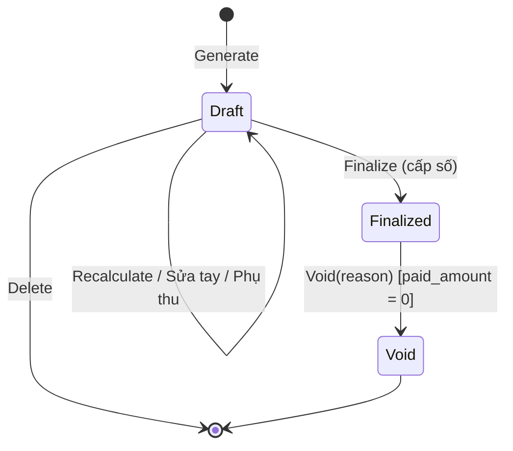

# M07 — Billing (Kỳ thu, Phiếu báo tiền phòng, Điều chỉnh & Giảm giá)

> Theo khuôn [_TEMPLATE.md](_TEMPLATE.md). Quy ước: C-03 (tiền), C-05 (kỳ thu), C-06 (snapshot). Pháp lý: L9, L15, LEG-05, LEG-08.

## 1. Mục tiêu & phạm vi

**Mục tiêu**: Tính **phiếu tiền phòng mỗi kỳ** cho từng hợp đồng, gồm 4 nhóm (04/10/2026):

| Nhóm trên phiếu | Nguồn | Ví dụ |
|---|---|---|
| **Tiền phòng** | Giá thuê HĐ (M05) | 3.500.000 |
| **Điện nước** | Công tơ của phòng (M06) × bản giá M04 `Metered` (một giá hoặc theo bậc) | Điện 88 kWh × 3.800 |
| **Dịch vụ** | Khoản dịch vụ gắn HĐ (M04 `Service`): theo phòng / theo đầu người / theo số gói | Mạng 120.000; Giữ xe 120.000 × 2 xe |
| **Phụ thu** (ít dùng) | Chủ trọ nhập tay trên phiếu nháp — 1 phòng hoặc nhiều phòng một lúc, bắt buộc lý do | Sửa khóa do người thuê làm hỏng; lắp thêm đã thỏa thuận; tiền điện công tơ cũ khi thay công tơ |

Cộng giảm trừ (giảm tay — 1 hoặc nhiều phòng) và **hoàn trả** (nhập tay như phụ thu, trả lại người thuê — BL-BR-27). Phiếu tồn tại dạng **nháp để chỉnh sửa** (mọi ô sửa được, đánh dấu "sửa tay");
**chốt** xong mới gửi cho người thuê (P2: qua Zalo kèm mã QR) và chỉ số cuối kỳ trở thành chỉ số cũ của phòng; sau khi chốt thì **bất biến** và là căn cứ thu tiền (M08).

**Trong phạm vi**
- Tạo phiếu nháp hàng loạt theo khu + tháng thu (idempotent); tính lại nháp.
- **Sửa tiền phòng của riêng kỳ này** (không đổi giá HĐ); thêm khoản phát sinh / giảm trừ thủ công.
- Chốt phiếu (cấp số), hủy phiếu (Void), phiếu quyết toán khi thanh lý.

**Ngoài phạm vi**: hóa đơn điện tử (L15), gửi phiếu qua Zalo kèm mã QR (P2), thanh toán online (P3 — sau khi có gửi Zalo), tính lãi chậm trả (P3).

**Phase**: P1.

**Hiện trạng (rà soát 10/10/2026 — đã code hết các mục dưới)**
- Phiếu nháp **Regular** theo khu + tháng thu (lọc phòng / tầng): Tiền phòng (kỳ lẻ theo C-05), Dịch vụ (trọn tháng — BL-BR-04), Điện nước (công tơ của phòng —
  cộng nhiều công tơ khi thay công tơ / chuyển phòng). Lập **tuần tự từ kỳ đầu** (BL-BR-21), kỳ đầu theo "Tính tiền từ ngày" (K5).
- Sửa tay dòng hệ thống (BL-BR-07), phụ thu / giảm trừ / hoàn trả cho 1 hoặc nhiều phòng (BL-BR-23, BL-UC-05; hoàn trả có phiếu nguồn — BL-BR-27),
  tính lại giữ ô sửa tay (BL-UC-06), cờ **"Cần tính lại"** + tính lại hàng loạt (BL-BR-20), **làm tròn** tổng xuống nghìn (BL-BR-29).
- Chốt (số `PB{yyyy}-{000000}`, BL-BR-12 tính lại và so — lệch ⇒ `DRAFT_STALE`), chốt hàng loạt, hủy phiếu theo thứ tự ngược (BL-BR-22), phiếu theo phòng.
- **Phiếu quyết toán** khi trả phòng (BL-UC-11, BL-BR-17/18) — bồi thường là phụ thu; phiếu Regular không lập cho kỳ chứa ngày trả phòng (BL-BR-02).
- **Giá theo phiên bản**: bản giá mới nhất có hiệu lực tới ngày cuối khoảng tính, áp cả dòng (FE-BR-10); điện nước một giá hoặc theo bậc (FE-BR-15).
- Kỳ thu theo khu, đổi ngày chốt có **kỳ chuyển tiếp** (BL-BR-28). Tiền phòng **thu hằng tháng** (không có đóng nhiều tháng / lần).
- Chi tiết phiếu hiện **nợ các kỳ trước** + tổng cần thanh toán (M08 PM-UC-18).
- ✅ **Khoản phát sinh theo phòng** (chốt 10/10/2026 — BL-UC-15..17, BL-BR-30..37): phụ thu / bù tạo ngay lúc xảy ra, có trạng thái đã thanh toán, cuối tháng tự vào phiếu.
- **Để sau**: in / xuất phiếu, gửi Zalo kèm mã QR (P2).
- Dữ liệu: `invoices.issues` jsonb, `is_stale`, `rounding_amount`, `round_total`; `invoice_lines` có `is_manually_edited`, `system_*`, `note`, `proration_factor`,
  `source_invoice_id`; `invoice_meter_segments` có `fee_type_id`; số phiếu dùng `document_number_sequences (organization_id, prefix, year)`. API: `docs/api/invoices.md`.

## 2. Thuật ngữ

| Thuật ngữ | Code | Định nghĩa |
|-----------|------|-----------|
| Phiếu báo tiền phòng | `Invoice` | Bảng kê số tiền phải trả của 1 HĐ cho 1 kỳ. **Không phải hóa đơn GTGT** (LEG-08) |
| Loại phiếu | `InvoiceType` | `Regular` (định kỳ), `Final` (quyết toán khi thanh lý) |
| Dòng phiếu | `InvoiceLine` | 1 khoản; lưu snapshot tên, đơn vị, số lượng, đơn giá, khoảng dịch vụ |
| Loại dòng | `LineType` | `Rent` (nhóm Tiền phòng), `Metered` (nhóm Điện nước), `Service` (nhóm Dịch vụ), `Surcharge` (nhóm Phụ thu — thủ công), `ManualDiscount` (giảm tay), `Refund` (nhóm **Hoàn trả** — thủ công) |
| Sửa tay | `is_manually_edited` | Ô (số lượng, đơn giá, chỉ số, thành tiền) trên **phiếu nháp** do chủ trọ sửa; lưu giá trị hệ thống gốc; tính lại vẫn giữ (trừ khi chọn bỏ sửa tay) |
| Nháp lỗi thời | `is_stale` | Dữ liệu nguồn (giá, chỉ số, HĐ, quy tắc) đổi sau khi tạo nháp |
| Vấn đề | `issues` | Lỗi chặn chốt: thiếu chỉ số, thiếu giá… |

## 3. Nghiệp vụ

### 3.1 Use case

| ID | Mô tả |
|----|-------|
| BL-UC-01 ✅ | Tạo phiếu nháp cho **1 hoặc nhiều khu** cho tháng thu M (hoặc 1 HĐ cụ thể) |
| BL-UC-02 ✅ | Xem danh sách phiếu theo khu/tháng/trạng thái; tổng hợp: tổng phải thu, đã thu, còn nợ |
| BL-UC-03 ✅ | Xem chi tiết phiếu: từng dòng + công thức (chỉ số cũ/mới, số người, prorate) |
| BL-UC-04 ✅ | **Sửa tay mọi ô** trên phiếu nháp (tiền phòng, số lượng, đơn giá, chỉ số, thành tiền) + ghi chú; ô bị sửa hiện nhãn "Sửa tay" và giá trị hệ thống tính; bỏ sửa tay từng ô |
| BL-UC-05 ✅ | Thêm/sửa/xóa **phụ thu** (lý do bắt buộc: sửa chữa do người thuê làm hỏng, lắp đặt thêm có thu phí, đền bù, tiền điện công tơ cũ…), **giảm trừ** hoặc **hoàn trả** thủ công — cho **1 phiếu** hoặc **nhiều phòng một lúc** (chọn phiếu, hoặc khu + tháng thu lọc phòng / tầng; kết quả từng phòng, phòng chưa có nháp báo `NO_DRAFT_INVOICE`) |
| BL-UC-06 ✅ | **Tính lại nháp** theo phạm vi: 1 phòng / nhiều phòng chọn / 1 tầng / cả khu (tháng thu M) — tùy chọn "giữ ô sửa tay" (mặc định) hoặc "tính lại từ đầu"; luôn giữ phụ thu & giảm tay |
| BL-UC-07 ✅ | Chốt phiếu (1 hoặc hàng loạt) |
| BL-UC-08 ✅ | Hủy phiếu đã chốt (chưa có thanh toán) với lý do → có thể lập lại |
| BL-UC-09 ✅ | Xóa phiếu nháp |
| BL-UC-11 ✅ | **Lập phiếu quyết toán** khi trả phòng (HĐ đang thanh lý): nhập chỉ số cuối các công tơ (M06) → hệ thống lập phiếu nháp loại `Final` cho đoạn cuối [đầu kỳ chứa ngày trả phòng, ngày trả phòng] — sửa tay / phụ thu (VD phạt báo trễ theo điều khoản) / giảm trừ / **hoàn trả** (tiền phòng chưa ở…) như phiếu thường → chốt. Trừ cọc, bồi thường: để sau |
| BL-UC-12 | In/xuất phiếu (PDF/ảnh — P2; Excel ở M10) |
| BL-UC-13 | Gửi phiếu đã chốt cho người thuê (P2: tin nhắn Zalo có chi tiết phiếu + mã VietQR); P1: xem / tải phiếu để gửi thủ công |
| BL-UC-14 ✅ | Xem **phiếu theo phòng**: danh sách phiếu của phòng (mọi HĐ), trạng thái thu, còn nợ (M08) |
| BL-UC-15 ✅ | **Tạo khoản phát sinh cho phòng đang có người thuê** — ngay lúc xảy ra (VD ngày 3/3 phòng 301 hỏng khóa, chủ trọ / quản lý khu thuê thợ thay ⇒ tạo phụ thu "Thay khóa 250k"; mất nước 2 ngày ⇒ tạo khoản bù 50k): loại **phụ thu** hoặc **bù** (giảm trừ cho người thuê), nội dung, số tiền, ngày phát sinh, lý do, và **đã thanh toán hay chưa** (phụ thu: người thuê đã trả ngay; bù: chủ trọ đã trả ngay) |
| BL-UC-16 ✅ | **Đánh dấu đã thanh toán / bỏ đánh dấu**, **hủy** khoản phát sinh khi nó chưa nằm trên phiếu đã chốt |
| BL-UC-17 ✅ | **Theo dõi khoản phát sinh theo phòng / khu**: chờ vào phiếu, đang trên nháp, đã vào phiếu số …, đã thanh toán ngay, đã hủy — chủ trọ ở xa thấy người quản lý đã ghi gì |

### 3.2 Quy tắc nghiệp vụ

| Mã | Quy tắc | Nơi kiểm tra |
|----|---------|-------------|
| BL-BR-01 ✅ | Mỗi `(contract, invoice_type, period_start)` có tối đa **1 phiếu chưa Void** | DB partial unique |
| BL-BR-02 ✅ | Kỳ phiếu Regular theo C-05: **kỳ của HĐ** có tháng thu = M (tháng của kỳ chuẩn của khu chứa kỳ đó — mỗi HĐ mỗi tháng đúng 1 kỳ, chốt 09/10/2026). Không tạo nếu kỳ bắt đầu sau `actual_end_date`; không tạo Regular khi HĐ đã có phiếu Final chưa Void. **Thêm (04/10/2026)**: HĐ đang / đã thanh lý — kỳ chứa `actual_end_date` không lập Regular (bỏ qua lý do `USE_FINAL_INVOICE`), do phiếu quyết toán đảm nhận | Domain |
| BL-BR-03 ✅ | **Dòng Tiền phòng** (hằng tháng) = giá thuê hiệu lực tại `period_start` (M05) × hệ số prorate C-05 (`Daily`: Σ overlap/len kỳ chuẩn; `FullPeriod`: 1). Không có chu kỳ nhiều tháng (BL-BR-26 đã bỏ) | Domain |
| BL-BR-04 ✅ | **Dòng Dịch vụ** (`Service`): đăng ký hiệu lực tại `period_start`; `PerRoom` qty = 1, `PerOccupant` qty = số người ở tại `period_start` (FE-BR-14), `PerUnit` qty = số gói đăng ký (VD 2 xe = 2 gói). **Thu trọn tháng, không tính theo ngày** ở kỳ lẻ (đổi 08/10/2026, code 09/10/2026): vào ở 3 ngày hay thỏa thuận riêng thì chủ trọ **sửa số lượng / thành tiền** trên nháp (BL-BR-07). Đơn giá = `unit_price_override` ?? **bản giá theo phiên bản** tại ngày cuối kỳ (FE-BR-10). Sai mà phiếu đã chốt / đã thu ⇒ sửa ở phiếu tháng sau (hoàn trả hoặc phụ thu) | Domain |
| BL-BR-05 ✅ | **Dòng Điện nước** (`Metered`): **không cần HĐ đăng ký** — mỗi công tơ của phòng hoạt động trong kỳ sử dụng U (FE-BR-17) sinh 1 dòng theo khoản thu của công tơ. U = kỳ của phiếu (`Postpaid`) hoặc kỳ liền trước (`Prepaid`; kỳ đầu tiên không có dòng Điện nước), U cắt theo khoảng ở của HĐ (bắt đầu từ chỉ số nhận phòng MT-BR-13). Sản lượng theo thuật toán M06 §3.3 (thay công tơ giữa kỳ: tự cộng phần công tơ cũ — MT-BR-15). Thành tiền theo **bản giá theo phiên bản** tại **ngày cuối U** (FE-BR-10 — đổi giá giữa kỳ thì cả kỳ tính giá mới; giá có hiệu lực từ ngày đầu kỳ sau thì thuộc kỳ sau; tạo phiếu muộn vẫn lấy giá tới ngày cuối kỳ, không lấy giá ngày tạo phiếu — (chốt 09/10/2026)): **một giá** ⇒ sản lượng × đơn giá; **theo bậc** (FE-BR-15) ⇒ chia **tổng sản lượng của kỳ** (mọi đoạn đo) theo bậc, không prorate bậc theo số ngày. Không giá riêng theo HĐ. Khoản đã ngừng dùng thì bỏ qua | Domain |
| BL-BR-06 ✅ | Làm tròn mỗi dòng về đồng (C-03). `amount` dòng giảm trừ là **số âm** | Domain + CHECK theo loại dòng |
| BL-BR-07 ✅ | **Sửa tay** (thay "sửa tiền phòng tháng"): chỉ phiếu Draft; sửa được số lượng / đơn giá / chỉ số cuối / thành tiền của mọi dòng hệ thống; dòng bị sửa lưu `is_manually_edited`, `system_quantity/system_unit_price/system_amount` (giá trị hệ thống tính) và ghi chú (bắt buộc với dòng Tiền phòng). Không ảnh hưởng HĐ / bảng giá / chỉ số gốc. Tính lại (BL-UC-06) mặc định **giữ** ô sửa tay và cập nhật giá trị hệ thống bên cạnh; nếu giá trị hệ thống mới khác giá trị hệ thống lúc sửa → cờ cảnh báo `EDITED_BASE_CHANGED`. Sửa chỉ số cuối trên phiếu = ghi chỉ số `Periodic` (M06) rồi tính lại dòng đó | Domain |
| BL-BR-08 | **Thứ tự tính**: Tiền phòng → Điện nước / Dịch vụ (hệ thống) → sửa tay → dòng thủ công (phụ thu / giảm trừ / hoàn trả). Không có quy tắc điều chỉnh | Domain |
| BL-BR-10 ✅ | **Phần thu sau giảm trừ ≥ 0** (`subtotal + discount_total`, kể cả phiếu quyết toán): giảm tay làm phần này âm → 422 `NEGATIVE_TOTAL`; muốn trả tiền lại cho người thuê thì dùng **Hoàn trả** (BL-BR-27) — chỉ dòng hoàn trả được làm **tổng phiếu âm** | Domain + CHECK `subtotal + discount_total >= 0` |
| BL-BR-11 ✅ | Phiếu Draft có `issues` mức lỗi (`MISSING_READING`, `FEE_PRICE_MISSING`, `RENT_TERM_MISSING`) → không chốt được | Domain |
| BL-BR-12 ✅ | **Chốt**: tính lại dòng hệ thống trong cùng transaction và so với nháp — **bỏ qua ô sửa tay**; lệch ở ô hệ thống → 409 `DRAFT_STALE` (người dùng tính lại / xem lại rồi chốt) ⇒ phần hệ thống của phiếu chốt luôn khớp dữ liệu nguồn tại thời điểm chốt | Application |
| BL-BR-13 ✅ | Chốt cấp `invoice_no` = `PB{yyyy}-{seq:000000}` theo tổ chức/năm (bảng sequence, `UPDATE … RETURNING`), `issue_date` = hôm nay (C-04), `due_date` = issue_date + `payment_due_days` | Application |
| BL-BR-14 ✅ | Phiếu `Finalized`/`Void` **bất biến** (không sửa dòng, không sửa tổng). Ngoại lệ duy nhất: lệnh ẩn danh người thuê (RT-BR-06) thay `snapshot_representative_name` | Domain + không có endpoint |
| BL-BR-15 ✅ | **Void** chỉ khi `paid_amount = 0` (phải hủy phân bổ thanh toán ở M08 trước); lý do bắt buộc; đặt `voided = true` cho các `invoice_meter_segments` | Domain |
| BL-BR-16 ✅ | Phiếu tổng = 0 khi chốt → coi như đã thanh toán (trạng thái thanh toán `Paid`) | Dẫn xuất |
| BL-BR-17 ✅ | **Phiếu quyết toán** (`Final`): kỳ = [Pk.start, `actual_end_date`], Pk = kỳ HĐ chứa ngày trả phòng; các kỳ trước Pk phải có phiếu (BL-BR-21). Dòng hệ thống chỉ **thu phần còn thiếu**: (1) **Tiền phòng** cho số ngày đã ở trong Pk (prorate theo HĐ) nếu Pk **chưa** có dòng Tiền phòng trên phiếu chưa hủy; đã có ⇒ không có dòng, và nếu số đã thu > tiền phòng số ngày ở thực tế ⇒ cảnh báo `RENT_OVERPAID` (ghi số thừa) — **không tự hoàn**, chủ trọ thêm dòng **Hoàn trả** nếu trả lại (BL-BR-27); (2) **Dịch vụ** của Pk nếu Pk chưa có phiếu Regular — **thu trọn tháng** như BL-BR-04 (chốt 09/10/2026); phiếu quyết toán còn là nháp nên chủ trọ sửa số lượng / thành tiền, chốt rồi mới là số người thuê phải trả; (3) **Điện nước** từ đoạn đo cuối đã lập phiếu tới **chỉ số cuối** `Final` (Prepaid gồm cả kỳ trước nếu chưa thu + kỳ cuối). (4) **Bồi thường tài sản**: chủ trọ thêm **phụ thu** (BL-BR-23) — không có dòng hệ thống riêng (đổi 10/10/2026, M05 CT-BR-23). Sửa tay / phụ thu / giảm trừ / hoàn trả như phiếu thường | Domain + Application |
| BL-BR-18 ✅ | Tạo phiếu Final khi HĐ còn phiếu **Draft** → 409 `INVOICE_DRAFT_EXISTS` (chốt hoặc xóa trước); đã có phiếu Final chưa hủy → 409 `FINAL_INVOICE_EXISTS` | Application |
| BL-BR-20 ✅ | **Cờ "Cần tính lại"** (I1 — chốt 09/10/2026): nháp đã lập mà sau đó **dữ liệu nguồn** đổi ⇒ `is_stale = true` (gợi ý UI, không chặn). Nguồn (rút gọn 10/10/2026 — chỉ những thứ hay đổi trước kỳ quyết toán mà đã lập nháp; phiếu đã chốt không bao giờ "cần tính lại" vì đổi giá trong kỳ đã chốt bị chặn): (1) chỉ số công tơ của phòng (thêm / sửa / hủy, thay công tơ); (2) HĐ: giá thuê, khoản thu, người ở (vào / ra), ngày trả phòng, "Tính tiền từ ngày", **chuyển phòng**; (xe, cài đặt khu không tính — tránh báo thừa); (3) bảng giá khoản thu (phiên bản giá mới / sửa / xóa) ⇒ nháp của khu có kỳ kết thúc từ ngày hiệu lực của giá (khoản thu vừa tạo kèm giá ban đầu: bỏ qua — chưa HĐ nào dùng); (3b) công tơ (lắp / thay / gỡ) của phòng. Đánh dấu tự động trong **cùng lần lưu** (đọc ChangeTracker — không cần nhớ gọi ở từng lệnh). Tính lại phiếu ⇒ `is_stale = false`. `GET /invoices?stale=true`; `POST /invoices/recalculate` thêm `staleOnly` (tính lại các nháp cần tính lại của khu / tháng, giữ ô sửa tay). Chốt vẫn tính lại và so (BL-BR-12) — cờ chỉ là gợi ý | Infrastructure (SaveChanges) + Application |
| BL-BR-21 ✅ | **Lập phiếu tuần tự từ kỳ đầu** (đổi (chốt 09/10/2026)): phiếu kỳ k chỉ tạo được khi kỳ k−1 của HĐ đã có phiếu chưa Void; kỳ đầu = kỳ chứa "Tính tiền từ ngày" (C-05). Bỏ ngoại lệ "phiếu đầu tiên lập kỳ nào cũng được" — HĐ nhập từ sổ cũ đặt "Tính tiền từ ngày" thay vào đó. Quên kỳ đầu ⇒ `PREVIOUS_PERIOD_NOT_BILLED`, không tự cộng dồn. Lý do: chuỗi chỉ số (MT-BR-12) và không để kỳ sau "nuốt" / bỏ sót kỳ trước | Domain |
| BL-BR-22 ✅ | **Hủy/xóa theo thứ tự ngược (LIFO)**: chỉ Void phiếu đã chốt / xóa phiếu nháp khi nó là phiếu **mới nhất chưa Void** của HĐ (theo `period_start`, Final là mới nhất). Muốn sửa phiếu kỳ cũ → hủy lần lượt các phiếu sau nó | Domain |
| BL-BR-23 ✅ | **Phụ thu** (`Surcharge`): dòng nhập tay trên phiếu nháp, số tiền > 0, **lý do bắt buộc**, tùy chọn gắn khoản thu (`fee_type_id`) và số lượng × đơn giá. Thêm cho 1 phiếu hoặc **nhiều phòng một lúc** (BL-UC-05). Dùng cho: sửa chữa do người thuê làm hỏng (VD khóa cửa), lắp đặt thêm có thu phí đã thỏa thuận, đền bù, và **thay công tơ — cách 1**: tính theo công tơ mới + phụ thu = tiền điện công tơ cũ do chủ trọ tự tính (cách 2: công tơ phiên bản, hệ thống tự cộng — MT-BR-15). Giữ nguyên khi tính lại; không tạo đoạn đo | Domain |
| BL-BR-24 ✅ | **Sau khi chốt**: phiếu bất biến (BL-BR-14); chỉ số cuối kỳ bị khóa và thành chỉ số cũ của phòng cho kỳ sau (MT-BR-16); phiếu sẵn sàng gửi (BL-UC-13). Sai sót sau khi chốt → hủy phiếu (BL-BR-15, chưa có thanh toán) rồi lập lại | Domain |
| BL-BR-27 ✅ | **Hoàn trả** (07/10/2026; **đổi 09/10/2026 — E**): nhóm dòng riêng `Refund` trên phiếu (không thuộc Dịch vụ), nhập tay, số tiền nhập dương, lưu **âm**, lý do bắt buộc. **Chỉ dùng khi hệ thống tính sai trên phiếu đã chốt mà người thuê đã trả** (VD trả phòng sớm đã thu trọn tiền phòng — gợi ý từ `RENT_OVERPAID`, thu nhầm kỳ trước): bắt buộc chọn **phiếu nguồn** (`source_invoice_id` — phiếu đã chốt của cùng HĐ) → thiếu ⇒ 400 `REFUND_SOURCE_REQUIRED`; số tiền ≤ **số đã thu thật** của phiếu nguồn (`paid_amount − written_off_amount`) − Σ hoàn trả khác đã trỏ tới phiếu nguồn (phiếu chưa hủy) → 422 `REFUND_EXCEEDS_PAID` (chặn nhẹ — tránh hoàn tiền chưa từng thu). Phiếu nguồn **chưa thu** mà tính sai ⇒ không hoàn — dùng bỏ nợ phần sai (M08 PM-UC-16). Thêm hàng loạt **không** cho loại Hoàn trả (mỗi phòng một phiếu nguồn khác nhau) → 400. Chỉ hoàn trả được làm **tổng phiếu âm** (`total = subtotal + discount_total + refund_total + rounding_amount`). Phiếu đã chốt tổng âm: **Chờ hoàn** (`RefundPending`) — không phải nợ, không bù trừ nợ phiếu khác — tới khi chủ trọ **xác nhận đã hoàn** (`POST /invoices/{id}/refund`: ngày hoàn ∈ [ngày lập phiếu, hôm nay], phương thức, ghi chú) ⇒ **Đã hoàn** (`Refunded`); bỏ xác nhận được (nhập nhầm) và phải bỏ trước khi hủy phiếu (`REFUND_CONFIRMED`). Hoàn tất thanh lý bị chặn khi còn phiếu Chờ hoàn → 422 `REFUND_PENDING`. Trả thừa (người thuê chuyển dư) vẫn chặn ở M08 `PAYMENT_EXCEEDS_DEBT` — backlog khi có thanh toán online (M08 §1) | Domain + Application |
| BL-BR-28 ✅ | **Kỳ chuyển tiếp khi đổi ngày chốt / thu trước–thu sau** (K4 — chốt 09/10/2026, PR-BR-09). (1) **Tiền phòng** kỳ chuyển tiếp = 1 tháng ± **số ngày điều chỉnh** chủ trọ chọn khi đổi ngày chốt: kỳ dư N ngày ⇒ tính thêm 0..N ngày, kỳ thiếu N ngày ⇒ trừ 0..N ngày; hệ thống hiện "Kỳ chuyển tiếp dư / thiếu N ngày (≈ X đ/phòng)" và **điền sẵn**: lệch ≤ 3 ngày ⇒ 0 (không đáng thu), lệch ≥ 4 ngày ⇒ đủ N ngày; chủ trọ sửa được. Một số ngày cho cả khu, tiền tính theo giá từng phòng, giá 1 ngày theo cách chia ngày của khu (như kỳ lẻ). Dòng tiền phòng ghi rõ "1 tháng + 4 ngày (đổi ngày chốt)"; phòng ngoại lệ sửa tay trên phiếu nháp. (2) **Điện nước theo công tơ**: theo chỉ số thật cuối kỳ chuyển tiếp — không điều chỉnh. (3) **Dịch vụ cố định**: trọn 1 tháng, không chia ngày. (4) **Thu trước ↔ thu sau**: mỗi kỳ tiền phòng / dịch vụ cố định chỉ thu một lần — thu trước → thu sau: phiếu thu sau của kỳ đã thu trước không có lại tiền phòng / dịch vụ cố định (chỉ điện nước); thu sau → thu trước: phiếu đầu tiên gồm kỳ vừa qua (thu sau) + kỳ mới (thu trước) ⇒ cảnh báo `TWO_RENT_PERIODS` "Phiếu này gồm 2 tháng tiền phòng". Khóa mức lệch / số lần đổi: **để sau**. Code 09/10/2026: `BillingSchedule` (kỳ chuyển tiếp = [mốc đổi, ngày chốt mới tháng sau − 1], tháng thu = tháng của mốc đổi), dòng tiền phòng ghi "Tiền phòng (1 tháng + N ngày — đổi ngày chốt)" | Domain `InvoiceCalculator` + Application |
| BL-BR-29 ✅ | **Làm tròn tổng phiếu** (H1 — chốt 09/10/2026): khu bật "Làm tròn tổng phiếu" (`properties.round_invoice_total`, mặc định **bật**) ⇒ sau khi tính mọi dòng, bỏ phần lẻ dưới 1.000đ của tổng (về 0 — 523.560 → 523.000; tổng âm −12.400 → −12.000), lưu ở cột `rounding_amount` (|x| < 1.000) và **hiển thị thành dòng "Làm tròn" (−560)** cuối phiếu — không phải `invoice_line` (code: tránh lẫn với dòng hệ thống khi so BL-BR-12, không sửa tay được). Tính lại mỗi khi tổng nháp đổi (tính lại, sửa tay, thêm / xóa dòng); phiếu nhớ cờ `round_total` lúc tính. Tổng đã tròn nghìn ⇒ không có dòng. Tắt ở khu ⇒ nháp sau khi tính lại không còn dòng làm tròn. Phiếu đã chốt giữ nguyên | Domain |
| BL-BR-30 ✅ | **Khoản phát sinh** (`room_charges`, chốt 10/10/2026): thuộc **phòng** nhưng chỉ tạo được khi phòng **có người thuê** tại ngày phát sinh — hệ thống gắn với HĐ đang ở phòng ngày đó (tính cả lịch sử chuyển phòng, M05 CT-BR-14); phòng trống → 422 `ROOM_CHARGE_NO_TENANT` (việc của riêng chủ trọ, không ghi ở đây). HĐ phải còn lập được phiếu: `Active`, hoặc `Liquidating` mà phiếu quyết toán chưa chốt → ngược lại 422 `ROOM_CHARGE_NO_OPEN_INVOICE`. Loại `Surcharge` (phụ thu, +) / `Credit` (bù cho người thuê, −); số tiền > 0 nguyên đồng; ngày phát sinh ≤ hôm nay; nội dung + lý do bắt buộc | Domain + Application |
| BL-BR-31 ✅ | **Trạng thái thanh toán của khoản**: `settled = false` (chưa thanh toán — sẽ thu / trừ qua phiếu) hoặc `true` kèm ngày + phương thức (phụ thu: người thuê **đã trả ngay**; bù: chủ trọ **đã trả ngay**). Đánh dấu / bỏ đánh dấu được khi khoản **chưa nằm trên phiếu đã chốt**; khoản đang trên nháp ⇒ dòng trên nháp đổi theo ngay. Đã chốt ⇒ khóa (422 `ROOM_CHARGE_LOCKED`) | Domain + Application |
| BL-BR-32 ✅ | **Vào phiếu nào — tháng nào ra tháng đấy**: khoản được gắn vào **phiếu nháp của HĐ có ngày cuối kỳ ≥ ngày phát sinh** (phiếu thường hoặc quyết toán). Nháp đã có ⇒ gắn ngay lúc tạo khoản; chưa có ⇒ khoản **chờ**, tự gắn khi lập / tính lại nháp. Kỳ chứa ngày phát sinh **đã chốt** (VD phát sinh 29/3 nhưng phiếu tháng 3 chốt 28/3) ⇒ vào phiếu **kỳ kế tiếp**; chốt sau (1/4) ⇒ vào tháng 3. Một khoản chỉ nằm trên 1 phiếu | Application |
| BL-BR-33 ✅ | **Trên phiếu**: mỗi khoản là 1 dòng `Surcharge` / `ManualDiscount` có `room_charge_id`. Khoản **chưa thanh toán** cộng vào tổng (phụ thu +, bù −). Khoản **đã thanh toán / đã hoàn** vẫn hiện trên phiếu cho đầy đủ ("đã thu 3/3" / "đã trả 3/3") nhưng **không tính vào tổng** (`is_settled = true`) — tiền hai phía rõ ràng, không thu / trừ lần 2. Bù chưa trả mà làm phần thu của phiếu âm (BL-BR-10) ⇒ chưa gắn, khoản vẫn chờ, nháp có cảnh báo `ROOM_CHARGE_NOT_ATTACHED` | Domain |
| BL-BR-34 ✅ | **Thêm tay trên nháp cũng là khoản phát sinh**: phụ thu / giảm trừ thêm trên nháp (BL-BR-23, 1 phiếu hoặc nhiều phòng) tạo luôn 1 khoản phát sinh của phòng gắn vào nháp đó (ngày phát sinh = hôm nay, hoặc ngày cuối kỳ nếu kỳ đã qua), cũng chọn đã thanh toán / chưa ⇒ mọi phụ thu / bù đều theo dõi được theo phòng. Sửa dòng trên nháp ⇒ sửa khoản; xóa dòng ⇒ **hủy** khoản. (Dòng **Hoàn trả** theo phiếu nguồn — BL-BR-27 — không phải khoản phát sinh.) | Application |
| BL-BR-35 ✅ | **Hủy khoản** (lý do): khi chưa nằm trên phiếu đã chốt; đang trên nháp ⇒ xóa dòng. **Nháp bị xóa / phiếu đã chốt bị hủy** ⇒ các khoản của phiếu đó quay về **chờ** và vào phiếu lập lại | Application |
| BL-BR-36 ✅ | **Tính lại nháp** giữ nguyên dòng khoản phát sinh (như dòng nhập tay) và gắn thêm các khoản đang chờ đủ điều kiện (BL-BR-32). Chốt phiếu ⇒ khoản bị khóa cùng phiếu | Application |
| BL-BR-37 ✅ | **Báo cáo** (M10): phụ thu đã thu ngay tính vào tiền thực nhận theo ngày thanh toán; bù đã trả ngay tính là tiền đã trả lại người thuê | M10 |

### 3.3 Vòng đời


Trạng thái thanh toán (dẫn xuất, chỉ khi Finalized): tổng âm ⇒ `RefundPending` (chưa xác nhận hoàn) / `Refunded`; còn lại `Unpaid` (paid = 0), `PartiallyPaid`, `Paid` (paid ≥ total), `WrittenOff` (đủ nhờ bỏ nợ — PM-BR-16), `Overdue` = chưa Paid ∧ hôm nay > due_date.

### 3.4 Ví dụ tính (khu thu trước, chốt ngày 5)

HĐ bắt đầu 05/10/2026, giá 3.500.000; dịch vụ: giữ xe 2 gói × 100.000, wifi 50.000 (theo phòng); điện nước: điện 3.800đ/kWh.
- Phiếu tháng 10 (kỳ 05/10–04/11): Rent 3.500.000; Giữ xe 200.000; Wifi 50.000; **không có điện** (kỳ đầu, prepaid) → 3.750.000.
- Phiếu tháng 11 (kỳ 05/11–04/12): Rent 3.500.000; Giữ xe 200.000; Wifi 50.000; Điện kỳ 05/10–04/11: 1.338 − 1.250 = 88 kWh × 3.800 = 334.400;
  → **4.084.400**.
- Chủ trọ sửa tay tiền phòng tháng 11 thành 3.000.000 (ghi chú: mất nước 5 ngày) → 3.584.400.
- Người thuê làm hỏng khóa: thêm **phụ thu** 250.000 (lý do "Thay khóa cửa do làm hỏng") → 3.834.400.
- Bồn nước hỏng 3 ngày: chủ trọ thêm **giảm trừ** 100.000 cho cả khu một lúc (BL-UC-05) → **3.734.400**.
- Giá điện đổi 3.800 → 4.000 từ 20/10: cả kỳ 05/10–04/11 tính **4.000** (giá mới) → điện 352.000.

## 4. Dữ liệu

**`invoices`**

| Cột | Kiểu | Null | Ghi chú |
|-----|------|------|--------|
| id, organization_id | uuid | N | |
| property_id, room_id, contract_id | uuid | N | FK composite; property/room = của HĐ (kiểm khi tạo) |
| invoice_type | varchar(8) | N | `Regular`,`Final` |
| period_start / period_end | date | N | CHECK period_end ≥ period_start |
| billing_month | date | N | ngày 1 của tháng thu (`date_trunc('month', period_start)`) — CHECK |
| status | varchar(12) | N | `Draft`,`Finalized`,`Void` |
| invoice_no | varchar(20) | Y | NOT NULL khi Finalized/Void (CHECK); UNIQUE (organization_id, invoice_no) |
| issue_date / due_date | date | Y | NOT NULL khi Finalized |
| subtotal | numeric(18,0) | N | Σ dòng dương |
| discount_total | numeric(18,0) | N | Σ dòng giảm trừ (≤ 0, không gồm hoàn trả) |
| refund_total | numeric(18,0) | N | Σ dòng hoàn trả (≤ 0) — BL-BR-27 |
| total_amount | numeric(18,0) | N | subtotal + discount_total + refund_total + rounding_amount; được âm (chủ trọ phải hoàn). CHECK `subtotal + discount_total >= 0` khi đã chốt |
| paid_amount | numeric(18,0) | N | 0; cache do M08 cập nhật trong cùng transaction (gồm cả phần bỏ nợ); CHECK 0 ≤ paid_amount ≤ max(total_amount, 0) |
| written_off_amount | numeric(18,0) | N | phần của `paid_amount` đóng bằng bỏ nợ (PM-BR-16) — loại khỏi doanh thu; CHECK 0 ≤ written_off ≤ paid |
| is_stale | bool | N | false — "Cần tính lại" (BL-BR-20, I1) |
| rounding_amount | numeric(18,0) | N | 0 — "Làm tròn" (BL-BR-29); CHECK \|x\| < 1000 |
| round_total | bool | N | khu bật làm tròn lúc tính phiếu gần nhất |
| issues | jsonb | N | `[]` — `{code, severity: Error|Warning, ref}` |
| refunded_on / refund_method / refund_note | date / varchar(16) / varchar(300) | Y | xác nhận đã trả lại người thuê phần tổng âm (BL-BR-27); CHECK `refunded_on IS NULL OR (total_amount < 0 AND refund_method IS NOT NULL)` |
| snapshot_room_code / snapshot_contract_no / snapshot_representative_name | varchar | N | C-06 |
| note | text | Y | in trên phiếu |
| finalized_at/by, voided_at/by, void_reason | | Y | |
| audit, xmin | | | |

- UNIQUE `(contract_id, invoice_type, period_start) WHERE status <> 'Void'` (BL-BR-01).
- UNIQUE `(organization_id, contract_id, id)` — đích của FK composite từ `payment_allocations` (M08), chặn phân bổ chéo HĐ.
- FK composite `(organization_id, property_id, contract_id)` → contracts.
- CHECK `status <> 'Void' OR void_reason IS NOT NULL`; CHECK `status = 'Draft' OR (invoice_no IS NOT NULL AND issue_date IS NOT NULL)`.
- INDEX `(organization_id, property_id, billing_month)`, `(organization_id, contract_id, period_start)`, `(organization_id, due_date) WHERE status='Finalized' AND paid_amount < total_amount`.

**`invoice_lines`**

| Cột | Kiểu | Null | Ghi chú |
|-----|------|------|--------|
| id, organization_id, invoice_id | uuid | N | |
| line_type | varchar(16) | N | |
| is_system | bool | N | true = do hệ thống sinh (bị thay khi tính lại) |
| fee_type_id | uuid | Y | Metered / Service; Surcharge tùy chọn |
| description | varchar(200) | N | snapshot tên |
| unit | varchar(20) | Y | snapshot |
| service_from / service_to | date | N | khoảng dịch vụ của dòng |
| quantity | numeric(12,2) | N | |
| unit_price | numeric(18,2) | N | |
| proration_factor | numeric(12,8) | Y | hệ số prorate (C-05); điện nước theo bậc: thành tiền / (sản lượng × đơn giá bình quân) |
| system_quantity / system_unit_price / system_amount | numeric | Y | giá trị hệ thống tính khi dòng bị sửa tay (BL-BR-07) |
| is_manually_edited | bool | N | false |
| note | varchar(300) | Y | ghi chú sửa tay / lý do phụ thu (bắt buộc với `Surcharge`) |
| source_invoice_id | uuid | Y | phiếu nguồn của dòng `Refund` (BL-BR-27 — bắt buộc với dòng hoàn trả mới) |
| amount | numeric(18,0) | N | |
| sort_order | int | N | |

CHECK theo loại: `line_type IN ('ManualDiscount','Refund') OR amount >= 0`; `line_type NOT IN ('ManualDiscount','Refund') OR amount <= 0`; `line_type NOT IN ('Surcharge','ManualDiscount','Refund') OR note IS NOT NULL`.
UNIQUE `(invoice_id) WHERE line_type = 'Rent'` (tối đa 1 dòng Rent); UNIQUE `(invoice_id, fee_type_id) WHERE fee_type_id IS NOT NULL AND is_system` (dòng thủ công gắn khoản thu — BL-BR-23 — không bị giới hạn).

**`room_charges`** (BL-BR-30..37)

| Cột | Kiểu | Null | Ghi chú |
|-----|------|------|--------|
| id, organization_id, property_id, room_id | uuid | N | phòng phát sinh |
| contract_id | uuid | N | HĐ đang ở phòng tại ngày phát sinh |
| kind | varchar(10) | N | `Surcharge` / `Credit` |
| description | varchar(200) | N | |
| amount | numeric(18,0) | N | CHECK > 0 |
| incurred_on | date | N | ngày phát sinh |
| reason | varchar(300) | N | |
| is_settled | bool | N | đã thanh toán / đã hoàn ngay |
| settled_on / settled_method | date / varchar(20) | Y | CHECK có khi `is_settled` |
| invoice_id | uuid | Y | phiếu đang chứa khoản (nháp hoặc đã chốt); NULL = chờ |
| cancelled_at / cancel_reason | | Y | |
| audit, xmin | | | |

`invoice_lines` thêm `room_charge_id uuid NULL` (index, không unique — phiếu đã hủy vẫn giữ dòng cũ khi khoản vào phiếu lập lại), `is_settled bool` (dòng không tính vào tổng).
Index `(organization_id, room_id, incurred_on)`, `(organization_id, contract_id) WHERE invoice_id IS NULL AND cancelled_at IS NULL`.

**`invoice_meter_segments`**: id, organization_id, invoice_line_id, meter_id, start_reading_id, end_reading_id, start_value, end_value,
consumption numeric(12,2), voided bool.
- UNIQUE `(end_reading_id) WHERE NOT voided`; UNIQUE `(start_reading_id) WHERE NOT voided` ⇒ một khoảng chỉ số **không thể** bị tính 2 lần.
- CHECK `end_value >= start_value`, `consumption = end_value - start_value`.

**`document_number_sequences`**: (organization_id, prefix, year) PK, last_value bigint — dùng chung `PB` (phiếu báo) và `PT` (phiếu thu).

## 5. Domain model

```
Invoice (aggregate root; Lines, MeterSegments)
  + static CreateDraft(contractSnapshot, period, type)
  + ApplyCalculation(CalculationResult)        // thay dòng is_system, giữ dòng thủ công & ô sửa tay (BL-BR-07)
  + EditLine(lineId, values, note) / ResetLine(lineId)   // sửa tay / bỏ sửa tay
  + AddManualLine(type, description, amount, ...) / UpdateManualLine / RemoveManualLine
  + Finalize(invoiceNo, today, dueDays)         // BL-BR-11, 14
  + Void(reason, now)                            // BL-BR-15
  + ApplyPayment(delta) // chỉ M08 gọi; giữ 0 ≤ paid ≤ total
InvoiceCalculator (domain service thuần) — đầu vào là snapshot dữ liệu (HĐ, rent terms, fees, giá, người ở, đoạn đo):
  Calculate(contract, period, type, options) : CalculationResult { lines[], segments[], issues[] }
```
Toàn bộ logic tính tiền nằm trong `InvoiceCalculator` + `BillingPeriodCalculator` + `MeterUsageCalculator` → unit test thuần, không DB.

## 6. Application

| Use case | Loại | Lỗi nghiệp vụ |
|----------|------|---------------|
| `GenerateInvoicesCommand` (Idempotency-Key) | Cmd | input: propertyIds[] hoặc contractIds[], billingMonth, `recalculateExistingDrafts` → `{created, recalculated, skipped:[{contractId, reason: EXISTS \| PREVIOUS_PERIOD_NOT_BILLED \| ENDED \| HAS_FINAL}], withIssues}` |
| `RecalculateInvoicesCommand` | Cmd | phạm vi: `invoiceIds[]` \| `roomIds[]` \| `propertyId + floor` \| `propertyId` + `billingMonth`; `keepManualEdits` (mặc định true) → kết quả từng phiếu; bỏ qua phiếu không phải Draft |
| `EditInvoiceLineCommand` / `ResetInvoiceLineCommand` | Cmd | sửa tay / bỏ sửa tay 1 dòng hệ thống — `INVOICE_NOT_DRAFT`, `NEGATIVE_TOTAL`, `NOTE_REQUIRED` |
| `AddManualLineCommand` / `UpdateManualLineCommand` / `RemoveManualLineCommand` | Cmd | phụ thu (`Surcharge`) / giảm tay (`ManualDiscount`) / hoàn trả (`Refund`), lý do bắt buộc — `INVOICE_NOT_DRAFT`, `NEGATIVE_TOTAL`, `NOTE_REQUIRED` |
| `BulkAddManualLineCommand` | Cmd | cùng 1 dòng tay cho nhiều phiếu nháp: `invoiceIds[]` hoặc `propertyId + billingMonth` (lọc `roomIds[]`, `floor`) → `{ added, results:[{invoiceId?, roomId, roomCode, success, errorCode}] }` |
| `ConfirmInvoiceRefundCommand` / `CancelInvoiceRefundCommand` | Cmd | xác nhận / bỏ xác nhận đã hoàn phần tổng âm — `NOTHING_TO_REFUND`, `REFUND_CONFIRMED`, `REFUND_NOT_CONFIRMED`, `INVALID_REFUND_DATE` |
| `FinalizeInvoiceCommand` | Cmd | `INVOICE_HAS_ISSUES`, `DRAFT_STALE`, `CONCURRENCY_CONFLICT` |
| `FinalizeInvoicesBatchCommand` | Cmd | mỗi phiếu chốt trong transaction riêng; trả kết quả từng phiếu |
| `VoidInvoiceCommand` | Cmd | `INVOICE_HAS_PAYMENTS`, `NOT_LATEST_INVOICE` |
| `DeleteDraftInvoiceCommand` | Cmd | `INVOICE_NOT_DRAFT`, `NOT_LATEST_INVOICE` |
| `CreateFinalInvoiceCommand` (từ M05) | Cmd | `INVOICE_DRAFT_EXISTS`, `FINAL_INVOICE_EXISTS`, `PREVIOUS_PERIOD_NOT_BILLED`, `MISSING_READING` |
| `ListInvoicesQuery` | Qry | propertyIds, billingMonth, status, paymentStatus, overdue, contractId, **roomId**, floor; kèm tổng hợp |
| `GetInvoiceQuery` | Qry | chi tiết + segments + công thức |
| Interfaces cung cấp cho module khác | | `IInvoiceLockReader.GetFirstOpenPeriodStart(contractId)` (M05), `IFinalizedUsageReader` (M04), `IReadingLockReader` (M06) |

## 7. API

| Method | Route | Mã lỗi |
|--------|-------|--------|
| POST | `/rooms/{roomId}/charges` `{ kind, description, amount, incurredOn, reason, settled?, settledOn?, method? }` (Idempotency-Key) | 422 `ROOM_CHARGE_NO_TENANT`, `ROOM_CHARGE_NO_OPEN_INVOICE` |
| GET | `/rooms/{roomId}/charges` · `/room-charges?propertyId=&status=&from=&to=` | danh sách theo phòng / khu |
| POST / DELETE | `/room-charges/{id}/settle` `{ settledOn, method }` | đánh dấu / bỏ đánh dấu đã thanh toán — 422 `ROOM_CHARGE_LOCKED` |
| POST | `/room-charges/{id}/cancel` `{ reason }` | 422 `ROOM_CHARGE_LOCKED` |
| POST | `/invoices/generate` | 422 |
| GET | `/invoices?propertyIds=&billingMonth=2026-11&status=&paymentStatus=&overdue=` | |
| GET | `/rooms/{roomId}/invoices` — phiếu theo phòng + còn nợ | |
| GET | `/invoices/{id}` | 404 |
| DELETE | `/invoices/{id}` (Draft) | 422 `INVOICE_NOT_DRAFT` |
| POST | `/invoices/recalculate` `{ invoiceIds? , roomIds?, propertyId?, floor?, billingMonth?, keepManualEdits }` | 200 kết quả từng phiếu |
| PUT / DELETE | `/invoices/{id}/lines/{lineId}` `{ quantity?, unitPrice?, endReading?, amount?, note, version }` — sửa tay / bỏ sửa tay | 422 |
| POST / PUT / DELETE | `/invoices/{id}/manual-lines[/{lineId}]` (phụ thu / giảm tay / hoàn trả) | 422 `NEGATIVE_TOTAL`, `NOTE_REQUIRED` |
| POST | `/invoices/manual-lines` — cùng 1 dòng tay cho nhiều phòng | 200 kết quả từng phiếu |
| POST | `/invoices/{id}/finalize` `{ version }` | 409 `DRAFT_STALE`, 422 `INVOICE_HAS_ISSUES` |
| POST | `/invoices/finalize-batch` `{ invoiceIds[] }` | 200 kết quả từng phiếu |
| POST | `/invoices/{id}/void` `{ reason }` | 422 `INVOICE_HAS_PAYMENTS`, `REFUND_CONFIRMED` |
| POST / DELETE | `/invoices/{id}/refund` `{ refundedOn, method, note? }` — xác nhận / bỏ xác nhận đã hoàn | 422 `NOTHING_TO_REFUND`, `REFUND_CONFIRMED` |

**Ví dụ — chi tiết phiếu**
```json
{
  "id": "…", "invoiceNo": null, "status": "Draft", "type": "Regular",
  "period": { "start": "2026-11-05", "end": "2026-12-04" }, "billingMonth": "2026-11",
  "room": "101", "contractNo": "HD2026-0012",
  "lines": [
    { "type": "Rent", "group": "Rent", "description": "Tiền phòng", "quantity": 1, "unitPrice": 3500000, "amount": 3000000,
      "isManuallyEdited": true, "systemAmount": 3500000, "note": "Mất nước 5 ngày" },
    { "type": "Metered", "description": "Điện", "unit": "kWh", "serviceFrom": "2026-10-05", "serviceTo": "2026-11-04",
      "segments": [ { "meterSerial": "E-101", "startValue": 1250, "endValue": 1338, "consumption": 88 } ],
      "quantity": 88, "unitPrice": 3800, "amount": 334400 },
    { "type": "Service", "description": "Giữ xe máy", "unit": "xe", "quantity": 2, "unitPrice": 100000, "amount": 200000 },
    { "type": "Service", "description": "Wifi", "unit": "phòng", "quantity": 1, "unitPrice": 50000, "amount": 50000 },
    { "type": "Surcharge", "description": "Thay khóa cửa", "quantity": 1, "unitPrice": 250000, "amount": 250000, "note": "Người thuê làm hỏng khóa" },
    { "type": "ManualDiscount", "description": "Giảm trừ – Mất nước 3 ngày", "amount": -100000, "note": "Bồn nước hỏng" }
  ],
  "subtotal": 3834400, "discountTotal": -100000, "totalAmount": 3734400, "paidAmount": 0,
  "isStale": false, "issues": [], "version": "123456"
}
```

## 8. Validation

| Field | Quy tắc |
|-------|---------|
| billingMonth | `yyyy-MM`; ≤ tháng hiện tại + 1 |
| propertyIds / contractIds | 1–50 khu hoặc 1–1.000 HĐ |
| line edit | quantity ≥ 0 (2 số lẻ); unitPrice / amount số nguyên ≥ 0, ≤ 1.000.000.000; note 1–300 (bắt buộc với dòng Tiền phòng) |
| surcharge reason / manual description / void reason | 1–300 |
| manualLine.amount | Surcharge / ManualDiscount / Refund: nhập dương 1…100.000.000; giảm trừ và hoàn trả lưu âm |

## 9. Phân quyền
P1: chủ trọ và phó quản lý toàn quyền nghiệp vụ (M01 §3.3). P3: quyền riêng `OverrideRent`, `VoidInvoice`.

## 10. Toàn vẹn dữ liệu & concurrency

| Kịch bản | Rủi ro | Giải pháp |
|----------|--------|-----------|
| 2 người bấm "tạo phiếu tháng 11" cùng lúc | Phiếu trùng | Partial unique BL-BR-01 + Idempotency-Key; xung đột unique → coi như "skipped: exists" |
| Chốt phiếu trong khi ai đó sửa giá/chỉ số | Phiếu chốt với số liệu cũ | BL-BR-12 tính lại khi chốt; khóa theo thứ tự cố định: `contracts` → `fee_types` (theo id) → `meters` (theo id) → `invoices` |
| Chốt song song 2 phiếu → trùng số | Trùng `invoice_no` | Sequence row lock + UNIQUE |
| Sửa nháp đồng thời 2 tab | Mất cập nhật | xmin version (C-07) |
| Void phiếu đã có thanh toán | Tiền "mồ côi" | BL-BR-15 + CHECK paid ≤ total |
| Chỉ số bị tính 2 lần (2 phiếu / Final + Regular) | Thu trùng | UNIQUE start/end reading trên segments chưa void |
| Quy tắc % lũy kế ra số âm | Tổng âm | BL-BR-10 + CHECK total ≥ 0 |
| Giá thuê đổi giữa kỳ | Không rõ áp giá nào | CT-BR-05: chỉ đổi từ đầu kỳ |
| Draft cũ quên chốt, nguồn thay đổi nhiều lần | Lệch | `is_stale` + BL-BR-12 |
| Lệch múi giờ khi cấp `issue_date` | Ngày phiếu sai lúc 0h–7h | TimeProvider VN (C-04) |

## 11. Audit
Audit: tạo/tính lại/sửa tay (từng ô: giá trị hệ thống → giá trị sửa)/phụ thu/giảm trừ/hoàn trả/chốt/void/xóa nháp. Phụ thu & void luôn có lý do.

## 12. Kế hoạch test
- **Unit `InvoiceCalculator` (bảng ≥ 40 case)**: Prepaid vs Postpaid; kỳ đầu lẻ (Daily/FullPeriod); anchor 31 vào tháng 2 (năm nhuận/không);
  PerOccupant đổi người giữa kỳ; giữ xe đổi số lượng từ kỳ sau; giá danh mục vs giá riêng; sửa tay giữ qua tính lại; giá điện đổi giữa kỳ → giá mới; thay công tơ giữa kỳ (2 cách); dịch vụ kỳ lẻ thu trọn tháng;
  giá dịch vụ đổi giữa kỳ → bản giá mới nhất tới cuối kỳ; phiếu Final: Prepaid đã thu trọn kỳ → cảnh báo `RENT_OVERPAID`, Postpaid chưa có Regular, thay công tơ trong kỳ cuối; thiếu chỉ số → issue;
  hoàn trả làm tổng âm / giảm tay không vượt phần thu / xác nhận & bỏ xác nhận hoàn / hủy phiếu đã xác nhận hoàn → 422.
- Integration: generate idempotent (gọi 2 lần → không trùng); chốt khi nguồn đổi → 409 `DRAFT_STALE`; chốt song song 20 phiếu → số liên tục không trùng;
  void khi có thanh toán → 422; sau void lập lại được và chỉ số được tái sử dụng; trả phòng sớm → hoàn trả → Chờ hoàn chặn hoàn tất thanh lý → xác nhận hoàn;
  phụ thu nhiều phòng (phòng chưa có nháp báo `NO_DRAFT_INVOICE`); **C-01**.
- **Khoản phát sinh (BL-BR-30..37) — kịch bản**:
  1. Phòng trống → `ROOM_CHARGE_NO_TENANT`; phòng có người, chưa có nháp → khoản **chờ**; lập nháp tháng đó ⇒ có dòng phụ thu, tổng tăng.
  2. Nháp đã có ⇒ tạo khoản là gắn ngay; khoản **bù** ⇒ dòng giảm trừ, tổng giảm.
  3. Khoản **đã thanh toán** ⇒ dòng hiện trên phiếu với `isSettled`, **tổng không đổi**; đánh dấu đã thanh toán khoản đang trên nháp ⇒ tổng giảm đúng số đó; bỏ đánh dấu ⇒ tổng trở lại.
  4. Phát sinh ngày thuộc kỳ **đã chốt** ⇒ không vào phiếu đó, vào nháp kỳ kế tiếp; phát sinh ngày thuộc kỳ sau ⇒ không vào nháp kỳ trước.
  5. Chốt phiếu ⇒ đánh dấu / hủy khoản → `ROOM_CHARGE_LOCKED`. Hủy phiếu ⇒ khoản về chờ, lập lại phiếu thì có lại. Xóa nháp ⇒ về chờ.
  6. Hủy khoản đang trên nháp ⇒ dòng mất, tổng đổi. Xóa dòng trên nháp ⇒ khoản thành đã hủy.
  7. Thêm phụ thu tay trên nháp (kể cả nhiều phòng) ⇒ có khoản phát sinh tương ứng trong danh sách của phòng; chọn đã thanh toán ⇒ không tính tổng.
  8. Bù lớn hơn phần thu ⇒ không gắn, nháp có cảnh báo `ROOM_CHARGE_NOT_ATTACHED`, khoản vẫn chờ.
  9. HĐ đang thanh lý chưa có phiếu quyết toán ⇒ khoản vào phiếu quyết toán; phiếu quyết toán đã chốt → `ROOM_CHARGE_NO_OPEN_INVOICE`.
  10. Chuyển phòng: khoản tạo ở phòng cũ với ngày trước ngày chuyển ⇒ gắn HĐ đã chuyển đi, vào phiếu của HĐ đó.
- E2E: F4 trên khu 20 phòng.

## 13. Phụ thuộc
- Dùng: M02 (phòng, nhóm), M04 (giá), M05 (HĐ, rent terms, fees, occupants), M06 (`IMeterUsageProvider`).
- Bị dùng: M08 (phân bổ thanh toán, cập nhật `paid_amount`), M05 (khóa kỳ, phiếu Final), M10.

## 14. Task breakdown

| ID | Task | Ước lượng |
|----|------|-----------|
| BL-01 | `InvoiceCalculator` + bảng test (thuần domain) | 3d |
| BL-02 | Entity Invoice/Lines/Segments + EF + constraints + sequence | 1.5d |
| BL-03 | Generate (batch, idempotent, snapshot loader tối ưu theo khu) | 2d |
| BL-04 | Sửa tay / phụ thu / tính lại theo phòng–tầng–khu | 1.5d |
| BL-05 | Finalize (+ batch) với tính lại & khóa | 1.5d |
| BL-06 | Void/Delete | 0.5d |
| BL-08 | Final invoice | 1.5d |
| BL-09 | Interfaces lock cho M04/M05/M06 | 0.5d |
| BL-10 | Integration/E2E tests | 2d |
| BL-11 ✅ | Khoản phát sinh theo phòng (BL-BR-30..37): domain, EF, lệnh, gắn vào nháp / gỡ khi xóa–hủy phiếu, thêm tay = khoản phát sinh, test 10 kịch bản, seeder | 2d |

## 15. Câu hỏi mở

| # | Câu hỏi | Đề xuất |
|---|---------|---------|
| Q2 | Có cho phép chốt phiếu khi thiếu chỉ số (tính sau)? | Không (P1) — giữ chặt; công tơ hỏng thì thay công tơ (MT-BR-15) hoặc sửa tay dòng điện nước có ghi chú |
| Q3 | Tiền nợ kỳ trước có cộng vào phiếu kỳ này? | **Không cộng vào tổng phiếu** (tránh tính trùng); phiếu hiển thị thêm mục "Nợ cũ" (thông tin, lấy từ M08) |
| Q4 | Lãi/phạt chậm trả? | P3 — dùng phụ thu nếu cần |
