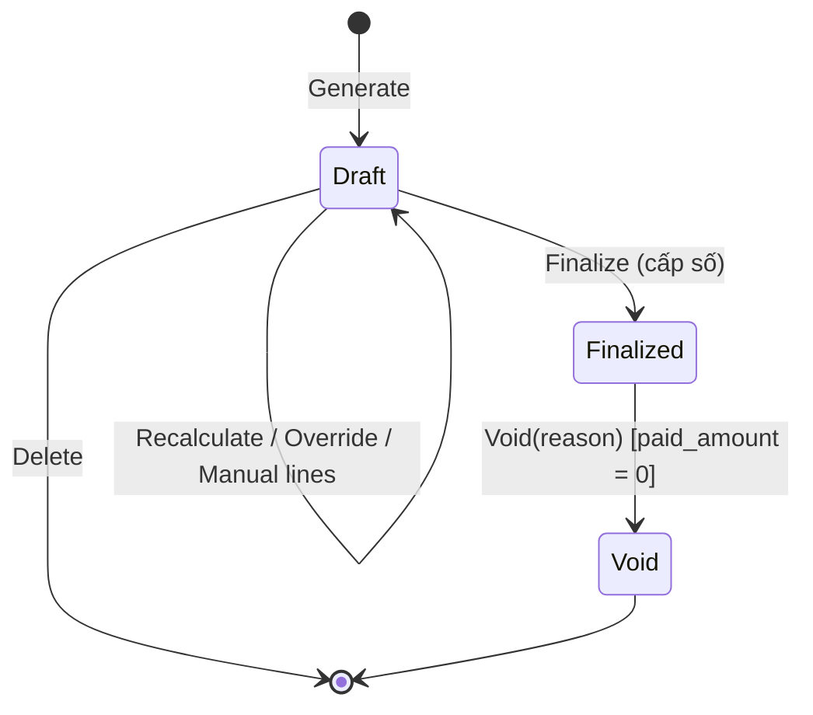

# M07 — Billing (Kỳ thu, Phiếu báo tiền phòng, Điều chỉnh & Giảm giá)

> Theo khuôn [_TEMPLATE.md](_TEMPLATE.md). Quy ước: C-03 (tiền), C-05 (kỳ thu), C-06 (snapshot). Pháp lý: L9, L15, LEG-05, LEG-08.

## 1. Mục tiêu & phạm vi

**Mục tiêu**: Tính **tiền phòng mỗi kỳ** cho từng hợp đồng = tiền phòng + khoản thu theo chỉ số + dịch vụ cố định + dịch vụ theo số lượng
± điều chỉnh, cho phép chủ trọ **rà soát và sửa trước khi chốt**, sau khi chốt thì **bất biến** và là căn cứ thu tiền (M08).

**Trong phạm vi**
- Tạo phiếu nháp hàng loạt theo khu + tháng thu (idempotent); tính lại nháp.
- **Sửa tiền phòng của riêng kỳ này** (không đổi giá HĐ); thêm khoản phát sinh / giảm trừ thủ công.
- **Quy tắc điều chỉnh** (giảm/tăng) theo **phòng / nhóm phòng / cả khu**, theo khoảng tháng (VD hỏng khóa, mất nước, sửa chữa).
- Chốt phiếu (cấp số), hủy phiếu (Void), phiếu quyết toán khi thanh lý.

**Ngoài phạm vi**: hóa đơn điện tử (L15), gửi phiếu qua Zalo/SMS (P2), tính lãi chậm trả (P3).

**Phase**: P1.

## 2. Thuật ngữ

| Thuật ngữ | Code | Định nghĩa |
|-----------|------|-----------|
| Phiếu báo tiền phòng | `Invoice` | Bảng kê số tiền phải trả của 1 HĐ cho 1 kỳ. **Không phải hóa đơn GTGT** (LEG-08) |
| Loại phiếu | `InvoiceType` | `Regular` (định kỳ), `Final` (quyết toán khi thanh lý) |
| Dòng phiếu | `InvoiceLine` | 1 khoản; lưu snapshot tên, đơn vị, số lượng, đơn giá, khoảng dịch vụ |
| Loại dòng | `LineType` | `Rent`, `Metered`, `Fixed`, `Quantity`, `Adjustment`, `ManualCharge`, `ManualDiscount`, `RentRefund` |
| Sửa tiền phòng tháng | `RentOverride` | Ghi đè số tiền dòng `Rent` **chỉ trên phiếu này**; giữ `original_amount` |
| Quy tắc điều chỉnh | `AdjustmentRule` | Giảm/tăng tự động cho các phiếu khớp phạm vi + khoảng tháng |
| Nháp lỗi thời | `is_stale` | Dữ liệu nguồn (giá, chỉ số, HĐ, quy tắc) đổi sau khi tạo nháp |
| Vấn đề | `issues` | Lỗi chặn chốt: thiếu chỉ số, thiếu giá… |

## 3. Nghiệp vụ

### 3.1 Use case

| ID | Mô tả |
|----|-------|
| BL-UC-01 | Tạo phiếu nháp cho **1 hoặc nhiều khu** cho tháng thu M (hoặc 1 HĐ cụ thể) |
| BL-UC-02 | Xem danh sách phiếu theo khu/tháng/trạng thái; tổng hợp: tổng phải thu, đã thu, còn nợ |
| BL-UC-03 | Xem chi tiết phiếu: từng dòng + công thức (chỉ số cũ/mới, số người, prorate) |
| BL-UC-04 | **Sửa tiền phòng tháng này** (nhập số tiền mới + lý do) / bỏ sửa |
| BL-UC-05 | Thêm/sửa/xóa dòng thủ công: phát sinh (sửa đồ hỏng do người thuê…) hoặc giảm trừ |
| BL-UC-06 | Tính lại nháp (lấy dữ liệu nguồn mới nhất, giữ dòng thủ công & sửa tiền phòng) |
| BL-UC-07 | Chốt phiếu (1 hoặc hàng loạt) |
| BL-UC-08 | Hủy phiếu đã chốt (chưa có thanh toán) với lý do → có thể lập lại |
| BL-UC-09 | Xóa phiếu nháp |
| BL-UC-10 | Tạo/xem/hủy **quy tắc điều chỉnh**: phạm vi (Phòng / Nhóm phòng / Cả khu), Giảm/Tăng, số tiền cố định hoặc % tiền phòng, từ tháng – đến tháng, lý do |
| BL-UC-11 | Tạo phiếu quyết toán (gọi từ thanh lý M05) |
| BL-UC-12 | In/xuất phiếu (PDF/ảnh — P2; Excel ở M10) |

### 3.2 Quy tắc nghiệp vụ

| Mã | Quy tắc | Nơi kiểm tra |
|----|---------|-------------|
| BL-BR-01 | Mỗi `(contract, invoice_type, period_start)` có tối đa **1 phiếu chưa Void** | DB partial unique |
| BL-BR-02 | Kỳ phiếu Regular theo C-05: **kỳ của HĐ** có `PeriodStart` ∈ tháng M (C-05 bảo đảm tối đa 1). Không tạo nếu kỳ bắt đầu sau `actual_end_date`; không tạo Regular khi HĐ đã có phiếu Final chưa Void | Domain |
| BL-BR-03 | **Dòng Rent** = giá thuê hiệu lực tại `period_start` (M05) × hệ số prorate theo C-05 (`Daily`: Σ overlap/len kỳ chuẩn; `FullPeriod`: 1) | Domain |
| BL-BR-04 | **Dòng Fixed/Quantity**: đăng ký hiệu lực tại `period_start`; `PerRoom` qty = 1, `PerOccupant` qty = số người ở tại `period_start` (FE-BR-14), `Quantity` qty = số lượng đăng ký; cùng hệ số prorate như Rent. Đơn giá = `unit_price_override` ?? giá danh mục tại `period_start` | Domain |
| BL-BR-05 | **Dòng Metered**: kỳ sử dụng U = kỳ của phiếu (`Postpaid`) hoặc kỳ liền trước (`Prepaid`; kỳ đầu tiên không có dòng Metered). Sản lượng theo thuật toán M06 §3.3. Đơn giá tại `U.start`. Đăng ký hiệu lực tại `U.start` | Domain |
| BL-BR-06 | Làm tròn mỗi dòng về đồng (C-03). `amount` dòng giảm trừ là **số âm** | Domain + CHECK theo loại dòng |
| BL-BR-07 | **Sửa tiền phòng tháng**: chỉ phiếu Draft, chỉ dòng Rent; `override_amount` ≥ 0; lý do bắt buộc; lưu `original_amount`; không ảnh hưởng `contract_rent_terms`; được giữ khi tính lại nháp (nếu giá gốc thay đổi khi tính lại → giữ override nhưng gắn cờ cảnh báo `OVERRIDE_BASE_CHANGED`) | Domain |
| BL-BR-08 | **Thứ tự tính**: Rent (gốc → override) → Fixed/Quantity/Metered → quy tắc điều chỉnh (% tính trên **tiền phòng sau override**, không lũy kế lên nhau) → dòng thủ công | Domain |
| BL-BR-09 | Quy tắc điều chỉnh áp cho phiếu khi: `billing_month` ∈ [from_month, to_month] ∧ phạm vi khớp phòng của HĐ (Room: đúng phòng; RoomGroup: phòng là thành viên **tại thời điểm tính**; Property: mọi phòng của khu) ∧ quy tắc `Active`. Nhiều quy tắc → cộng dồn | Domain |
| BL-BR-10 | **Tổng phiếu ≥ 0**. Nếu giảm trừ từ quy tắc vượt tổng khoản thu → giảm phần vượt ở dòng quy tắc cuối cùng (theo created_at) và ghi `issues` dạng cảnh báo `DISCOUNT_CAPPED`. Dòng giảm thủ công làm tổng âm → 422 | Domain |
| BL-BR-11 | Phiếu Draft có `issues` mức lỗi (`MISSING_READING`, `FEE_PRICE_MISSING`, `RENT_TERM_MISSING`) → không chốt được | Domain |
| BL-BR-12 | **Chốt**: tính lại toàn bộ dòng hệ thống trong cùng transaction và so với nháp; lệch → 409 `DRAFT_STALE` (người dùng xem lại rồi chốt) ⇒ phiếu chốt luôn khớp dữ liệu nguồn tại thời điểm chốt | Application |
| BL-BR-13 | Chốt cấp `invoice_no` = `PB{yyyy}-{seq:000000}` theo tổ chức/năm (bảng sequence, `UPDATE … RETURNING`), `issue_date` = hôm nay (C-04), `due_date` = issue_date + `payment_due_days` | Application |
| BL-BR-14 | Phiếu `Finalized`/`Void` **bất biến** (không sửa dòng, không sửa tổng). Ngoại lệ duy nhất: lệnh ẩn danh người thuê (RT-BR-06) thay `snapshot_representative_name` | Domain + không có endpoint |
| BL-BR-15 | **Void** chỉ khi `paid_amount = 0` (phải hủy phân bổ thanh toán ở M08 trước); lý do bắt buộc; đặt `voided = true` cho các `invoice_meter_segments` | Domain |
| BL-BR-16 | Phiếu tổng = 0 khi chốt → coi như đã thanh toán (trạng thái thanh toán `Paid`) | Dẫn xuất |
| BL-BR-17 | **Phiếu Final**: kỳ = `[Pk.start, actual_end_date]` với Pk là kỳ HĐ chứa `actual_end_date`. Rent mục tiêu cho đoạn đó (prorate theo mode) **trừ** tiền phòng đã có trên phiếu Regular chưa Void của Pk: dương → dòng Rent; âm → dòng `RentRefund` **chỉ khi** `refundUnusedRent = true`. Fixed/Quantity: chỉ tính nếu Pk chưa có phiếu Regular. Metered: từ đoạn đo cuối đã lập phiếu đến chỉ số `Final`. Nếu tổng tính ra **âm** (hoàn nhiều hơn phải thu): phiếu Final tổng = 0 (dòng RentRefund bị cắt bằng tổng dương) và phần còn lại sinh **phiếu thu ghi có** `method = CreditNote` (M08) khi chốt — tiền hoàn đi vào số dư có, được hoàn cùng lúc hoàn cọc | Domain + Application |
| BL-BR-18 | Tạo phiếu Final khi Pk có phiếu Regular đang **Draft** → 409 `REGULAR_DRAFT_EXISTS` (chốt hoặc xóa trước) | Application |
| BL-BR-19 | Quy tắc điều chỉnh: `to_month` bắt buộc, ≤ from_month + 24 tháng; % ∈ (0,100]; số tiền cố định > 0. Không sửa quy tắc đã từng áp lên phiếu Finalized — chỉ **hủy** (có hiệu lực cho phiếu chưa chốt) và tạo quy tắc mới | Domain |
| BL-BR-20 | Thay đổi nguồn (giá M04, giá thuê/khoản thu M05, chỉ số M06, quy tắc điều chỉnh, thành viên nhóm, người ở) → đánh dấu `is_stale` các Draft liên quan (gợi ý UI); BL-BR-12 là chốt chặn thật | Event handlers |
| BL-BR-21 | **Lập phiếu tuần tự**: phiếu Regular của kỳ k chỉ được tạo khi kỳ k−1 của HĐ (nếu k > 1) đã có phiếu Regular chưa Void. Lý do: chuỗi chỉ số (MT-BR-12) và prorate dựa vào phiếu kỳ trước; bỏ qua 1 kỳ sẽ làm kỳ sau "nuốt" sản lượng của kỳ bị bỏ | Domain |
| BL-BR-22 | **Hủy/xóa theo thứ tự ngược (LIFO)**: chỉ Void phiếu đã chốt / xóa phiếu nháp khi nó là phiếu **mới nhất chưa Void** của HĐ (theo `period_start`, Final là mới nhất). Muốn sửa phiếu kỳ cũ → hủy lần lượt các phiếu sau nó | Domain |

### 3.3 Vòng đời


Trạng thái thanh toán (dẫn xuất, chỉ khi Finalized): `Unpaid` (paid = 0), `PartiallyPaid`, `Paid` (paid ≥ total), `Overdue` = chưa Paid ∧ hôm nay > due_date.

### 3.4 Ví dụ tính (Prepaid, anchor 5)

HĐ bắt đầu 05/10/2026, giá 3.500.000; giữ xe 2 × 100.000; wifi 50.000 (PerRoom); điện 3.800đ/kWh.
- Phiếu tháng 10 (kỳ 05/10–04/11): Rent 3.500.000; Giữ xe 200.000; Wifi 50.000; **không có điện** (kỳ đầu, prepaid) → 3.750.000.
- Phiếu tháng 11 (kỳ 05/11–04/12): Rent 3.500.000; Giữ xe 200.000; Wifi 50.000; Điện kỳ 05/10–04/11: 1.338 − 1.250 = 88 kWh × 3.800 = 334.400;
  quy tắc "Giảm 10% – hỏng khóa – Phòng 101 – tháng 11": −350.000 → **3.734.400**.
- Chủ trọ sửa tiền phòng tháng 11 thành 3.000.000 (lý do: mất nước 5 ngày) → giảm 10% tính trên 3.000.000 = −300.000 → 3.284.400.

## 4. Dữ liệu

**`invoices`**

| Cột | Kiểu | Null | Ghi chú |
|-----|------|------|--------|
| id, organization_id | uuid | N | |
| property_id, room_id, contract_id | uuid | N | FK composite; property/room = của HĐ (kiểm khi tạo) |
| invoice_type | varchar(8) | N | `Regular`,`Final` |
| period_start / period_end | date | N | CHECK period_end ≥ period_start |
| billing_month | date | N | ngày 1 của tháng thu (`date_trunc('month', period_start)`) — CHECK |
| status | varchar(12) | N | `Draft`,`Finalized`,`Void` |
| invoice_no | varchar(20) | Y | NOT NULL khi Finalized/Void (CHECK); UNIQUE (organization_id, invoice_no) |
| issue_date / due_date | date | Y | NOT NULL khi Finalized |
| subtotal | numeric(18,0) | N | Σ dòng dương |
| discount_total | numeric(18,0) | N | Σ dòng âm (≤ 0) |
| total_amount | numeric(18,0) | N | subtotal + discount_total; CHECK ≥ 0 |
| paid_amount | numeric(18,0) | N | 0; cache do M08 cập nhật trong cùng transaction; CHECK 0 ≤ paid_amount ≤ total_amount |
| is_stale | bool | N | |
| issues | jsonb | N | `[]` — `{code, severity: Error|Warning, ref}` |
| refund_unused_rent | bool | N | chỉ Final |
| snapshot_room_code / snapshot_contract_no / snapshot_representative_name | varchar | N | C-06 |
| note | text | Y | in trên phiếu |
| finalized_at/by, voided_at/by, void_reason | | Y | |
| audit, xmin | | | |

- UNIQUE `(contract_id, invoice_type, period_start) WHERE status <> 'Void'` (BL-BR-01).
- UNIQUE `(organization_id, contract_id, id)` — đích của FK composite từ `payment_allocations` (M08), chặn phân bổ chéo HĐ.
- FK composite `(organization_id, property_id, contract_id)` → contracts.
- CHECK `status <> 'Void' OR void_reason IS NOT NULL`; CHECK `status = 'Draft' OR (invoice_no IS NOT NULL AND issue_date IS NOT NULL)`.
- INDEX `(organization_id, property_id, billing_month)`, `(organization_id, contract_id, period_start)`, `(organization_id, due_date) WHERE status='Finalized' AND paid_amount < total_amount`.

**`invoice_lines`**

| Cột | Kiểu | Null | Ghi chú |
|-----|------|------|--------|
| id, organization_id, invoice_id | uuid | N | |
| line_type | varchar(16) | N | |
| is_system | bool | N | true = do hệ thống sinh (bị thay khi tính lại) |
| fee_type_id | uuid | Y | Metered/Fixed/Quantity |
| adjustment_rule_id | uuid | Y | Adjustment |
| description | varchar(200) | N | snapshot tên |
| unit | varchar(20) | Y | snapshot |
| service_from / service_to | date | N | khoảng dịch vụ của dòng |
| quantity | numeric(12,2) | N | |
| unit_price | numeric(18,2) | N | |
| proration_days / proration_base_days | smallint | Y | VD 27/31 |
| original_amount | numeric(18,0) | Y | Rent khi bị override |
| override_reason | varchar(300) | Y | |
| amount | numeric(18,0) | N | |
| sort_order | int | N | |

CHECK theo loại: `line_type IN ('Adjustment','ManualDiscount','RentRefund') OR amount >= 0`;
`line_type NOT IN ('ManualDiscount','RentRefund') OR amount <= 0`; (Adjustment có thể ± tùy Discount/Surcharge).
UNIQUE `(invoice_id) WHERE line_type = 'Rent'` (tối đa 1 dòng Rent); UNIQUE `(invoice_id, fee_type_id) WHERE fee_type_id IS NOT NULL`.

**`invoice_meter_segments`**: id, organization_id, invoice_line_id, meter_id, start_reading_id, end_reading_id, start_value, end_value,
consumption numeric(12,2), voided bool.
- UNIQUE `(end_reading_id) WHERE NOT voided`; UNIQUE `(start_reading_id) WHERE NOT voided` ⇒ một khoảng chỉ số **không thể** bị tính 2 lần.
- CHECK `end_value >= start_value`, `consumption = end_value - start_value`.

**`adjustment_rules`**

| Cột | Kiểu | Null | Ghi chú |
|-----|------|------|--------|
| id, organization_id, property_id | uuid | N | |
| scope_type | varchar(12) | N | `Property`,`RoomGroup`,`Room` |
| room_group_id / room_id | uuid | Y | FK composite cùng khu; CHECK đúng 1 theo scope |
| direction | varchar(10) | N | `Discount`,`Surcharge` |
| value_type | varchar(16) | N | `FixedAmount`,`PercentOfRent` |
| value | numeric(18,2) | N | CHECK > 0; Percent ≤ 100 |
| from_month / to_month | date | N | ngày 1; CHECK to ≥ from |
| reason | varchar(300) | N | in trên phiếu |
| status | varchar(10) | N | `Active`,`Cancelled` |
| cancelled_at/by | | Y | |
| audit, xmin | | | |

**`invoice_number_sequences`**: (organization_id, year) PK, last_value bigint.

## 5. Domain model

```
Invoice (aggregate root; Lines, MeterSegments)
  + static CreateDraft(contractSnapshot, period, type)
  + ApplyCalculation(CalculationResult)        // thay dòng is_system, giữ dòng thủ công & override (BL-BR-07)
  + OverrideRent(amount, reason) / ClearRentOverride()
  + AddManualLine(type, description, amount, ...) / UpdateManualLine / RemoveManualLine
  + Finalize(invoiceNo, today, dueDays)         // BL-BR-11, 14
  + Void(reason, now)                            // BL-BR-15
  + ApplyPayment(delta) // chỉ M08 gọi; giữ 0 ≤ paid ≤ total
InvoiceCalculator (domain service thuần) — đầu vào là snapshot dữ liệu (HĐ, rent terms, fees, giá, người ở, đoạn đo, quy tắc):
  Calculate(contract, period, type, options) : CalculationResult { lines[], segments[], issues[] }
AdjustmentRule (aggregate root): Create, Cancel, Matches(roomId, groupIdsOfRoom, billingMonth)
```
Toàn bộ logic tính tiền nằm trong `InvoiceCalculator` + `BillingPeriodCalculator` + `MeterUsageCalculator` → unit test thuần, không DB.

## 6. Application

| Use case | Loại | Lỗi nghiệp vụ |
|----------|------|---------------|
| `GenerateInvoicesCommand` (Idempotency-Key) | Cmd | input: propertyIds[] hoặc contractIds[], billingMonth, `recalculateExistingDrafts` → `{created, recalculated, skipped:[{contractId, reason: EXISTS \| PREVIOUS_PERIOD_NOT_BILLED \| ENDED \| HAS_FINAL}], withIssues}` |
| `RecalculateInvoiceCommand` | Cmd | `INVOICE_NOT_DRAFT` |
| `OverrideRentCommand` / `ClearRentOverrideCommand` | Cmd | `INVOICE_NOT_DRAFT`, `NEGATIVE_TOTAL` |
| `AddManualLineCommand` / `UpdateManualLineCommand` / `RemoveManualLineCommand` | Cmd | `INVOICE_NOT_DRAFT`, `NEGATIVE_TOTAL` |
| `FinalizeInvoiceCommand` | Cmd | `INVOICE_HAS_ISSUES`, `DRAFT_STALE`, `CONCURRENCY_CONFLICT` |
| `FinalizeInvoicesBatchCommand` | Cmd | mỗi phiếu chốt trong transaction riêng; trả kết quả từng phiếu |
| `VoidInvoiceCommand` | Cmd | `INVOICE_HAS_PAYMENTS`, `NOT_LATEST_INVOICE` |
| `DeleteDraftInvoiceCommand` | Cmd | `INVOICE_NOT_DRAFT`, `NOT_LATEST_INVOICE` |
| `CreateFinalInvoiceCommand` (từ M05) | Cmd | `REGULAR_DRAFT_EXISTS`, `MISSING_READING` |
| `ListInvoicesQuery` | Qry | propertyIds, billingMonth, status, paymentStatus, overdue, contractId; kèm tổng hợp |
| `GetInvoiceQuery` | Qry | chi tiết + segments + công thức |
| `CreateAdjustmentRuleCommand` / `CancelAdjustmentRuleCommand` / `ListAdjustmentRulesQuery` | Cmd/Qry | `INVALID_SCOPE`, `RULE_RANGE_TOO_LONG` |
| Interfaces cung cấp cho module khác | | `IInvoiceLockReader.GetFirstOpenPeriodStart(contractId)` (M05), `IFinalizedUsageReader` (M04), `IReadingLockReader` (M06) |

## 7. API

| Method | Route | Mã lỗi |
|--------|-------|--------|
| POST | `/invoices/generate` | 422 |
| GET | `/invoices?propertyIds=&billingMonth=2026-11&status=&paymentStatus=&overdue=` | |
| GET | `/invoices/{id}` | 404 |
| DELETE | `/invoices/{id}` (Draft) | 422 `INVOICE_NOT_DRAFT` |
| POST | `/invoices/{id}/recalculate` | |
| PUT | `/invoices/{id}/rent-override` `{ amount, reason, version }`; DELETE để bỏ | 422 |
| POST / PUT / DELETE | `/invoices/{id}/manual-lines[/{lineId}]` | 422 `NEGATIVE_TOTAL` |
| POST | `/invoices/{id}/finalize` `{ version }` | 409 `DRAFT_STALE`, 422 `INVOICE_HAS_ISSUES` |
| POST | `/invoices/finalize-batch` `{ invoiceIds[] }` | 200 kết quả từng phiếu |
| POST | `/invoices/{id}/void` `{ reason }` | 422 `INVOICE_HAS_PAYMENTS` |
| GET / POST | `/properties/{propertyId}/adjustment-rules` | |
| POST | `/adjustment-rules/{id}/cancel` | |

**Ví dụ — tạo quy tắc giảm cho nhóm phòng**
```json
POST /api/v1/properties/{pid}/adjustment-rules
{ "scopeType": "RoomGroup", "roomGroupId": "…tầng 3", "direction": "Discount",
  "valueType": "FixedAmount", "value": 200000,
  "fromMonth": "2026-11", "toMonth": "2026-11", "reason": "Mất nước 3 ngày do sửa bồn" }
→ 201 { "id": "…", "affectedDraftInvoiceIds": ["…"] }
```

**Ví dụ — chi tiết phiếu**
```json
{
  "id": "…", "invoiceNo": null, "status": "Draft", "type": "Regular",
  "period": { "start": "2026-11-05", "end": "2026-12-04" }, "billingMonth": "2026-11",
  "room": "101", "contractNo": "HD2026-0012",
  "lines": [
    { "type": "Rent", "description": "Tiền phòng", "quantity": 1, "unitPrice": 3500000, "originalAmount": 3500000, "amount": 3000000, "overrideReason": "Mất nước 5 ngày" },
    { "type": "Metered", "description": "Điện", "unit": "kWh", "serviceFrom": "2026-10-05", "serviceTo": "2026-11-04",
      "segments": [ { "meterSerial": "E-101", "startValue": 1250, "endValue": 1338, "consumption": 88 } ],
      "quantity": 88, "unitPrice": 3800, "amount": 334400 },
    { "type": "Quantity", "description": "Giữ xe máy", "unit": "xe", "quantity": 2, "unitPrice": 100000, "amount": 200000 },
    { "type": "Fixed", "description": "Wifi", "quantity": 1, "unitPrice": 50000, "amount": 50000 },
    { "type": "Adjustment", "description": "Giảm 10% – Hỏng khóa", "amount": -300000, "adjustmentRuleId": "…" }
  ],
  "subtotal": 3584400, "discountTotal": -300000, "totalAmount": 3284400, "paidAmount": 0,
  "isStale": false, "issues": [], "version": "123456"
}
```

## 8. Validation

| Field | Quy tắc |
|-------|---------|
| billingMonth | `yyyy-MM`; ≤ tháng hiện tại + 1 |
| propertyIds / contractIds | 1–50 khu hoặc 1–1.000 HĐ |
| rentOverride.amount | số nguyên, 0 ≤ x ≤ 1.000.000.000 |
| rentOverride.reason / manual description / void reason | 1–300 |
| manualLine.amount | ManualCharge: 1…100.000.000; ManualDiscount: nhập dương, lưu âm |
| adjustment value | FixedAmount: số nguyên 1…100.000.000; Percent: 0 < x ≤ 100, 2 số lẻ |
| fromMonth/toMonth | `yyyy-MM`; to ≥ from; ≤ 24 tháng |
| scope | Room → roomId thuộc khu; RoomGroup → groupId thuộc khu |

## 9. Phân quyền
OrgOwner toàn quyền. OrgManager (P3): tạo nháp, ghi đè **cần** quyền `OverrideRent`; Void cần quyền `VoidInvoice`.

## 10. Toàn vẹn dữ liệu & concurrency

| Kịch bản | Rủi ro | Giải pháp |
|----------|--------|-----------|
| 2 người bấm "tạo phiếu tháng 11" cùng lúc | Phiếu trùng | Partial unique BL-BR-01 + Idempotency-Key; xung đột unique → coi như "skipped: exists" |
| Chốt phiếu trong khi ai đó sửa giá/chỉ số | Phiếu chốt với số liệu cũ | BL-BR-12 tính lại khi chốt; khóa theo thứ tự cố định: `contracts` → `fee_types` (theo id) → `meters` (theo id) → `invoices` |
| Chốt song song 2 phiếu → trùng số | Trùng `invoice_no` | Sequence row lock + UNIQUE |
| Sửa nháp đồng thời 2 tab | Mất cập nhật | xmin version (C-07) |
| Void phiếu đã có thanh toán | Tiền "mồ côi" | BL-BR-15 + CHECK paid ≤ total |
| Chỉ số bị tính 2 lần (2 phiếu / Final + Regular) | Thu trùng | UNIQUE start/end reading trên segments chưa void |
| Quy tắc % lũy kế ra số âm | Tổng âm | BL-BR-10 + CHECK total ≥ 0 |
| Giá thuê đổi giữa kỳ | Không rõ áp giá nào | CT-BR-05: chỉ đổi từ đầu kỳ |
| Draft cũ quên chốt, nguồn thay đổi nhiều lần | Lệch | `is_stale` + BL-BR-12 |
| Lệch múi giờ khi cấp `issue_date` | Ngày phiếu sai lúc 0h–7h | TimeProvider VN (C-04) |

## 11. Audit
Audit: tạo/tính lại/override/dòng thủ công/chốt/void/xóa nháp, quy tắc điều chỉnh. Override & void luôn có lý do.

## 12. Kế hoạch test
- **Unit `InvoiceCalculator` (bảng ≥ 40 case)**: Prepaid vs Postpaid; kỳ đầu lẻ (Daily/FullPeriod); anchor 31 vào tháng 2 (năm nhuận/không);
  PerOccupant đổi người giữa kỳ; giữ xe đổi số lượng từ kỳ sau; giá danh mục vs override; % trên tiền sau override; nhiều quy tắc cộng dồn; cap giảm giá;
  phiếu Final: Prepaid đã thu trọn kỳ (refund bật/tắt), Postpaid chưa có Regular, thay công tơ trong kỳ cuối; thiếu chỉ số → issue.
- Integration: generate idempotent (gọi 2 lần → không trùng); chốt khi nguồn đổi → 409 `DRAFT_STALE`; chốt song song 20 phiếu → số liên tục không trùng;
  void khi có thanh toán → 422; sau void lập lại được và chỉ số được tái sử dụng; **C-01**.
- E2E: F4 trên khu 20 phòng.

## 13. Phụ thuộc
- Dùng: M02 (phòng, nhóm), M04 (giá), M05 (HĐ, rent terms, fees, occupants), M06 (`IMeterUsageProvider`).
- Bị dùng: M08 (phân bổ thanh toán, cập nhật `paid_amount`), M05 (khóa kỳ, phiếu Final), M10.

## 14. Task breakdown

| ID | Task | Ước lượng |
|----|------|-----------|
| BL-01 | `InvoiceCalculator` + bảng test (thuần domain) | 3d |
| BL-02 | Entity Invoice/Lines/Segments/AdjustmentRule + EF + constraints + sequence | 1.5d |
| BL-03 | Generate (batch, idempotent, snapshot loader tối ưu theo khu) | 2d |
| BL-04 | Override/manual lines/recalculate | 1d |
| BL-05 | Finalize (+ batch) với tính lại & khóa | 1.5d |
| BL-06 | Void/Delete | 0.5d |
| BL-07 | Adjustment rules + stale handlers | 1d |
| BL-08 | Final invoice | 1.5d |
| BL-09 | Interfaces lock cho M04/M05/M06 | 0.5d |
| BL-10 | Integration/E2E tests | 2d |

## 15. Câu hỏi mở

| # | Câu hỏi | Đề xuất |
|---|---------|---------|
| Q1 | Giảm cố định có prorate ở kỳ lẻ không? | Không — áp nguyên số tiền (đơn giản, dễ hiểu); bị cap bởi BL-BR-10 |
| Q2 | Có cho phép chốt phiếu khi thiếu chỉ số (tính sau)? | Không (P1). Có thể bỏ đăng ký khoản đó kỳ này bằng ManualDiscount… → không khuyến khích; giữ chặt |
| Q3 | Tiền nợ kỳ trước có cộng vào phiếu kỳ này? | **Không cộng vào tổng phiếu** (tránh tính trùng); phiếu hiển thị thêm mục "Nợ cũ" (thông tin, lấy từ M08) |
| Q4 | Lãi/phạt chậm trả? | P3 — dùng ManualCharge nếu cần |
