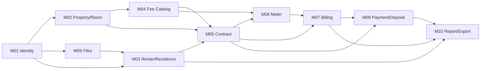

# Pipeline tổng — Phần mềm quản lý nhà trọ (renting_room)

> File này là **bản đồ chung** liên kết mọi plan. Mỗi module có file plan chi tiết riêng
> (nghiệp vụ, dữ liệu, API, validation, test, task) theo khuôn [_TEMPLATE.md](_TEMPLATE.md).
> Các **quy ước dùng chung** (multi-tenant, tiền, thời gian, kỳ thu, lỗi, concurrency…) chỉ định nghĩa
> ở mục 6 của file này — module plan tham chiếu bằng mã `C-xx`, không định nghĩa lại.

## 1. Tầm nhìn & phạm vi

Phần mềm SaaS giúp **chủ trọ** quản lý nhiều khu trọ: phòng, người thuê, hợp đồng, cư trú,
chỉ số điện nước, tính tiền phòng hàng tháng, thu tiền, cọc, lưu trữ giấy tờ, xuất Excel.
Định hướng **B2B**: quản trị viên nền tảng cấp tài khoản cho chủ trọ (tổ chức); sau này chủ trọ
có thể tạo tài khoản nhân viên quản lý.

**Trong phạm vi**
- Quản lý tổ chức (chủ trọ) & tài khoản do Admin cấp.
- Khu trọ, phòng, nhóm phòng.
- Hồ sơ người thuê, người ở cùng (P1); theo dõi thủ tục tạm trú / lưu trú / tạm vắng (P2).
- Hợp đồng (lưu trữ thông tin + file scan), phụ lục giá, thanh lý.
- Danh mục khoản thu 3 nhóm: **Theo chỉ số** (điện, nước, …), **Dịch vụ cố định** (rác, wifi…),
  **Dịch vụ theo số lượng** (giữ xe ×N…).
- Màn hình ghi chỉ số cuối kỳ; tính tiền phòng; sửa tay trên phiếu nháp; phụ thu / giảm trừ / hoàn trả cho 1 hoặc nhiều phòng;
  chốt phiếu; thu tiền; sổ cọc.
- Upload ảnh/file lưu trữ; xuất Excel (người thuê, tiền phòng tháng, thông tin phòng) cho 1 hoặc nhiều khu.

**Ngoài phạm vi** (ghi rõ để không bị "trôi" yêu cầu)
- Người thuê **không** đăng nhập, không tương tác hệ thống (chỉ là dữ liệu).
- Không phải phần mềm pháp lý: không ký số, không nộp tạm trú thay, không xuất hóa đơn điện tử, không tính thuế.
- Không tích hợp cổng thanh toán (MVP). Không công tơ dùng chung chia theo đầu người (MVP).

Căn cứ pháp lý & quy tắc LEG-xx: [00-legal-basis.md](00-legal-basis.md).

## 2. Vai trò (actors)

| Role | Thuộc | Mô tả | Phase |
|------|-------|-------|-------|
| `SystemAdmin` | Nền tảng (không thuộc tổ chức) | Tạo/khóa tổ chức chủ trọ, cấp & reset tài khoản chủ trọ, quản lý dữ liệu tham chiếu (ĐVHC). **Mặc định không xem dữ liệu nghiệp vụ** của tổ chức | P1 |
| `OrgOwner` | 1 tổ chức | Chủ trọ — toàn quyền trong tổ chức của mình | P1 |
| `OrgManager` | 1 tổ chức | **Phó quản lý** do chủ trọ tạo — thao tác nghiệp vụ như chủ trọ, KHÔNG quản lý thành viên. P3: giới hạn theo khu được gán | P1 |
| Renter | — | Người thuê/người ở: **không phải user**, chỉ là bản ghi dữ liệu | — |

## 3. Kiến trúc

- **Modular monolith** trên Clean Architecture hiện có: `renting_room.Domain` / `.Application` /
  `.Infrastructure` / `renting_room` (API, Minimal API endpoints).
- Application tổ chức **theo feature/module**: `Application/{Module}/Commands|Queries/{UseCase}/`.
- Mediator (`Mediator.Abstractions` source-gen) + FluentValidation pipeline (đã có `ValidationBehavior`).
- EF Core + **PostgreSQL** (Npgsql). Một DB, một schema `public` (module tách bằng tiền tố bảng không cần thiết — dùng tên rõ nghĩa).
- Xuất Excel: **ClosedXML** (MIT). Lưu file: abstraction `IFileStorage` (Local disk → S3/MinIO).
- ✅ Đã nâng lên **net10.0** (LTS, SDK 10.0.4xx) — EF Core 10 / Npgsql 10, Swashbuckle 10 (Microsoft.OpenApi v2). .NET 8 hết hỗ trợ 10/11/2026.

## 4. Bản đồ module

| Mã | Module | File plan | Phase | Phụ thuộc |
|----|--------|-----------|-------|-----------|
| M01 | Identity & Access (tổ chức, tài khoản, phân quyền) | [01-identity-access.md](01-identity-access.md) | P0–P1 | — |
| M02 | Property & Room (khu trọ, phòng, nhóm phòng) | [02-property-room.md](02-property-room.md) | P1 | M01 |
| M03 | Renter & Residence (người thuê; cư trú = người ở trong phòng — thủ tục tạm trú, tạm vắng: P2) | [03-renter-residence.md](03-renter-residence.md) | P1 | M01, M09 |
| M04 | Fee Catalog (danh mục khoản thu, bảng giá) | [04-fee-catalog.md](04-fee-catalog.md) | P1 | M02 |
| M05 | Contract (hợp đồng, người ở, phụ lục, thanh lý) | [05-contract.md](05-contract.md) | P1 | M02, M03, M04 |
| M06 | Meter Reading (công tơ, ghi chỉ số) | [06-meter-reading.md](06-meter-reading.md) | P1 | M02, M04, M05 |
| M07 | Billing (kỳ thu, phiếu báo tiền, điều chỉnh, giảm giá) | [07-billing.md](07-billing.md) | P1 | M04, M05, M06 |
| M08 | Payment & Deposit (thu tiền, phân bổ, sổ cọc) | [08-payment-deposit.md](08-payment-deposit.md) | P1 | M05, M07 |
| M09 | File Storage (ảnh, tài liệu đính kèm) | [09-file-storage.md](09-file-storage.md) | P1 | M01 |
| M10 | Reporting & Export (Excel, dashboard, nhắc việc) | [10-reporting-export.md](10-reporting-export.md) | P1–P2 | Tất cả |
| — | Self-review: lỗi tìm thấy & cách xử lý | [99-self-review.md](99-self-review.md) | — | — |

## 5. Luồng nghiệp vụ end-to-end

### F1. Onboarding chủ trọ (M01)
Admin tạo **Tổ chức + tài khoản OrgOwner** (mật khẩu tạm) → chủ trọ đăng nhập, bắt buộc đổi mật khẩu.

### F2. Thiết lập khu trọ (M02, M04)
Tạo khu trọ (địa chỉ 2 cấp, **cài đặt kỳ thu của khu** — áp chung mọi phòng: ngày chốt kỳ 1–28, thu trước/thu sau, tính theo ngày/trọn tháng, số ngày hạn thanh toán)
→ hệ thống seed khoản thu mặc định **Điện, Nước** (Metered) → chủ trọ thêm khoản thu (rác, wifi, giữ xe…)
→ tạo phòng (hàng loạt) → gắn công tơ + chỉ số ban đầu (M06) → tạo nhóm phòng (tùy chọn).

### F3. Cho thuê phòng (M03, M05, M06, M08)
Tạo/tìm người thuê (theo số giấy tờ) → chọn **mẫu hợp đồng** (thuê trọ / không cọc / thuê nhà) → tạo hợp đồng nháp
(giá thuê, cọc, ngày chốt kỳ, khoản thu đăng ký, trường tùy biến của mẫu, người ở cùng + **quan hệ với người đứng tên**,
đồng ý của người giám hộ nếu < 18 tuổi) → upload scan → **kích hoạt** (ghi chỉ số bàn giao, ghi nhận tiền cọc) → hệ thống tạo nhắc
**đăng ký tạm trú/lưu trú** cho từng người ở.

### F4. Chu kỳ hàng tháng (M06 → M07 → M08 → M10)
1. Màn hình **ghi chỉ số**: chọn khu + tháng thu → lưới phòng có chỉ số cũ, nhập chỉ số mới.
2. **Tạo phiếu nháp** hàng loạt cho khu (idempotent).
3. Chủ trọ rà soát phiếu nháp: **sửa tay** mọi ô, thêm phụ thu / giảm trừ, tính lại theo phòng / tầng / khu
   (không có quy tắc giảm/tăng tự động — dùng phụ thu / giảm trừ / hoàn trả cho nhiều phòng một lúc).
4. **Chốt phiếu** (Finalize) → phiếu bất biến, có số phiếu.
5. **Thu tiền** (toàn phần/một phần). Cấn trừ cọc: để sau.
6. **Xuất Excel** tiền phòng tháng cho 1/nhiều khu.

### F5. Trả phòng / thanh lý (M05, M06, M07, M08)
Báo trả phòng (ngày dự kiến) → bắt đầu thanh lý → ghi chỉ số cuối → phiếu **quyết toán** (thu phần còn thiếu; đã thu thừa tiền phòng ⇒ cảnh báo, chủ trọ thêm dòng **Hoàn trả**) →
hoàn tất thanh lý: còn nợ ⇒ "Đã thu toàn bộ" / "Bỏ nợ"; còn phiếu Chờ hoàn ⇒ xác nhận đã hoàn trước (hợp đồng `Ended`). Cọc, cư trú: để sau.

## 6. Quy ước dùng chung (cross-cutting) — BẮT BUỘC

### C-01 Multi-tenant (cô lập dữ liệu giữa các chủ trọ)
- Mọi bảng nghiệp vụ có `organization_id uuid NOT NULL`.
- **EF Core global query filter** theo `ICurrentUser.OrganizationId`; khi `SaveChanges`: entity `Added` được
  gán `OrganizationId` tự động, entity `Modified/Deleted` có `OrganizationId` khác user hiện tại → throw.
- **Khóa ngoại composite** `(organization_id, xxx_id) → (organization_id, id)` cho mọi quan hệ giữa bảng nghiệp vụ,
  để **DB** chặn liên kết chéo tổ chức (global filter không bảo vệ raw SQL / `IgnoreQueryFilters`).
  Mỗi bảng cha cần `UNIQUE (organization_id, id)`.
- `SystemAdmin` không có `OrganizationId` → endpoints nghiệp vụ trả 403 với admin.
- Test bắt buộc mỗi module: user tổ chức A truy cập id của tổ chức B → **404** (không lộ tồn tại).
- Phase 3: cân nhắc PostgreSQL Row-Level Security làm lớp bảo vệ thứ hai.

### C-02 Định danh
- ✅ Khóa chính `uuid`, sinh **UUIDv7** (`Guid.CreateVersion7()`) cho mọi entity — sắp xếp theo thời gian, index tốt (08/10/2026). Giá trị cần ngẫu nhiên khó đoán (security stamp, JTI, họ refresh token) vẫn dùng `Guid.NewGuid()`.
- Mã nghiệp vụ dễ đọc (`code`, `invoice_no`) unique **trong tổ chức**.

### C-03 Tiền & số lượng
- Tiền tệ duy nhất **VND**. Số tiền (`amount`): `numeric(18,0)` (đồng, không lẻ). Đơn giá: `numeric(18,2)`.
  Số lượng / chỉ số: `numeric(12,2)`. C#: `decimal`. **Cấm** `double/float`.
- Làm tròn **ở cấp dòng phiếu** (`MidpointRounding.AwayFromZero`, về 0 chữ số thập phân);
  tổng phiếu = tổng các dòng đã làm tròn (không làm tròn lại tổng).
- Phần trăm: `numeric(5,2)` trong khoảng (0, 100].

### C-04 Thời gian
- Thời điểm: `timestamptz` lưu UTC (`DateTimeOffset`). Ngày nghiệp vụ: `date` (`DateOnly`).
- "Hôm nay" của nghiệp vụ = ngày theo múi giờ **Asia/Ho_Chi_Minh**, lấy qua `TimeProvider` (inject, test được).
  Không bao giờ dùng `DateTime.Now` / `DateTime.UtcNow.Date` để suy ra ngày nghiệp vụ.

### C-05 Kỳ thu (BillingPeriod) — định nghĩa chuẩn
- **Ngày chốt kỳ thuộc khu** (`billing_anchor_day` ∈ [1, 28], chốt 08/10/2026): **mọi phòng / HĐ của khu dùng chung**, HĐ không chọn riêng.
  Không cho 29–31 ⇒ tháng nào cũng có ngày chốt. Thu trước / thu sau, tính theo ngày / trọn tháng, số ngày hạn thanh toán cũng là **cài đặt của khu** (M02 PR-BR-09).
- **Tháng thu M của khu** = kỳ chuẩn `S(M)` (VD khu chốt ngày 5: tháng 11 = 05/11–04/12) — ngày chốt **cố định hằng tháng**, không dùng chu kỳ "30 ngày"
  (30 ngày làm ngày thu trôi dần, 13 kỳ / năm ⇒ thu 13 tháng tiền phòng, tháng 12 có 2 kỳ không định danh được — R-141).
  Ngày tạo phiếu không ảnh hưởng kỳ: phiếu tháng 11 luôn là kỳ tháng 11 dù tạo sớm hay muộn.
- `AnchorDate(y, m) = DateOnly(y, m, min(anchorDay, DaysInMonth(y, m)))` (với ngày chốt 1–28 không bao giờ phải kẹp; giữ công thức cho dữ liệu cũ).
- **Kỳ chuẩn** của tháng M: `S(M) = [AnchorDate(M), AnchorDate(M+1) − 1]`.
- **Kỳ của hợp đồng** (dùng để lập phiếu) (chốt 09/10/2026):
  - **Tính tiền từ ngày** (`billing_start_date`, mặc định = `start_date`): ngày bắt đầu tính tiền trong phần mềm — **không cộng thêm tiền**,
    chỉ dùng cho vài phòng: HĐ nhập từ sổ cũ (bắt đầu từ năm trước, tính tiền từ kỳ đầu dùng phần mềm), chủ trọ cho ở miễn phí vài ngày đầu.
    Những ngày trước mốc này không tính tiền.
  - Kỳ đầu: `[billing_start_date, ngày cuối kỳ chuẩn của khu chứa ngày đó]`, tính theo ngày / trọn tháng theo cài đặt của khu —
    **không gộp** vào kỳ sau (VD khu chốt ngày 5, vào 03/11 ⇒ kỳ đầu 03/11–04/11 = 2 ngày; vào 20/10 ⇒ 20/10–04/11).
  - **Tháng thu** của một kỳ = tháng của **kỳ chuẩn của khu chứa kỳ đó** (kỳ 03/11–04/11 nằm trong kỳ tháng 10 = 05/10–04/11 ⇒ phiếu tháng 10)
    ⇒ mỗi HĐ mỗi tháng thu đúng 1 kỳ, và trùng tên tháng với cả khu.
  - Không bỏ sót: phiếu phải lập **lần lượt từ kỳ đầu** (BL-BR-21) — quên lập kỳ đầu thì tạo phiếu tháng sau báo `PREVIOUS_PERIOD_NOT_BILLED`
    (UI gợi ý tạo tháng còn thiếu), không tự cộng dồn tiền.
  - Các kỳ sau: kỳ chuẩn.
  - Kỳ cuối: cắt tại `actual_end_date` (ngày cuối tính tiền, **bao gồm**).
- Kỳ được định danh bằng `PeriodStart`. **Tháng thu** (`billing_month`) = tháng của kỳ chuẩn của khu chứa `PeriodStart` (xem trên).
- Prorate `Daily`: `amount = round(rent × Σ_k overlapDays_k / len(S_k))` với `S_k` là các kỳ chuẩn giao với kỳ HĐ
  (làm tròn **một lần** ở cuối). Kỳ đầy đủ ⇒ hệ số = 1; kỳ đầu lẻ 03/11–04/11 (khu chốt ngày 5) ⇒ 2/31. Kỳ chuyển tiếp khi đổi ngày chốt (K4):
  [mốc đổi, ngày chốt mới tháng sau − 1], vẫn là tháng thu của mốc đổi; tiền phòng = 1 tháng ± số ngày chủ trọ chọn / độ dài kỳ cũ (M07 BL-BR-28).
  `FullPeriod`: mỗi kỳ HĐ (kể cả kỳ lẻ/gộp) tính đúng 1 tháng tiền.
- Tiền phòng **thu hằng tháng**, mỗi kỳ 1 dòng — không có chu kỳ đóng nhiều tháng (đã bỏ 07/10/2026, M07 BL-BR-26).
- Hiện thực một lần duy nhất ở `Domain/Billing/BillingPeriodCalculator.cs` (`BillingSchedule` — lịch kỳ thu của khu) + unit test bảng (anchor 1/5/28/29/30/31, tháng 2 năm nhuận/không,
  bắt đầu trước/sau/đúng anchor, kết thúc giữa kỳ).

### C-06 Xóa & lưu trữ
- Dữ liệu danh mục (khu, phòng, khoản thu, người thuê): **archive** (`archived_at`), không xóa vật lý nếu đã được tham chiếu.
- Dữ liệu tài chính & pháp lý (hợp đồng, phiếu, thanh toán, cọc, chỉ số đã dùng, cư trú): **không bao giờ xóa/sửa sau khi chốt**; sửa sai bằng bút toán đảo / hủy có lý do (LEG-02).
- Snapshot: phiếu báo tiền lưu bản sao tên khoản thu, đơn vị, đơn giá, số lượng — đổi danh mục sau đó không ảnh hưởng phiếu cũ.

### C-07 Concurrency
- Optimistic concurrency bằng cột hệ thống `xmin` của PostgreSQL (`UseXminAsConcurrencyToken` / `IsRowVersion`).
- API trả `version` (string) trong response; lệnh cập nhật nhận `version` → lệch trả **409 `CONCURRENCY_CONFLICT`**.
- Thao tác tài chính (chốt phiếu, phân bổ thanh toán, giao dịch cọc, cấp số phiếu) chạy trong **transaction** và khóa hàng cha (`SELECT … FOR UPDATE`) khi cần tính số dư.
- **Thứ tự khóa toàn cục** (chống deadlock — mọi module phải tuân theo, cùng loại thì theo `id` tăng dần):
  `organizations → properties → rooms → contracts → renters → fee_types → meters → invoices → payments → sequences`.

### C-08 Idempotency
- Header `Idempotency-Key` (8–64 ký tự `[A-Za-z0-9_-]`, khuyến nghị UUID) — **bắt buộc** cho thao tác tạo mới / tài chính
  (tạo tổ chức, tạo phòng; sau này: thanh toán, giao dịch cọc, tạo phiếu hàng loạt, lưu chỉ số hàng loạt), tùy chọn cho thao tác đổi trạng thái.
  Khai báo trên endpoint: `.WithIdempotency(required: true|false)`.
- Phạm vi key: **theo user** — bảng `idempotency_keys(user_id, key, request_hash, status, response_*, created_at, expires_at)`, PK `(user_id, key)`, giữ 24h, job dọn mỗi giờ.
- Hành vi (đã hiện thực — `IdempotencyMiddleware`):

  | Tình huống | Kết quả |
  |-----------|---------|
  | Key mới | Chạy bình thường, lưu response (body **mã hóa** bằng Data Protection vì có thể chứa token / mật khẩu tạm) |
  | Gửi lại sau khi xong, cùng nội dung | Trả **đúng** response cũ + header `Idempotent-Replayed: true` |
  | Gửi lại khi lần đầu đang chạy (double-click, retry song song) | 409 `IDEMPOTENCY_REQUEST_IN_PROGRESS` + `Retry-After` |
  | Cùng key, nội dung khác | 422 `IDEMPOTENCY_KEY_REUSED` |
  | Lần đầu lỗi (exception / 5xx / validation) | Key được giải phóng → retry cùng key được |
  | Lần đầu "chết" giữa chừng (process crash) | Sau `InProgressTimeoutSeconds` (120s) key được chạy lại |

- Chốt chặn race condition là `INSERT … ON CONFLICT DO NOTHING` trên PK — chỉ đúng 1 request giành được key.
- Giới hạn đã biết: kết quả nghiệp vụ và việc lưu response là 2 lần ghi riêng; nếu process chết đúng giữa 2 bước,
  retry sau timeout có thể chạy lại. Với nghiệp vụ tiền (M07, M08) phải có thêm **ràng buộc unique nghiệp vụ** (đã có trong plan) làm lớp bảo vệ thứ hai.

### C-09 API
- Tiền tố `/api/v1`. JSON camelCase, enum dạng chuỗi (đã cấu hình `JsonStringEnumConverter`).
- Lỗi theo **RFC 9457 ProblemDetails** + extension `code` (UPPER_SNAKE) và `errors` (lỗi theo field).
  - 400 validation, 401, 403, 404 (kể cả khác tổ chức), 409 xung đột trạng thái/unique/concurrency, 422 vi phạm quy tắc nghiệp vụ.
- Phân trang: `?page=1&pageSize=20` (max 100) → `{ items, page, pageSize, totalCount }`.
- Lọc/sắp xếp: query params whitelisted; không nhận chuỗi sort tự do.
- Hành động trạng thái dùng endpoint động từ: `POST /contracts/{id}/activate` (không PATCH status tự do).

### C-10 Audit log ✅
- Bảng `audit_logs(id uuid v7, organization_id, user_id, action, entity_type, entity_id, changes jsonb, ip_address, occurred_at)`.
  Không lưu `user_agent` (dài, ít giá trị tra cứu, làm bảng phình nhanh); lý do của lệnh (void, sửa chỉ số…) nằm trong `changes` / cột của entity.
- Index chỉ 2: `(organization_id, entity_type, entity_id)` — lịch sử 1 đối tượng; `(organization_id, occurred_at)` — nhật ký theo thời gian.
- **Hai đường ghi** — mục tiêu: không thêm lượt gọi DB cho mỗi thao tác:

  | Loại thao tác | Cách ghi | Lượt DB thêm | Mất audit khi crash? |
  |---|---|---|---|
  | **Ghi** (tạo / sửa / xóa entity) | `AppDbContext.SaveChanges` đọc ChangeTracker → sinh dòng audit → thêm vào **chính lần lưu đó** (cùng batch lệnh, cùng transaction). Rollback ⇒ audit cũng không có; lưu lỗi ⇒ gỡ dòng audit khỏi context | 0 | Không |
  | Sự kiện nghiệp vụ trong lệnh ghi (ẩn danh, import) | `IAuditTrail.Record(...)` — đi kèm SaveChanges kế tiếp, cùng transaction | 0 | Không |
  | **Đọc** dữ liệu nhạy cảm (xem số giấy tờ đầy đủ, in HĐ có số đầy đủ, xuất Excel `includeSensitive`, tải ảnh giấy tờ — M09) | `IAuditTrail.RecordRead(...)` → hàng đợi RAM (`Channel`, tối đa `Audit:QueueCapacity` = 10.000) → `AuditLogWriter` (BackgroundService) gom lô: ghi khi **đủ `Audit:MaxBatchSize` = 500 HOẶC hết `Audit:FlushInterval` = 2 giây** tính từ bản ghi đầu của lô | 1 INSERT / lô | Tối đa 1 cửa sổ gom (~2 giây). Tắt app bình thường ⇒ vét hàng đợi trước khi dừng. Hàng đợi đầy / ghi lỗi ⇒ chép tóm tắt ra log ứng dụng |

  Lý do không đưa thao tác ghi sang nền: lượt SaveChanges đằng nào cũng xảy ra, audit đi nhờ không tốn thêm round-trip/commit; tách ra nền chỉ thêm commit và rủi ro mất audit.
- Audit **tự động** cho mọi entity kế thừa `Entity` trừ `RefreshToken` (sự kiện đăng nhập ở bảng `login_events` — M01 §11). Không áp dụng cho lệnh `ExecuteUpdate` / `ExecuteDelete` / SQL thô (không qua ChangeTracker) ⇒ lệnh nghiệp vụ cần audit không được viết bằng các API này, hoặc phải tự gọi `IAuditTrail.Record`.
- `changes`: sửa ⇒ chỉ trường đổi `{"field":{"old":…,"new":…}}`; tạo / xóa ⇒ giá trị các trường. Bỏ cột đã có trên dòng audit (id, organization_id, created/updated_*, version).
- Trường nhạy cảm **không** ghi giá trị — ghi `"[redacted]"`: tên kết thúc `Encrypted` / `Hash`, mọi cột nhị phân, `SecurityStamp`, `SigningSnapshot` (chứa số giấy tờ đã mã hóa).
- ✅ Xem nhật ký (ID-BR-19, 08/10/2026): `GET /audit-logs?entityType=&entityId=&userId=&action=&from=&to=&page=` — **chỉ chủ trọ**, luôn lọc theo tổ chức của người gọi (bảng không có global filter), mới nhất trước, kèm tên người làm; `no-store` vì có dữ liệu cá nhân.
- ✅ Ẩn danh (RT-BR-06): xóa giá trị cá nhân trong `changes` của người được ẩn danh, cùng transaction với lệnh ẩn danh.
- Job nền chạy trên dữ liệu tổ chức qua `CurrentUserOverride` (người dùng hệ thống của tổ chức, `user_id` rỗng trên audit) — vẫn bị lọc và kiểm tổ chức như request.
- Chưa làm: chính sách lưu giữ / partition theo tháng khi bảng lớn.

### C-11 Bảo mật & dữ liệu cá nhân
- JWT access 15 phút + refresh token xoay vòng (chi tiết M01). Rate limit đăng nhập & API.
- Số giấy tờ: mã hóa cột (AES-GCM, khóa từ secret manager) + cột `id_number_hash` (HMAC-SHA256) để tìm kiếm/unique.
- Không ghi dữ liệu cá nhân vào log ứng dụng (chỉ ghi id). **Không dùng Serilog** (chốt 08/10/2026): log mặc định của ASP.NET Core; che dữ liệu hiển thị ở FE. Số giấy tờ mã hóa ở DB, API luôn trả dạng che trừ endpoint xem đầy đủ (có audit).
- ✅ Secrets qua biến môi trường / User Secrets; app dừng ngay khi thiếu chuỗi kết nối (`ConnectionStrings__DefaultConnection`). `appsettings.Development.json` chỉ có mật khẩu mặc định `postgres/postgres` của container Postgres dev (`docker-compose.yml`, đổi qua `.env`) — không phải bí mật thật; môi trường thật bắt buộc lấy từ env / secret manager (P0-02).

### C-12 Địa chỉ
- Bảng tham chiếu `provinces(code, name)`, `communes(code, province_code, name, type)` seed từ QĐ 19/2025/QĐ-TTg.
- Địa chỉ có cấu trúc: `province_code`, `commune_code`, `street_address`; kèm `address_text` tự do cho địa chỉ cũ (LEG-07).

### C-13 Kiểm thử
- Unit test domain (xUnit + FluentAssertions), integration test API (WebApplicationFactory + **Testcontainers PostgreSQL** — vì dùng partial index, exclusion constraint, xmin; không dùng InMemory/SQLite).
- Mỗi module có: test cô lập tổ chức (C-01), test concurrency cho lệnh tài chính, coverage ≥ 80%.

## 7. Lộ trình (phase) & tiêu chí hoàn thành

| Phase | Nội dung | Exit criteria |
|-------|----------|---------------|
| **P0 Foundation** | **Nâng net10.0 ✅**; secrets; multi-tenant infra (C-01), audit (C-10 ✅ — ghi cùng SaveChanges + ghi nền theo lô cho thao tác đọc), ProblemDetails (C-09), idempotency (C-08), TimeProvider (C-04), BillingPeriodCalculator (C-05), Testcontainers; M01 auth | Đăng nhập được; test cô lập tổ chức chạy xanh trên CI |
| **P1 MVP** | M01–M09 đầy đủ; M10 các export chính | Chạy trọn F1→F5 trên 1 khu 20 phòng trong integration/E2E test |
| **P2** | **Gửi phiếu tiền phòng qua Zalo kèm mã VietQR** (BL-UC-13), in hợp đồng / phụ lục / biên bản bàn giao từ mẫu (CT-UC-15), nhắc việc (hợp đồng sắp hết hạn, tạm trú chưa đăng ký, giấy tờ PCCC hết hạn), đối chiếu hóa đơn điện EVN, dashboard, báo cáo doanh thu năm, export bất đồng bộ | — |
| **P3 B2B** | Thanh toán online / đối soát ngân hàng (sau gửi Zalo), giới hạn `OrgManager` theo khu, gói dịch vụ & giới hạn (số khu/phòng), RLS, admin impersonation có audit | — |

## 8. Thay đổi so với plan cũ (room/tenant/lease/payment)

Plan cũ giả định 1 chủ trọ, `Room.Status` lưu cứng, hợp đồng 1 người, thanh toán không có phiếu báo tiền.
Đã thay bằng bộ plan này; lý do chi tiết ở [99-self-review.md](99-self-review.md) (mục R-01…R-04).
Code hiện có (`Room` + CRUD) sẽ được **viết lại** theo M02 (thêm `organization_id`, `property_id`, bỏ `Status`
lưu cứng). Vì chưa có dữ liệu thật → **xóa migration `InitialCreate` và tạo lại** (task P0-05).

## 9. Task Phase 0

| ID | Task | Ước lượng |
|----|------|-----------|
| P0-01 ✅ | Nâng 4 project lên `net10.0`, cập nhật package (EF Core 10, Npgsql 10) | 0.5d |
| P0-02 ✅ | Chuyển connection string sang User Secrets / env; validate secrets khi khởi động (dev: mật khẩu mặc định container, xem C-11) | 0.25d |
| P0-03 | `ICurrentUser`, `TimeProvider` VN, base entity `TenantEntity` (Id, OrganizationId, CreatedAt/By, UpdatedAt/By) | 0.5d |
| P0-04 ✅ | Global query filter + SaveChanges guard + audit (C-10: cùng SaveChanges cho lệnh ghi, `AuditLogWriter` gom lô cho thao tác đọc) | 1d |
| P0-05 | Xóa migration cũ, cấu hình xmin, composite FK helper, tạo migration mới | 0.5d |
| P0-06 | ProblemDetails + mapping `Result`/`DomainException` → mã lỗi; idempotency middleware | 1d |
| P0-07 | `BillingPeriodCalculator` + bộ test bảng | 0.5d |
| P0-08 | Test infra: WebApplicationFactory + Testcontainers + helper tạo 2 tổ chức | 1d |
| P0-09 | Seed ĐVHC (34 tỉnh + xã/phường) | 0.5d |
